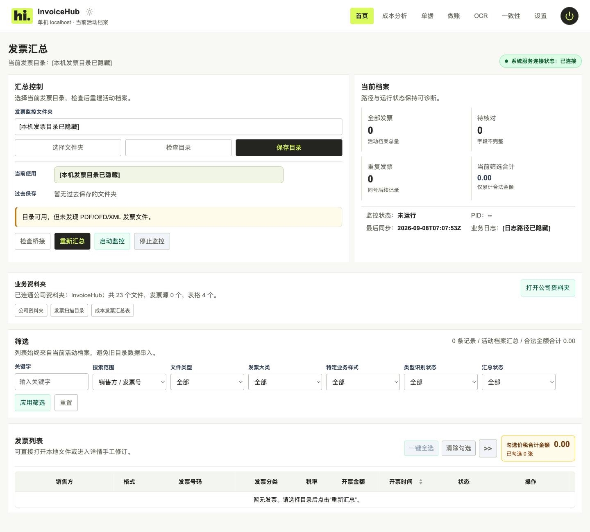
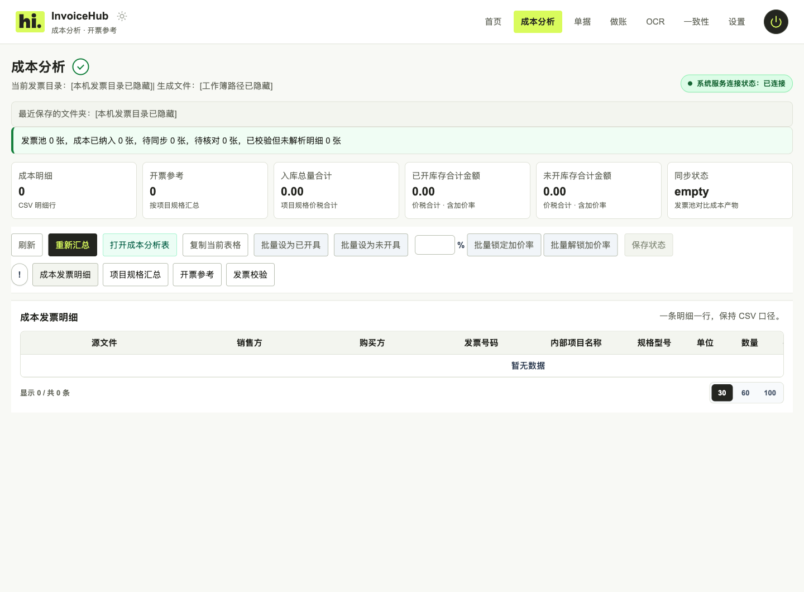
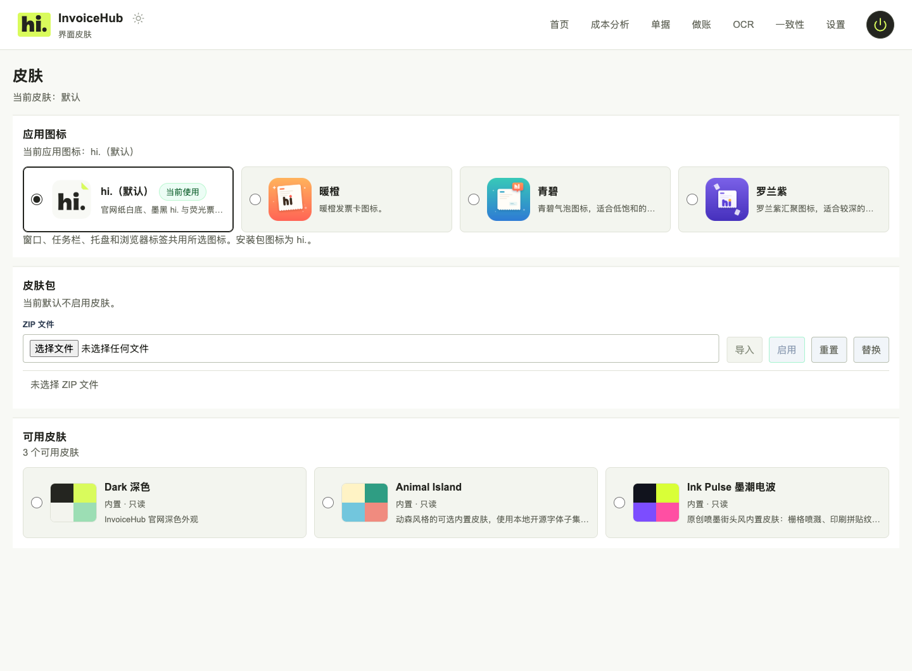

<div align="center">


# InvoiceHub

### 发票、成本、单据，一处整理。

把散落的 PDF、OFD、XML，变成看得清、找得到、用得上的账前资料。

[](https://github.com/lyc1126/InvoiceHub/releases/tag/v0.3.0-alpha.2)
[](https://github.com/lyc1126/InvoiceHub/releases/tag/v0.3.0-alpha.2)
[](src-tauri/README.md)
[](LICENSE)

**[下载预览版](https://github.com/lyc1126/InvoiceHub/releases/tag/v0.3.0-alpha.2) · [使用指南](docs/USER_GUIDE.md) · [产品介绍](website/README.md) · [更新记录](CHANGELOG.md)**

</div>

---

月底对票，不该从一张张打开文件、抄金额开始。

InvoiceHub 是一个开源的本地发票工作台。选好发票文件夹，识别、汇总、查重、预览和成本整理就能在同一个地方完成。需要交表时导出 Excel，需要核对时回到原票；开启监控后，新放进来的发票也会继续同步。

**文件留在自己的电脑里，整理出来的结果随时拿得走。**

<p align="center">
  
  <br />
  <sub>当前运行版本实拍：默认空目录；本机路径仅在截图会话中脱敏，未添加演示发票。</sub>
</p>

## 从收票，到交表

| 这一步 | InvoiceHub 能帮你做什么 |
|---|---|
| **把票收齐** | 读取 PDF、OFD、XML，整理号码、日期、购销方和金额。同票多格式按发票号码家族核对，勾选合计避免重复累计。 |
| **把票找准** | 按销售方、发票号搜索，也能单独查文件名；筛选票种、格式和识别状态，打开原文件核对。 |
| **把细项理清** | 查看项目、规格、单位、数量与税额，汇总成本；按行管理开票参考和加价率，保留已开部分的金额快照。 |
| **把资料交出去** | 导出汇总表、入库单与出库单；批量打印使用原始 PDF 票面，多页发票完整保留。 |
| **把重复活交给监控** | 新增、修改、删除后的记录按规则同步。大目录单据索引可停止、继续，已完成的解析进度会保留。 |

<details>
<summary><b>再看看成本分析和外观设置</b></summary>

### 成本有明细，开票有参考



### 常用的工具，也可以有喜欢的样子

四款内置图标，浅色、深色与可切换皮肤。外观可以换，表格、复制和导出照常用。



以上截图均来自同一运行版本；数据状态保持原样，目录与日志路径已隐藏。拍摄说明见[截图来源](docs/screenshots/README.md)。

</details>

## 下载后，从一个文件夹开始

| 平台 | 下载 | 开始使用 |
|---|---|---|
| Windows 10/11 x64 | **[便携工具包 ZIP](https://github.com/lyc1126/InvoiceHub/releases/download/v0.3.0-alpha.2/InvoiceHub-v0.3.0-alpha.2-windows-x64-portable.zip)** | 解压到新目录，运行其中的 InvoiceHub 程序。 |
| macOS 13+ · Apple Silicon | **[预览版 DMG](https://github.com/lyc1126/InvoiceHub/releases/download/v0.3.0-alpha.2/InvoiceHub-v0.3.0-alpha.2-macos-arm64-preview.dmg)** | 打开 DMG，将 App 拖到 Applications 后启动。 |

1. **选目录。** 首页选择你的发票文件夹，确认“待保存目录”后点击保存。
2. **等汇总。** 启动会自动检查当前目录；需要手动重建时点击“重新汇总”。
3. **开始用。** 搜索、勾选、核对原票，或进入成本分析与单据页面。
4. **按需开监控。** 后续把新发票放进同一目录，独立监控会继续整理。

桌面窗口和系统浏览器都能使用，在设置中选择启动方式，完整退出后下次生效。关掉桌面窗口只是隐藏；关闭系统时，可以选择是否保留监控。[完整操作说明 →](docs/USER_GUIDE.md)

> 当前为 **alpha.2 预览版**。Windows 包未签名；Mac 使用 ad-hoc 签名，未经 Apple 公证，首次打开可能需要系统确认。校验和、构建收据及具体已测/未测范围均在[发布页](https://github.com/lyc1126/InvoiceHub/releases/tag/v0.3.0-alpha.2)。

## 表格可以重建，原票始终保留

- **本地处理。** 发票识别、汇总和成本分析在本机完成；更新检查、另行配置的 OCR 服务是独立的联网行为。
- **不猜金额。** 缺少可靠证据就留空，发现冲突就提示核对。手工修订的字段会受到保护。
- **结果可带走。** 普通汇总与成本资料使用 CSV、XLSX、JSON；SQLite 只保存任务、事件、设置和缓存，不作为发票主存储。
- **删除有边界。** 删除同步只调整汇总记录，不删除源发票。换版本请解压到新目录，旧目录可以保留作回退。

## 一起把它做得更顺手

遇到某种票面识别不对，或一条操作总要多点几次，都欢迎[提一个 Issue](https://github.com/lyc1126/InvoiceHub/issues)。描述复现步骤即可；请不要公开真实发票、公司资料或凭据。

项目采用 **[AGPL-3.0-or-later](LICENSE)** 许可证。[贡献指南](CONTRIBUTING.md) · [行为准则](CODE_OF_CONDUCT.md) · [安全问题](SECURITY.md)

<details>
<summary><b>开发者文档与源码运行</b></summary>

- [开发架构总入口](docs/DEVELOPMENT_ARCHITECTURE.md) · [Agent 任务导航](docs/architecture/AGENT_TASK_MAP.md)
- [文件地图](docs/architecture/FILE_MAP.md) · [接口与流程](docs/architecture/INTERFACES_AND_FLOWS.md) · [数据与算法](docs/architecture/DATA_AND_ALGORITHMS.md)
- [实现状态](IMPLEMENTATION_STATUS.md) · [迁移清单](docs/MIGRATION_GAP_CHECKLIST.md) · [平台工作流](docs/MAC_WINDOWS_WORKFLOW.md)
- [监控与日志](docs/MONITORING_AND_LOGGING.md) · [项目约束](AGENTS.md)

Windows 源码开发：

```powershell
py -3 -m venv .venv
.\.venv\Scripts\python.exe -m pip install -e .[dev]
.\启动一站式发票汇总系统.bat -Development
```

默认服务地址为 `http://127.0.0.1:8766/`。Tauri 工具链诊断使用 `scripts/dev/tauri-doctor.ps1` 与 `scripts/dev/tauri-bootstrap.ps1`；桌面壳开发说明见 [src-tauri](src-tauri/README.md)。

更新协议的工程状态：L10-D 已把这些边界接入 Host RPC/updater/startup restore，响应 flush 后才进入私有 commit，失败保持 `CommitLost` 诊断。L10-E 是不安装更新的隔离恢复样本，记录 `update_requests=0`；`internal-alpha` 也不代表正式更新验收。本预览禁用宿主自动安装更新，未发布更新 Feed。

</details>

## 接下来

官网里还有三件正在继续做的事：

- **OCR 识别更好配。** 已有引擎配置和探测入口，继续完善扫描件识别体验；当前工具包不内置正式 OCR 运行环境。
- **做账流程走得通。** 从凭证预览、人工复核到批次导出，继续完善本地流程。正式账套操作仍需单独核对与授权。
- **税额换算随手用。** 将含税、未税、税额换算做成独立小工具；目前官网展示的是概念预览。
