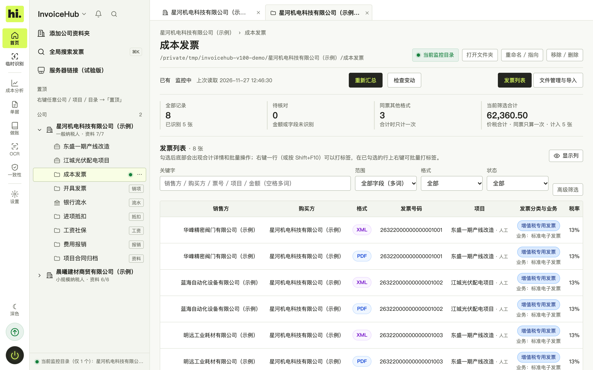
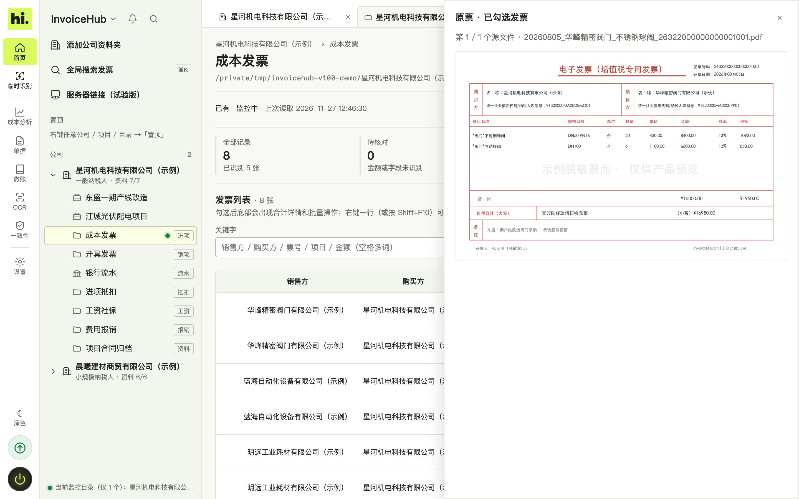
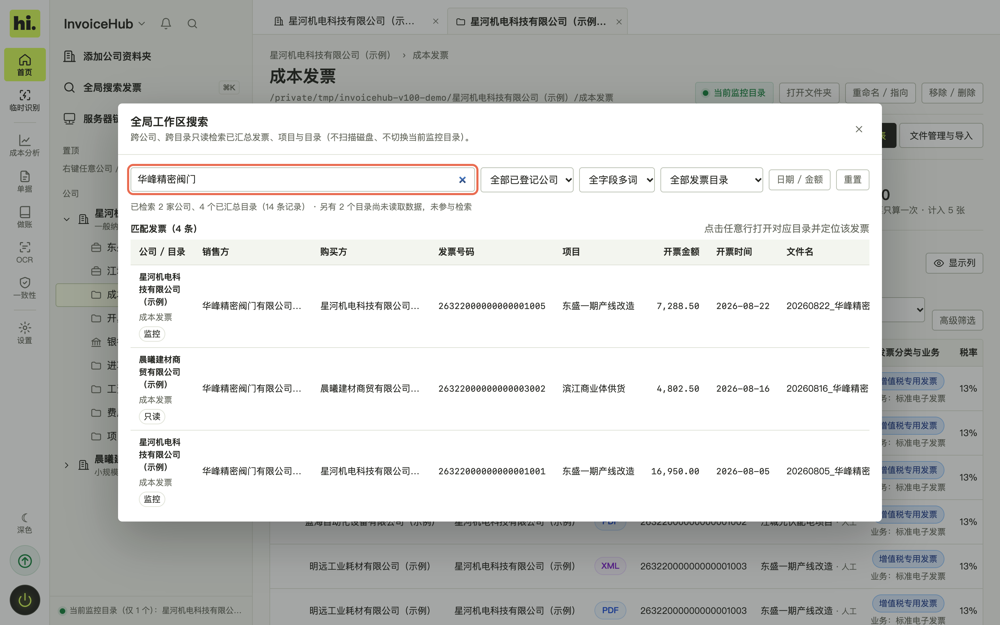
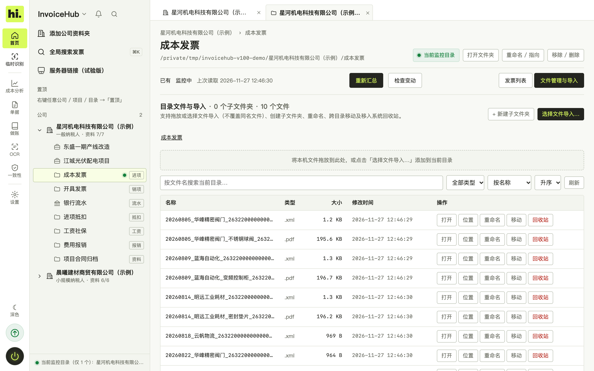
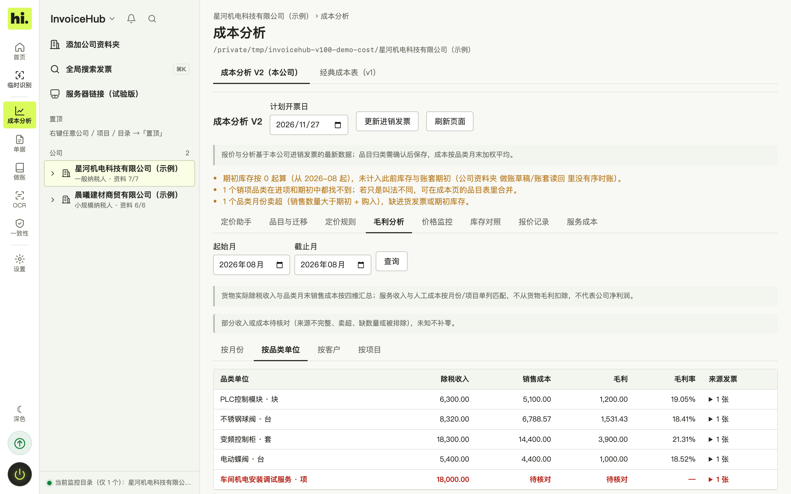
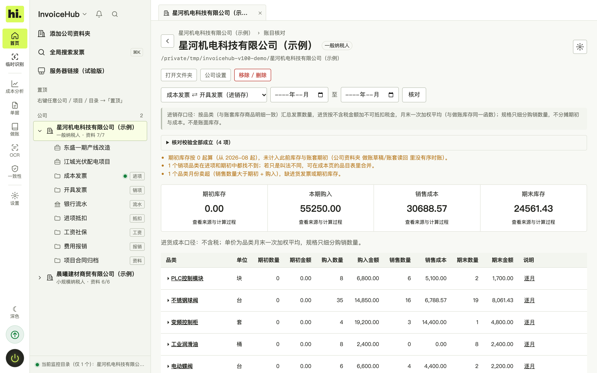
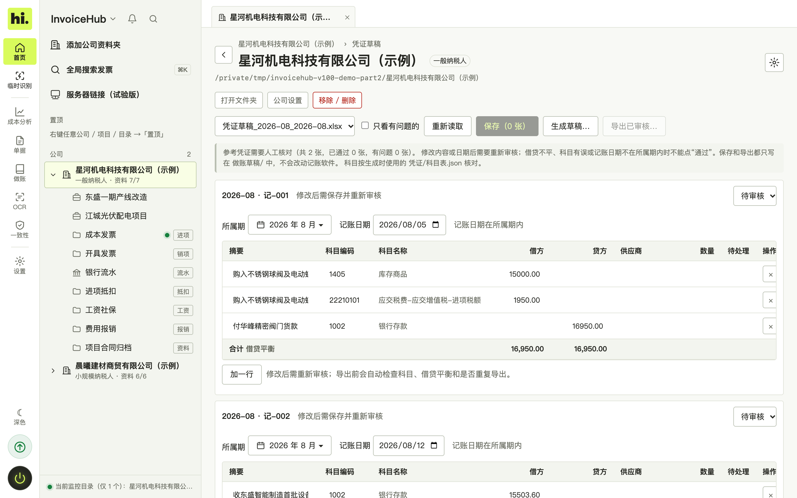

<div align="center">


# InvoiceHub

### 多公司发票、成本、勾稽与凭证，一处整理。

把散落的 PDF、OFD、XML、银行流水与公司资料夹，变成看得清、找得到、对得上的账前与做账资料。

[](https://github.com/lyc1126/InvoiceHub/releases/tag/v1.0.0)
[](https://github.com/lyc1126/InvoiceHub/releases/tag/v1.0.0)
[](src-tauri/README.md)
[](LICENSE)

**[下载 v1.0.0](#下载与安装) · [更新要点](#v100-更新要点) · [产品预览](#产品预览) · [使用指南](docs/USER_GUIDE.md) · [更新记录](CHANGELOG.md)**

</div>

---

月底对票、算成本、理流水、做凭证，不该从一张张打开文件、来回抄数字开始。

InvoiceHub 是一个开源的本地优先多公司发票与账前工作台。登记公司资料夹或选定监控目录后，发票识别、同票去重汇总、原始票面预览、跨公司检索、四维勾稽核对、成本分析 V2、自适应出入库单、通用凭证草稿导出以及按需 PaddleOCR 识别都可以在同一个工作台内完成；开启独立监控后，新放进来的发票会持续后台增量同步。

**源文件始终留在自己的电脑里，整理出来的结果随时拿得走。**

<p align="center">
  
  <br />
  <sub><code>v1.0.0</code> 示例预览：Vue 3 多公司工作区首页与实时监控目录（全脱敏合成示例数据，不含真实主体与票据）。</sub>
</p>

## `v1.0.0` 更新要点

相较上一公开预览版（`v0.3.0-alpha.2-opt.1`），`v1.0.0` 完成向多公司账前工作台的全面升级：

- **全新 Vue 3 多公司工作区**：支持三步引导建档或导入已有公司资料夹、自定义目录与默认 6 类功能角色映射，按公司独立保存标签与项目归属；支持只读挂载服务器目录（SMB / SFTP 试验版，不写入远端）。
- **原始票面预览与文件级管理（WS-12）**：列表行内侧滑直看 PDF / OFD（内置 Java 21 原生页面树渲染）/ XML 原票并支持 PDF 批量打印；目录支持切换「文件管理与导入」视图，提供拖放无覆盖导入、安全改名、跨目录移动归档与系统原生回收站回执。
- **跨公司全局检索（WS-11）**：`⌘K / Ctrl+K` 只读穿透全部公司与目录，支持购销方、票号、项目、金额、税率多词组合定位，点击命中一键直达目标记录。
- **成本分析 V2 与四维账目核对**：拆分货物与服务双路径、按品类月末加权平均核算毛利，支持 6 类定价规则、价格监控、库存对照与报价快照；新增进销存、应付/应收往来、进项抵扣与跨目录同号四维勾稽。
- **凭证草稿与通用凭证导出**：结合发票、银行流水与工资社保生成凭证草稿并实时校验借贷平衡，人工审核后默认导出软件无关的「通用凭证表（标准）」（支持无损读回，兼容品牌与自定义模板）。
- **按需 OCR 与桌面宿主可靠性**：新增「OCR」模块按需接入 PaddleOCR 官方 API 或自建服务；Tauri 2 桌面宿主强化 `/openapi.json` 与响应完整性严格握手、固定端口冲突引导恢复、以及完整代际与缓存自动容量治理。

## 产品预览

> 以下截屏均基于 `v1.0.0` 隔离合成示例环境实拍，所有公司名称、往来方、税号、票号、金额与票面内容均已完全脱敏，仅供功能预览；拍摄说明见 [截图来源](docs/screenshots/README.md)。

### 原始发票高清预览（PDF / OFD / XML）

列表行内一键侧滑展开原票预览，支持缩放、翻页、打开原文件与 PDF 批量打印；内嵌对应平台的 Java 21 / OFD 预览组件，离线还原真实票面。



### 跨公司全局检索（`⌘K / Ctrl+K`）

无需来回切目录，按关键字、票号、购销方或项目多词组合检索全部已登记公司（监控与只读目录并行命中），点击结果自动跳转并定位到对应目录与发票行。



### 通用文件管理与无覆盖导入（WS-12）

发票目录与普通资料目录均可在工作区内直接浏览子文件夹，支持拖放或选择文件无覆盖导入（自动重命名或跳过冲突）、安全改名、跨目录移动归档及走系统回收站的安全删除。



### 成本分析 V2：品目毛利与双路径核算

整合定价助手、品目与迁移、定价规则、毛利分析、价格监控、库存对照、报价记录与服务成本 8 个子页签；货物按品类月末加权平均计算销售成本与毛利率，缺进项或未归类服务项如实标注「待核对」、不猜数不补零。



### 多维账目核对（进销存 / 往来 / 抵扣）

将成本发票、开具发票、进项抵扣清单与银行流水集中勾稽，自动呈现期初、购入、销售成本、期末库存与校验项成立状态，并列出分品目加权核算明细。



### 凭证草稿审核与通用凭证导出

基于发票与流水自动整理凭证草稿，实时核验借贷平衡并支持逐行修订科目与金额，审核通过后一键导出「通用凭证表（标准）」或指定账套模板。



## 从收票，到核对与出表

| 这一步 | InvoiceHub 能帮你做什么 |
|---|---|
| **把多公司资料理顺** | Vue 3 多公司工作区支持登记已有资料夹或新建标准六类文件夹；支持自定义目录映射、独立标签与项目归属，并可只读挂载服务器目录（SMB / SFTP 试验版）。 |
| **把票收齐、找准** | 读取 PDF、OFD、XML，同票多格式按 20 位发票号码家族核对与去重合计；支持行内侧滑原票预览、PDF 批量打印与 `⌘K / Ctrl+K` 跨公司检索；扫描件可在「OCR」页按需接入 PaddleOCR。 |
| **把成本与勾稽算清** | 成本分析 V2 区分货物与服务双路径、支持公司纳税人身份时间线、6 类定价规则与已开快照；提供进销存、往来、抵扣与跨目录同号检查四维勾稽。 |
| **把单据与凭证交出去** | 导出汇总表、自适应扩行出入库单；基于发票、银行流水与工资社保生成凭证草稿，人工审核后默认导出软件无关的「通用凭证表（标准）」（支持无损读回，兼顾品牌模板）。 |
| **把重复活交给后台** | 独立监控 daemon 增量同步新增/修改/删除记录，不删除源发票并保护手改字段；完整代际与缓存自动容量治理，固定端口冲突提供引导式优雅恢复。 |

## 下载与安装

全部正式产物、SHA-256 校验和、构建收据与 CycloneDX SBOM 统一发布于 **[GitHub Releases `v1.0.0`](https://github.com/lyc1126/InvoiceHub/releases/tag/v1.0.0)**：

| 平台 | `v1.0.0` 下载地址 | 校验文件 | 开始使用 |
|---|---|---|---|
| Windows 10/11 x64 | **[InvoiceHub-v1.0.0-windows-x64-portable.zip](https://github.com/lyc1126/InvoiceHub/releases/download/v1.0.0/InvoiceHub-v1.0.0-windows-x64-portable.zip)**（约 110 MB） | [`.sha256`](https://github.com/lyc1126/InvoiceHub/releases/download/v1.0.0/InvoiceHub-v1.0.0-windows-x64-portable.zip.sha256) | 解压到新目录，运行其中的 `InvoiceHub.exe`（内置锁定 Python 3.14 与 Java 21 / OFD 组件）。 |
| macOS 13+ · Apple Silicon | **[InvoiceHub-v1.0.0-macos-arm64-preview.dmg](https://github.com/lyc1126/InvoiceHub/releases/download/v1.0.0/InvoiceHub-v1.0.0-macos-arm64-preview.dmg)**（约 164 MB） | [`.sha256`](https://github.com/lyc1126/InvoiceHub/releases/download/v1.0.0/InvoiceHub-v1.0.0-macos-arm64-preview.dmg.sha256) | 打开 DMG，将 `InvoiceHub.app` 拖到 `Applications` 后启动。 |

1. **添加公司或选目录。** 首次打开工作区按三步引导登记已有公司资料夹（或新建标准六类文件夹），也可直接为经典首页选定监控目录。
2. **自动同步与汇总。** 设为监控目录后后台自动增量解析与汇总；需要立即刷新时点击“重新汇总”。
3. **预览、核对与导出。** 在工作区完成原票预览、跨公司检索、成本分析 V2、四维勾稽、出入库单与通用凭证草稿导出。
4. **按需扩展。** 如需扫描发票或社保截图识别，可在「OCR」页配置 PaddleOCR 官方 API（需显式同意与按公司授权）或自建服务；如需只读查看共享目录，可连接 SMB / SFTP 服务器来源。

桌面窗口和系统浏览器都能使用，在设置中选择启动方式，完整退出后下次生效。关掉桌面窗口只是隐藏；关闭系统时，可以选择是否保留监控。[完整操作说明 →](docs/USER_GUIDE.md)

> 已包含启动响应完整性检查、固定端口冲突引导恢复、分阶段诊断和 Windows 浏览器兜底。遇到启动问题时，可查看[启动排障说明](docs/STARTUP_TROUBLESHOOTING.md)。

> **签名与更新说明：** `v1.0.0` Windows 便携包未代码签名；macOS 包使用 ad-hoc 签名、未经 Apple 公证，首次打开可能需要系统安全确认。当前版本禁用宿主自动更新、未发布公开更新 Feed；如需回退历史预览包，[v0.3.0-alpha.2-opt.1](https://github.com/lyc1126/InvoiceHub/releases/tag/v0.3.0-alpha.2-opt.1) 保留在 Releases。完整校验和、构建收据、SBOM 及具体已测/未测范围均以 [Releases](https://github.com/lyc1126/InvoiceHub/releases/tag/v1.0.0) 为准。

## 表格可以重建，原票始终保留

- **本地优先。** 核心发票识别、汇总、勾稽、成本与凭证生成均在本机完成；更新检查、另行配置的 PaddleOCR API 是显式授权的独立联网行为。
- **不猜金额。** 缺少可靠证据就留空，发现冲突就提示核对。手工修订的字段会受到保护。
- **结果可带走。** 普通汇总、成本资料与通用凭证导出使用标准 CSV、XLSX、JSON；SQLite 只保存任务、事件、设置和缓存，不作为发票主存储。
- **删除与缓存有边界。** 自动同步只调整投影与状态，不删除源发票；勾选删除走系统回收站；历史代际、解析缓存与服务器只读副本均有界自动回收。

## 一起把它做得更顺手

遇到某种票面识别不对，或一条操作总要多点几次，可在软件内「设置 › 关于 › 建议与反馈」一键复制脱敏版本环境后[前往 GitHub 提交 Issue](https://github.com/lyc1126/InvoiceHub/issues/new)。描述复现步骤即可；请不要公开真实发票、公司资料或凭据。

项目采用 **[AGPL-3.0-or-later](LICENSE)** 许可证。[贡献指南](CONTRIBUTING.md) · [行为准则](CODE_OF_CONDUCT.md) · [安全问题](SECURITY.md)

<details>
<summary><b>开发者文档与源码运行</b></summary>

**首页维护约定：** 仅在大型产品内容更新后，定点修改与更新直接相关的部分。日常修复、性能优化和构建验收记录写入 [CHANGELOG](CHANGELOG.md) 与 [Releases](https://github.com/lyc1126/InvoiceHub/releases)，不反复改写首页整体布局、文案和截图。

发行包已内置对应平台的 Java 21 / OFD 原票预览组件，按真实页面树输出 PNG，并在组件未变化时复用校验结果。源码开发首次构建运行 `python scripts/dev/build_ofd_preview.py --fetch`；构建、体积及验收范围见 [OFD 预览说明](docs/OFD_PREVIEW.md)。

- [开发架构总入口](docs/DEVELOPMENT_ARCHITECTURE.md) · [Agent 任务导航](docs/architecture/AGENT_TASK_MAP.md)
- [文件地图](docs/architecture/FILE_MAP.md) · [接口与流程](docs/architecture/INTERFACES_AND_FLOWS.md) · [数据与算法](docs/architecture/DATA_AND_ALGORITHMS.md)
- [实现状态](IMPLEMENTATION_STATUS.md) · [迁移清单](docs/MIGRATION_GAP_CHECKLIST.md) · [平台工作流](docs/MAC_WINDOWS_WORKFLOW.md)
- [监控与日志](docs/MONITORING_AND_LOGGING.md) · [项目约束](AGENTS.md)

Windows 源码开发：

```powershell
py -3 -m venv .venv
.\.venv\Scripts\python.exe -m pip install -e .[dev]
.\启动一站式发票汇总系统.bat -Development
```

默认服务地址为 `http://127.0.0.1:8766/`。Tauri 工具链诊断：

```powershell
.\scripts\dev\tauri-doctor.ps1 --require-ready
.\scripts\dev\tauri-bootstrap.ps1
```

桌面壳开发说明见 [src-tauri](src-tauri/README.md)。

更新协议的工程状态：L10-D 已把这些边界接入 Host RPC/updater/startup restore，响应 flush 后才进入私有 commit，失败保持 `CommitLost` 诊断。L10-E 是不安装更新的隔离恢复样本，记录 `update_requests=0`；`internal-alpha` 也不代表正式更新验收。当前版本禁用宿主自动安装更新，未发布公开更新 Feed。

</details>

## 接下来（`v1.1+` 路线）

当前核心工作区、成本 V2、通用凭证导出与按需 PaddleOCR 接入已就绪，下一阶段重点推进：

- **税务政策引擎（D0—D5）。** 当前工作区已支持公司税费记录与显式假设的手工测算；完整法规与多税种申报口径将在后续版本逐步复核接入。
- **只读服务器来源深化。** 当前支持 SMB 与 SFTP（SSH Agent 试验版）独立只读浏览与汇总；后续按需评估密码/钥匙串凭据及跨模块接入。
- **外部 Agent / MCP 扩展与更多账套模板。** 在严格脱敏与人工确认边界下，按真实样本补充更多记账软件官方导入模板，并规划 `v1.2+` 的只读外部协议接口。
