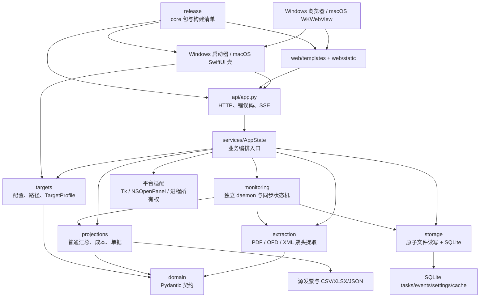
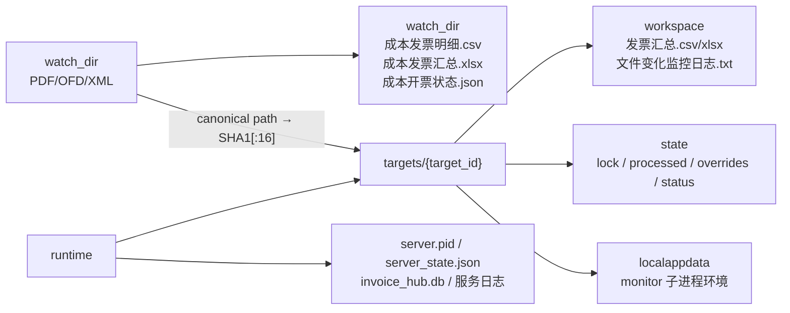

# InvoiceHub 开发架构与工程导航

> 文档状态：当前开发实现的权威架构入口
> 更新日期：2026-08-14
> 公共权威基线：经过审计的单一脱敏根提交；旧私有提交、Tag、二进制和验证材料不在公开图中
> 公开状态：候选树、保留 Git 对象和托管面已完成一次内容与凭据审计；公开图从脱敏根提交开始，详见 `docs/release/HISTORY_SANITIZATION_EXECUTION.md`
> 当前开发线：`codex/tauri2-unified-desktop` 已从公开 `main` 建立，首个版本为 `0.3.0-alpha.1`；当前仅完成 Tauri foundation，尚未形成可运行 host 或 Release
> 校验规则：精确的本地与 GitHub HEAD 以实时 `git rev-parse`、`git ls-remote` 和双向差异为准；发行源码候选不等于双平台成品 RC 或 GitHub 已发布版本

## 1. 这套文档解决什么问题

InvoiceHub 不是只有一个 FastAPI 页面。它同时包含发票提取、文件投影、成本计算、做账安全协议、独立监控进程、Windows 正式入口、macOS 本地壳、共享浏览器页面、皮肤导入、诊断事件和离线打包。任何一个字段或状态的改动，都可能沿着多条链路传播。

本页是开发者和编码 Agent 的共同入口。它回答四个问题：

1. 系统由哪些层组成，真实依赖方向是什么。
2. 一项需求应从哪个文件和哪个符号开始定位。
3. 一段看似复杂的代码在保护什么业务事实。
4. 修改之后还必须检查哪些接口、页面、产物、测试和文档。

专题文档：

- [平台架构](architecture/PLATFORM_ARCHITECTURE.md)：共享核心、Windows 与 macOS 的责任矩阵、所有权和启动时序。
- [完整文件地图](architecture/FILE_MAP.md)：逐目录、逐文件说明职责与关联。
- [接口与运行流程](architecture/INTERFACES_AND_FLOWS.md)：页面、API、SSE、服务和进程时序。
- [数据结构与算法](architecture/DATA_AND_ALGORITHMS.md)：模型、数据库、投影、算法和公式。
- [Agent 任务导航](architecture/AGENT_TASK_MAP.md)：按工程任务定位修改点和验收点。
- [注释与设计原因地图](architecture/COMMENT_RATIONALE_MAP.md)：高价值注释点及其不变量。

## 2. 事实来源和状态标记

架构说明采用以下优先级，不把历史描述机械地当作当前事实：

| 优先级 | 来源 | 用途 |
|---|---|---|
| 1 | `AGENTS.md` | 产品边界、长期规则、不可破坏的不变量 |
| 2 | 当前基线源码与测试 | 当前真正执行的行为、接口和数据结构 |
| 3 | `README.md`、`IMPLEMENTATION_STATUS.md` 等真值文档 | 运行方式、完成状态和验收口径 |
| 4 | `CHANGELOG.md` | 设计如何演进、某个保护逻辑为什么出现 |
| 5 | `docs/BASELINE_FROM_OLD_PROJECT.md` | 旧项目迁移基线，不代表重构版目录和实现 |

文中使用四种状态：

- **当前实现**：已存在于当前脱敏源码快照，或明确标注为后续 `codex/tauri2-unified-desktop` 开发候选，并有源码或测试证据。
- **历史原因**：用于解释设计形成过程，不表示旧实现仍然存在。
- **未启用能力**：保留接口或页面，但当前正式产品明确禁用。
- **架构债务**：当前可以运行，但结构、重复或测试覆盖仍有维护风险。

公开历史采用新的根提交，不与旧私有版本、包、Tag 或收据建立可误解的来源关系。版本/依赖单一真值、平台 runtime、SBOM、源码快照和 CI 门禁仍必须闭合；公开二进制只能从新的 RC 输入、完整性、签名和嵌入身份生成。

远端可达历史曾发现真实目录及私有标识。所有者已批准净化；在候选树、保留 Git 对象和托管面验证完成前，公开、Release、Feed 和 `v0.3` 分支创建均暂停。

阻断解除后，`v0.3` 从公开后的 `main` 演进。Tauri 2 只提供窗口、托盘、单实例、原生面板、打印、后端生命周期、随机令牌 Host RPC 和 updater，继续复用 Python/FastAPI/Web/monitor 业务核心。它只能绑定 `127.0.0.1:8766`，未知端口占用必须失败；不能自动换端口或接入旧实例。

源码采用单仓库共存，平台成品采用互斥边界：Windows 或 macOS 的 checkout 都可包含另一平台工程，但 Windows ZIP 与 macOS `.app/DMG/Sparkle ZIP` 的构建输入、依赖锁、运行时和启动器分别受独立白名单与反向平台拒绝门禁保护。共享 `src/`、`web/` 只避免业务分叉，不表示平台壳或 runtime 可以交叉进入成品。

退休的预公开包和平台资产只保留在私有备份中，绝不能上传、配对或用作公开 Release 证据。macOS 正式发布仍需要新的 Developer ID、签名和公证证据。

## 3. 第一性原则

### 3.1 真值与投影

- 源 PDF/OFD/XML 发票是业务事实。
- 普通 CSV/XLSX、成本 CSV/XLSX 和状态 JSON 是可重建投影。
- SQLite 只保存任务、事件、设置和缓存能力，不保存发票主数据。
- 删除同步只删除投影记录和状态，不删除源发票。

### 3.2 准确性优先

- 字段策略是“宁可空，不要脏值”。
- 金额必须通过合法格式校验；PDF 优先使用同页 `价税合计/小写` 锚点、货币符号、唯一有序三元组和 `0.02` 算术容差，失败后只允许同行或紧邻货币值的明确标签证据。
- 文件名不能回填正文缺失的核心字段，只能辅助同票家族、重复判断和路径展示。
- `invoice_type` 与 `business_type` 是两个独立维度；证据冲突必须保留冲突而不是强行覆盖。
- 用户手改的 `销售方/开票金额/发票号码` 优先于自动纠偏。

### 3.3 快速启动但后台自愈

- `/` 和 `/api/v1/health` 应尽快可用。
- 首轮普通汇总、成本同步和诊断在后台自动执行。
- monitor 是独立 daemon，不是 FastAPI 内线程。
- monitor 启动成功必须代表首次同步、观察器或周期兜底、补漏同步都已初始化并写入 `ready=true`。

### 3.4 路径隔离

- `watch_dir`：源发票及成本三件套。
- `workspace`：普通汇总和业务监控日志。
- `state_dir`：lock、processed、manual overrides、monitor status。
- `runtime`：localhost PID、SQLite、服务日志、偏好和皮肤。
- 每个活动目录通过 SHA1 派生的 `target_id` 获得独立档案。

## 4. 总体架构



理想依赖方向是“外层适配器依赖内层领域和服务”。当前真实结构中，`AppState` 同时依赖几乎所有子系统，是路由统一入口，也是最明显的架构债务。文档不会把它伪装成已经拆分完成的整洁服务层。

## 5. 目录树与职责

```text
仓库根
├─ AGENTS.md / CHANGELOG.md / README.md      治理、演进和使用真值
├─ config/                                   本地配置；不得泄露业务绝对路径
├─ .github/workflows/                        非发布 CI；不持有签名与发布权限
├─ docs/                                     架构、迁移、监控、Git、平台与发行手册
├─ macos/InvoiceHubMac/                      SwiftUI/WKWebView 壳、Sparkle 与正式构建脚本
├─ requirements/                             按平台/用途拆分的输入与哈希锁
├─ scripts/dev/                              开发测试和构建入口
├─ scripts/tools/                            随包做账 runner 包装
├─ scripts/windows/                          正式 Windows 启停和 monitor 入口
├─ src/invoice_hub/
│  ├─ domain/                                领域模型与外部契约
│  ├─ bookkeeping/                           W8/W9 做账状态、校验、映射和批次
│  ├─ extraction/                            票头提取、分类、同票纠偏
│  ├─ projections/                           汇总、成本、单据及 Excel 模板
│  ├─ targets/                               配置解析、运行目录和档案隔离
│  ├─ storage/                               原子文件操作与 SQLite 仓库
│  ├─ monitoring/                            daemon、lock、事件合并和同步
│  ├─ services/                              AppState、monitor bridge、皮肤与更新服务
│  ├─ api/                                   FastAPI 页面/API/SSE 适配
│  ├─ platform/                              Windows 原生交互边界
│  ├─ release/                               双平台清单、组装、验证、SBOM、Feed、源码快照
│  └─ runners/                               绑定批次 manifest 的随包 runner
├─ web/templates/                            真实 HTML 页面结构
├─ web/static/                               公共 CSS、页面 JS、内置皮肤
├─ tests/                                    Python、API、静态前端和发布契约
├─ 发票文件/                                 脱敏默认 watch_dir 占位
└─ 根目录三个 BAT                            用户第一视图正式入口
```

详细到每个文件的地图见 [FILE_MAP.md](architecture/FILE_MAP.md)。

## 6. 运行态拓扑



`server_state.json` 只诊断 localhost。monitor 真值是存活 PID 加 `state_dir/.invoice_monitor.lock`。成本产物必须留在 `watch_dir`；普通汇总必须留在对应档案的 `workspace`。

## 7. 主要模块如何协作

| 模块 | 主要入口 | 负责 | 不负责 |
|---|---|---|---|
| `domain` | `InvoiceRecord`、`CostAnalysisSnapshot`、`TargetProfile` | 稳定的数据契约 | 文件扫描和业务编排 |
| `targets` | `load_config`、`target_profile_for`、`ensure_runtime_layout` | 配置、路径解析、冲突隔离 | 发票内容 |
| `extraction` | `extract_invoice_record`、`apply_invoice_family_corrections` | 票头证据、分类、同票纠偏 | CSV/XLSX 展示 |
| `projections` | `build_summary`、`CostProjectionService`、单据函数 | 可重建投影和报表 | 长期主数据 |
| `bookkeeping` | `VoucherExecutabilityValidator`、映射/迁移/批次仓储 | W8/W9 做账协议与确定性状态 | 浏览器自动化和平台窗口 |
| `storage` | `atomic_write_json`、`SQLiteRepository` | 原子读写、任务、事件 | 发票主存储 |
| `monitoring` | `run_monitor`、`MonitorSynchronizer.run_sync` | 持续观察、变化判断、自动重建 | Web 页面生命周期 |
| `services` | `AppState`、`MonitorBridge`、`SkinService`、`UpdateService` | 用例编排、并发锁、平台协调与受限更新检查 | HTTP 细节 |
| `api` | `create_app` | HTTP、错误码、静态文件、SSE | 重复业务算法 |
| `platform` | `pick_directory`、`open_local_path` | Windows Python 适配；macOS 原生适配在 Swift 壳 | 领域判断 |
| `release` | `build_core`、三类 manifest、`provenance`、`update_metadata`、`sbom`、`source_snapshot` | 脱敏确定性包、身份/依赖证明、从真实产物/收据/Tag 派生的更新元数据与对应源码；公开 Feed 在 macOS 用 Tag 派生验证器复验实际成品 | 用户业务数据迁移或外部平台发布 |

## 8. 端到端主链

一次普通重建的核心路径是：

```text
BAT/页面/monitor 触发
  → AppState.bridge_rebuild 或 MonitorSynchronizer.run_sync
  → supported_invoice_files
  → extract_invoice_record(PDF/OFD/XML)
  → apply_invoice_family_corrections
  → build_summary → workspace/发票汇总.csv + xlsx
  → CostProjectionService.rebuild
  → build_cost_analysis_outputs
  → watch_dir/成本三件套
  → SQLite event
  → /api/v1/events/stream
  → 页面按事件刷新
```

接口、错误和完整时序见 [INTERFACES_AND_FLOWS.md](architecture/INTERFACES_AND_FLOWS.md)。算法和数据校验见 [DATA_AND_ALGORITHMS.md](architecture/DATA_AND_ALGORITHMS.md)。

源文件预览也是主数据链旁边的只读流程：`AppState` 逐条复核选择身份和 `watch_dir` 边界，`FilePreviewService` 保存短期不透明作业、文件签名和按需 PNG/纯文本缓存；PDF/OFD/SVG 与打印复用 `document_rendering.py` 的 MuPDF 层，常见图片由 Pillow 解码，未知格式只提供元信息。浏览器不接收绝对路径，主动内容不进入 DOM，流程不写源票、投影、runtime 文件或 SQLite 发票主数据。

批量打印是主数据链旁边的只读流程：`AppState` 重新校验勾选身份并按同票家族选出当前 `watch_dir` 内的 PDF，`InvoicePrintService` 在工作线程中生成有时限和容量上限的内存 PNG 页。独立打印页等待全部票面完成 `load + decode` 和两次浏览器渲染帧，再调用 `window.print()`；命名页只声明横/纵方向，纸型沿用打印机或用户选择，票面盒使用页框百分比而非固定 A4 或动态打印视口尺寸，避免预览重排反馈。该流程不写源发票、普通/成本投影或 SQLite 发票主数据，也不能把浏览器对话框状态解释为实体打印结果。

## 9. 新开发者阅读顺序

1. 先读 `AGENTS.md`，理解产品边界和不可破坏规则。
2. 阅读本页第 3 至第 8 节，建立系统模型。
3. 阅读 `domain/models.py` 和 `targets/paths.py`，理解契约和路径。
4. 阅读 `extraction/parsers.py`、`projections/summary.py`，跟一次普通汇总。
5. 阅读 `projections/cost_analysis.py`、`projections/costs.py`，理解成本算法与状态。
6. 阅读 `monitoring/daemon.py`、`monitoring/sync.py`、`services/monitor_bridge.py`，理解持续运行。
7. 阅读 `api/app.py`、相关模板和页面 JS，理解用户界面如何消费状态。
8. 阅读 [PLATFORM_ARCHITECTURE.md](architecture/PLATFORM_ARCHITECTURE.md)，区分共通核心与 Windows/macOS 适配边界。
9. 用 [AGENT_TASK_MAP.md](architecture/AGENT_TASK_MAP.md) 选择任务入口和测试范围。

## 10. 当前架构债务与未启用能力

| 状态 | 事实 | 维护含义 |
|---|---|---|
| 架构债务 | `services/app_state.py` 聚合大量跨域用例 | 改动前必须按用例定位，避免把不相关逻辑一起重构 |
| 架构债务 | `cost_analysis.py` 与 `costs.py` 有参考键、加价和锁定快照的对应实现 | 修改公式必须双向核对并跑成本全链测试 |
| 架构债务 | 路径规范化在 `targets`、`monitoring`、成本和选择合计中有不同语境实现 | 不能仅凭函数同名就机械合并 |
| 架构债务 | `base_head.html` 存在，但页面仍各自维护 head 和资源版本 | 静态资源变更必须逐模板核对版本参数 |
| 架构债务 | 当前前端自动化主要是静态契约测试 | UI 改动仍需要真实浏览器/DOM 验收 |
| 架构债务 | Windows 首版没有内置桌面 WebView 壳 | Tauri foundation 尚未改变这一事实；`startup_surface=desktop` 仍须在当前 Windows source/portable 路径 fail closed，不能让设置项暗示已实现 |
| 发布阻断 | Windows 与 macOS 正式脚本已实现但真机/签名证据未齐 | 自动化通过不等于 ZIP/DMG 已放行，必须分别执行平台手册 |
| 未启用能力 | OCR 页面和 API 保留候选文件入口 | core 包未内置正式本地 OCR，提取接口返回禁用状态 |
| 当前实现 | SQLite 建有 `settings` 和 `cache` 表 | 当前主要业务消费者集中在 `tasks/events`，不能误称已有数据库主存储 |

## 11. 文档维护规则

- 新增、删除或重命名工程文件：同步 `FILE_MAP.md` 和文档契约测试。
- 修改平台入口、选择器、进程所有权、构建握手或打包：同步 `PLATFORM_ARCHITECTURE.md` 和平台工作流。
- 修改 API、SSE、页面消费或错误语义：同步 `INTERFACES_AND_FLOWS.md`。
- 修改字段、公式、数据库或状态 JSON：同步 `DATA_AND_ALGORITHMS.md`。
- 修改跨模块影响范围或验收门禁：同步 `AGENT_TASK_MAP.md`。
- 在复杂代码旁新增注释：先核对 `COMMENT_RATIONALE_MAP.md`，只解释原因和不变量。
- 不在文档中写本机业务绝对路径、真实发票信息、运行态快照或本地配置值。
- 不维护易漂移的固定测试总数；以当前测试收集结果为准。
- 每次基线切换必须记录分支、commit、验收状态，并更新 `CHANGELOG.md`。

## 12. 相关真值文档

- [`AGENTS.md`](../AGENTS.md)
- [`CHANGELOG.md`](../CHANGELOG.md)
- [`README.md`](../README.md)
- [`IMPLEMENTATION_STATUS.md`](../IMPLEMENTATION_STATUS.md)
- [`MIGRATION_GAP_CHECKLIST.md`](MIGRATION_GAP_CHECKLIST.md)
- [`BASELINE_FROM_OLD_PROJECT.md`](BASELINE_FROM_OLD_PROJECT.md)
- [`MONITORING_AND_LOGGING.md`](MONITORING_AND_LOGGING.md)
- [`MAC_WINDOWS_WORKFLOW.md`](MAC_WINDOWS_WORKFLOW.md)
- [历史净化执行记录](release/HISTORY_SANITIZATION_EXECUTION.md)
- [更新体系开发说明](release/UPDATE_SYSTEM.md)
- [平台架构附录](architecture/PLATFORM_ARCHITECTURE.md)
