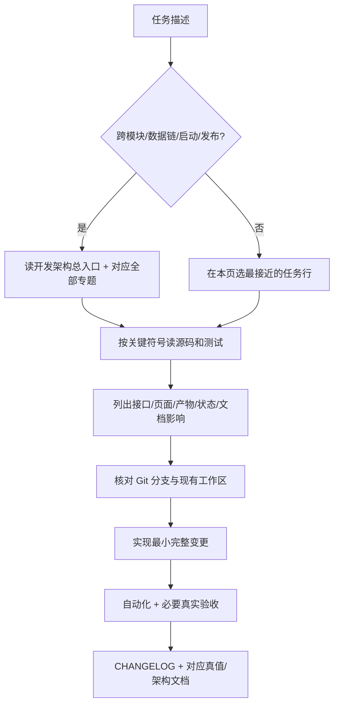

# InvoiceHub Agent 工程任务导航

> 作用：把自然语言任务转换成“先读哪里、从哪个符号开工、会影响什么、至少测什么”。
> 公共权威基线：单一脱敏根提交；退休私有提交、Tag、包和验证材料不在公开图中。
> 当前边界：候选树、Git 对象和托管面验证已完成；`v0.3.0-alpha.1` Tauri 2 开发分支已从公开 `main` 建立，版本/环境/Cargo lock 与代码级 lifecycle/Host RPC/updater 和隔离 TestClient L6 contract 已通过受控验证。裸 checkout 仍缺经编译绑定 manifest；development assembler 已构建并隔离烟测一个 macOS arm64 `.app`，但尚无 Release。
> 校验规则：精确的当前本地与 GitHub HEAD 以实时 Git 引用和双向差异为准。

## 1. 使用方法

每个新任务仍必须先读仓库根 `AGENTS.md`。涉及识别、汇总、localhost、OCR、成本、启动、发布或旧行为对照时，再按 `AGENTS.md` 读取全部相关真值文档。本页不能替代这些规则，只负责定位工程入口。



“最低测试”是下限，不是完整验收替代。跨两个以上业务模块、改变共享字段/状态/公式或用户可见行为时，收尾应运行完整 pytest 和 `compileall`；Windows、浏览器、选择器和打包只在实际执行后才能声明覆盖。

## 2. 通用开工门禁

1. 读取 `AGENTS.md`，确认产品边界、数据不变量和本任务必读真值。
2. 执行 `git status --short --branch --ignored`，确认当前分支、基线、用户修改和 ignored 运行态。
3. 当前公共实现以实时 `origin/main` 为准；功能开发必须记录当前分支和起点，并比较当前分支、`origin/main` 与 GitHub 实际引用。本地 `main` 不能在未核验时被假定为最新。
4. 在 [完整文件地图](FILE_MAP.md) 找到目标文件的上下游和同步检查项。
5. 在 [接口流程](INTERFACES_AND_FLOWS.md) 找页面/API/事件消费者，在 [数据算法](DATA_AND_ALGORITHMS.md) 找公式和失败策略。
6. 修改前写出本次不会改变的真值、接口和产物；这一步决定相邻回归范围。

## 3. 发票提取与金额准确性

| 导航项 | 内容 |
|---|---|
| 首先阅读 | 数据算法第 7 节；接口流程第 6.4 节；`AGENTS.md` 数据准确性规则 |
| 首要入口 | `extraction/parsers.py::extract_invoice_record`、`_record_from_text`、`_record_from_xml`、`_record_from_ofd`、`_normalize_money`、`_extract_pdf_amount_triple`、`_first_money_near`、`_extract_einvoice_value_sequence` |
| 必须联动 | `extraction/__init__.py` 公共导出、`projections/summary.py`、成本元数据、详情/一致性/API 字段；新字段还要改 `domain/models.py` |
| 产物与消费者 | 普通 CSV/XLSX、`GET /api/v1/invoices`、详情、成本校验和一致性报告 |
| 最低自动化 | `tests/test_summary_and_costs.py` 覆盖同页唯一三元组、同行标签、零税、红票、重复明细、两小数拒绝、歧义、不一致、无货币符号和跨页；再跑分类、API 详情/成本与完整 pytest |
| 真实验收 | 有真实版式时做旧/新影子对照，再检查 CSV/XLSX、列表、详情、勾选合计、成本状态与一致性；不能只看页面一格 |
| 高风险提醒 | 不得用文件名补正文核心字段，不得恢复全文最大金额；主体序列不得产出金额；多个三元组、跨页或算术不一致必须放弃 |

## 4. 发票分类与同票家族

| 导航项 | 内容 |
|---|---|
| 首先阅读 | 数据算法第 7.4 节；`AGENTS.md` 两维分类与同票冲突规则 |
| 首要入口 | `extraction/classification.py::classify_invoice`、`canonical_business_type`、`classification_status`；`parsers.py::_pdf_classification`、`_ofd_classification`、`apply_invoice_family_corrections` |
| 必须联动 | `InvoiceRecord`、summary 表头、`AppState.list_invoices/_build_consistency_groups`、成本校验字段、index/detail/consistency JS 与模板 |
| 产物与消费者 | 普通汇总四个分类字段、列表筛选、详情、一致性、成本“发票校验”sheet |
| 最低自动化 | 完整 `tests/test_invoice_classification.py`，加 `tests/test_summary_and_costs.py` 的同票纠偏测试、API 一致性测试、前端契约 |
| 真实验收 | 新业务样式必须区分“合成测试通过”和“真实票验证”；检查当前皮肤与 `?no_skin=1` 的徽标/长文本 |
| 高风险提醒 | 大类与业务样式不能合并；公司/项目/商品同名词不能触发业务类型；非空冲突不能被优先级吞掉 |

## 5. 成本明细、均价和开票参考

| 导航项 | 内容 |
|---|---|
| 首先阅读 | 数据算法第 8、9 节；接口流程第 3.3、6.6 节；`AGENTS.md` 成本规则 |
| 首要入口 | `projections/cost_analysis.py::parse_cost_rows_from_words`、`_cost_validation`、`_select_cost_analysis`、`project_spec_summary`、`_invoice_reference_summary`；`projections/costs.py::CostProjectionService`；`AppState.cost_snapshot/save_cost_reference_status` |
| 必须联动 | `cost_analysis.py` 与 `costs.py` 的重复公式/兼容键；`domain/models.py`、成本 CSV/XLSX 五 sheet、状态 JSON、cost API、page-costs、单据入库来源 |
| 产物与消费者 | `watch_dir/成本发票明细.csv`、`成本发票汇总.xlsx`、`成本开票状态.json`、详情/选择成本拆分、单据 |
| 最低自动化 | 完整 `tests/test_summary_and_costs.py`，成本相关 `tests/test_invoice_classification.py` 和 `tests/test_api_contract.py`；页面字段变化再跑 `test_frontend_contract.py` |
| 真实验收 | 页面四标签互斥、TSV 复制、行级加价草稿/保存/刷新、实际工作簿五 sheet；真实业务版式检查校验差异 |
| 高风险提醒 | 库存均价与采购算术均价不能混用；已开快照不能随新增明细漂移；默认 8% 只是行级 fallback；税率固定 13% 是当前开票参考公式。旧 schema 修复、状态 JSON 和工作簿写入必须同 monitor 共用所捕获 profile 写锁，且不能阻塞 health 或把旧 profile 完成事件投到新目录 |

## 6. 目录、配置与 TargetProfile

| 导航项 | 内容 |
|---|---|
| 首先阅读 | 开发架构第 3.4、6 节；数据算法第 4、6 节；接口流程设置接口 |
| 首要入口 | `targets/paths.py::load_config`、`serialize_config_path`、`target_id_for`、`target_profile_for`、`ensure_runtime_layout`；`AppState.update_settings` |
| 必须联动 | Windows 启动/停止脚本的路径解析、monitor control/daemon、CostProjectionService、SkinService、release 默认配置 |
| 产物与消费者 | `config/app.local.json`、runtime、目标 workspace/state/localappdata、普通与成本输出路径 |
| 最低自动化 | `tests/test_paths.py`、设置目录 API 测试、monitoring 路径用例、`tests/test_release.py` |
| 真实验收 | 项目内相对目录、包外绝对目录、中文空格路径、缺失目录、同名文件/目录冲突；原生选择器只在 Windows 实测后声明 |
| 高风险提醒 | 不读取或提交本机配置值；同一配置在 API、daemon、BAT 和打包内必须解析一致；成本产物不能搬到 workspace |

## 7. Monitor、文件事件和后台同步

| 导航项 | 内容 |
|---|---|
| 首先阅读 | 接口流程第 6.1 至 6.5 节；数据算法第 6、13 节；`docs/MONITORING_AND_LOGGING.md` |
| 首要入口 | `monitoring/daemon.py::run_monitor`、`monitoring/sync.py::MonitorSynchronizer.run_sync`、`monitoring/state.py::MonitorState`、`services/monitor_bridge.py::MonitorBridge`、`AppState.run_background_diagnostics` |
| 必须联动 | bridge API、SSE 事件、首页/设置/成本/单据刷新、Windows monitor PS1/BAT、SQLite events |
| 产物与消费者 | lock、stop flag、processed、manual overrides、monitor status、业务日志、bridge stdout/stderr |
| 最低自动化 | 完整 `tests/test_monitoring.py`，启动后台同步和 bridge API 测试；事件变化再跑 SSE API 与前端契约 |
| 真实验收 | daemon start/ready、启动后立即放文件、事件 1 秒合并、60 秒兜底、停止 localhost 后 monitor 仍在、stop-all 退出 |
| 高风险提醒 | PID+lock 才是运行真值；ready 必须在第二次补漏后；周期无变化不能全量解析；正式入口不能退回 FastAPI 内线程 |

## 8. 设置、偏好、诊断与 WebUI 关闭

| 导航项 | 内容 |
|---|---|
| 首先阅读 | 接口流程第 3.1、6.10 节；AGENTS 持续监听与关闭规则 |
| 首要入口 | `AppState.settings/preferences/save_preferences/diagnostic_*`、`request_server_shutdown/finalize_server_shutdown`；`api/app.py::shutdown`；`page-settings.js` |
| 必须联动 | settings 模板、settings-actions CSS、common SSE、bridge、server state/PID、两个正式停止 BAT 的固定语义 |
| 产物与消费者 | preferences、support packages、server_state、server.pid、events；设置页所有分类 |
| 最低自动化 | 设置/偏好/诊断/关闭 API 测试 + `tests/test_frontend_contract.py`；涉及 bridge 再跑 monitoring |
| 真实验收 | 两种关闭选择、记住/恢复询问、停止 monitor 失败时 WebUI 保留、响应先返回后进程退出、皮肤与 no-skin 两种页面 |
| 高风险提醒 | 页面偏好不能改变两个停止 BAT；不能假设 PID 文件等于 `os.getpid()`；只在 PID 内容仍等于请求快照时删除 |

## 9. 前端页面与静态资源

| 导航项 | 内容 |
|---|---|
| 首先阅读 | 接口流程第 2 至 5、7 节；AGENTS“接口与前端同步”全部规则 |
| 首要入口 | 目标 `web/templates/*.html`、对应 `web/static/js/page-*.js`、`common.js`、`app.css`；API 消费矩阵见接口专题 |
| 必须联动 | 后端字段/错误、页面文案、空/错误/处理中状态、资源 `?v=`、所有引用同一 CSS/JS 的模板和前端契约 |
| 产物与消费者 | 浏览器 DOM、真实 table/TSV、SSE 状态、当前活动皮肤与基础无皮肤样式 |
| 最低自动化 | `tests/test_frontend_contract.py` + 相关 API 契约；JS 运行时可用时对改动文件做语法检查 |
| 真实验收 | 当前 localhost 必须实际送达新 `?v=` 与文件；桌面/390px、当前皮肤/`?no_skin=1`、关键交互、控制台和滚动链 |
| 高风险提醒 | 未保存目录草稿不能被刷新覆盖；普通禁用态不能显示等待光标；SSE 必须同时处理断线和重连；表格不能改成 div 卡片；共享桌面基础 CSS 不得因缺失大括号被包入移动端 `@media`，契约必须检查规则作用域而非只查选择器文本；详情成本区的固定高度 Grid 必须让隐式项目行按 `max-content` 排布并由外层滚动，不能把带 `overflow:hidden` 的项目卡压扁后裁掉规格表 |

## 10. 入库单与出库单

| 导航项 | 内容 |
|---|---|
| 首先阅读 | 接口流程第 3.4、6.8 节；数据算法第 10、12.3 节 |
| 首要入口 | `projections/documents.py::build_inbound_preview/build_outbound_preview/write_*_workbook/rmb_uppercase/_ensure_detail_rows`；AppState 的 `_inbound/_outbound_document_target` 和导出方法 |
| 必须联动 | 两个 Excel 模板、documents API、page-documents、设置页单据目录/默认值、平台打开文件 |
| 产物与消费者 | `watch_dir/入库单/*.xlsx`、`outbound_invoice_dir/出库单/*.xlsx`；预览与导出状态 |
| 最低自动化 | 完整 `tests/test_documents.py` + 单据前端契约；路径配置变化再跑 paths/API |
| 真实验收 | 5 行与超模板行数、合并单元格/格式、覆盖/副本/取消/打开、文件占用、删除后重导、实际 Excel/WPS 打开 |
| 高风险提醒 | 单据不进入 monitor 自动生成；入库逐明细不合并；服务端只接受计算出的受控根内路径 |

## 10.1 发票预览与批量打印

| 导航项 | 内容 |
|---|---|
| 首先阅读 | 数据算法第 12.5 节；接口流程第 2、3.2、6.12 节；`AGENTS.md` 路径与 macOS bridge 规则 |
| 首要入口 | `services/file_preview.py`、`services/invoice_printing.py`、`services/document_rendering.py`、`AppState.prepare_invoice_preview/keep_invoice_preview_alive/prepare_invoice_print`、`page-index.js`、`invoice_print.html` |
| 必须联动 | API 路由/错误、预览闲置续租与 `404/410` 恢复、首页 DOM/CSS/静态版本、build manifest capabilities、Swift required routes 和 popup policy、OpenAPI verify、接口/数据/平台文档 |
| 产物与消费者 | 短期内存 job、分页 PNG/XML 文本、受控打印 HTML、macOS 系统打印面板；不产生 SQLite 或投影主数据 |
| 最低自动化 | `test_file_preview.py`、`test_invoice_printing.py`、两份预览/打印前端契约、`test_api_contract.py`、`test_build_manifest.py`、`swift test` |
| 真实验收 | 预览分页/缩放/打开文件和位置；弹窗超过原 15 分钟截止时间后仍可用；后台/恢复前台、后端重启和 job 回收后自动回到原文件/页码；批量打印同票收敛、首次打开非空、横纵混排，并核对 A4 与打印机保留 A5/default margins 时“源页数 = 打印纸数”；真实 WKWebView 系统面板及取消，不实际出纸 |
| 高风险提醒 | preview 不得按同票收敛；续租只能滑动延长闲置期限，弹窗关闭必须停止，不得绕过目录/源文件/缓存边界；print 不得接受任意路径或非 PDF；popup 只能 exact about:blank -> 同端口 print job，不能带通用 bridge；首印必须等待 `load + decode` 和两次渲染帧，不能固定 A4、使用打印态 `100vw/100vh` 或在末页后强制分页 |

## 10.2 业务资料夹与做账 W8/W9

| 导航项 | 内容 |
|---|---|
| 首先阅读 | 接口流程第 3.5 节；数据算法第 3.2、4.5 节；`AGENTS.md` 做账全部规则 |
| 首要入口 | `AppState.business_dossier/_scan_business_dossier/bookkeeping_*`；`bookkeeping/repository.py`、`validator.py`、`vouchers.py`、`decisions.py`、`catalogs.py`、`mapping.py`、`batches.py`；首页资料夹容错在 `page-index.js`，做账页在 `page-bookkeeping.js` |
| 必须联动 | 公司资料夹受控路径、profile/catalog/mapping/store 绑定、proposal revision、统一 validator、batch manifest/XLSX、API/页面 blockers、runner facts |
| 产物与消费者 | 公司资料夹 `凭证/` 下 JSON、批次、日志；`/api/v1/business-dossier*`、`/api/v1/bookkeeping/*` 和做账页 |
| 最低自动化 | 资料夹变化至少运行 `tests/test_api_contract.py` 的资料夹/线程池/有界扫描用例与 `tests/test_frontend_contract.py` 的资料夹刷新容错契约；做账变化运行全部 `tests/test_bookkeeping_*.py`、`test_api_bookkeeping.py`、`test_runner_dryrun.py` |
| 真实验收 | W9 profile/科目/辅助/映射人审必须基于目标账套重新采集；真实 Safari apply、读回和 reconcile-only 属 W10，每次 apply 仍需当回合明确授权 |
| 高风险提醒 | 资料夹导航不得变成完整发票扫描或任意本机打开器；截断统计和 `os.scandir` 迭代中断后的累计统计都必须显式标为下界且不能阻塞发票列表。做账不得自动迁移、不绕过 blockers、不猜最新 XLSX、不直接写状态 JSON；测试通过不授权真实账套迁移、审批、导出或导入 |

## 11. 皮肤系统

| 导航项 | 内容 |
|---|---|
| 首先阅读 | 接口流程第 3.6、6.9 节；数据算法第 12.2 节；AGENTS 皮肤安全规则 |
| 首要入口 | `services/skins.py::validate_skin_zip/SkinService`、`api/app.py::_skin_zip_body/active_skin_link`、page-skins、common 首屏水合 |
| 必须联动 | 内置 `skin.json/skin.css/asset-sources.json`、字体/纹理、设置外观分类、所有普通模板和 no-skin 恢复 |
| 产物与消费者 | `runtime/local_state/skins`、服务端 CSS/资产响应、普通页面样式 |
| 最低自动化 | 皮肤相关 `tests/test_api_contract.py` + `tests/test_frontend_contract.py` + `tests/test_paths.py` 的存储隔离 |
| 真实验收 | 导入/替换/启用/重置、恶意 ZIP 拒绝、当前皮肤与 no-skin、桌面/移动关键业务表格不被破坏 |
| 高风险提醒 | 禁止 JS/HTML/脚本/远程资源；先全量校验再写盘；导入目录不能是 watch_dir；内置同 id 不能被覆盖 |

## 12. Windows 正式入口与平台交互

| 导航项 | 内容 |
|---|---|
| 首先阅读 | 接口流程第 6.1、6.10 节；AGENTS Windows 与验收规则；`docs/MAC_WINDOWS_WORKFLOW.md` |
| 首要入口 | 根四个 BAT、`scripts/windows/InvoiceHub.Windows.psm1`、启动/停止/monitor/设置迁移 PS1、`platform/windows.py`、`native_dialogs.py` |
| 必须联动 | config/targets 路径、API 入口、package/build/runtime manifest、server PID/state/log、MonitorBridge、浏览器派发、Windows 锁和 portable 验包 |
| 产物与消费者 | 用户双击入口、`.lnk`、localhost/monitor 进程、runtime 诊断文件、系统壳/选择器 |
| 最低自动化 | paths/monitoring/API/release/update/settings-migration/Windows contract 与 `compileall`；PowerShell parser、UTF-8 BOM、固定路径/PATH PS7 选择、强制 PS5.1 和无 charset UTF-8 health 中文路径动态回归 |
| 真实验收 | 正式根 BAT 启动、首页与 health、连续/并发启动、stale state、外部占端口、只停 WebUI、stop-all、根快捷方式、浏览器拉起、原生选择器 |
| 高风险提醒 | 含非 ASCII 且可能由 PS 5.1 执行的发布 PS1 必须 UTF-8 BOM；固定 Program Files 路径不存在不代表没有 PS7，必须继续解析 PATH/App Execution Alias；PS5.1 不得直接信任无 charset JSON 的 `.Content`，必须按原始 UTF-8 字节解码后继续严格身份检查；自动化 Python 测试不能替代成品 BAT；系统壳派发成功后不要重复开 URL |

## 12.1 macOS 壳、构建握手与原生桥接

| 导航项 | 内容 |
|---|---|
| 首先阅读 | [平台架构](PLATFORM_ARCHITECTURE.md)第 5 至 8 节；接口流程第 3.2、6.12 节；`AGENTS.md` macOS 本地壳规则 |
| 首要入口 | `BackendPaths.swift`、`LocalBackendController.swift`、`BuildHandshake.swift`、`InvoiceHubSparkleUpdater.swift`、`StartupSurface.swift`、`WebView.swift`、`InvoiceHubAPIClient.swift`、`InvoiceHubMacApp.swift`、开发与正式三个 release 脚本 |
| 必须联动 | Python build/package/runtime manifest/health、OpenAPI 路由、API/做账协议/capabilities、固定端口、Application Support、owned/external、启动方式、Sparkle feed/key、升级标记与 monitor 恢复、原生面板和打印 identity |
| 产物与消费者 | development schema-3 arm64 `.app`（本地 ignored）；正式 arm64 `.app/DMG/Sparkle ZIP`；三类 manifest/SBOM；Application Support 配置/runtime/PID/log；WKWebView 页面 |
| 最低自动化 | `swift test`（更新恢复改动必须覆盖 marker 存在、verified owned startup release gate 后才可恢复，以及 external/失败拒绝）、build/release/update/Mac contract/API/前端测试、`bash -n`、JS syntax；Tauri development assembly 改动还跑 `tauri_dev_app.py` 的 stage/build contracts、manifest/launcher SHA、state-root 与 icon IHDR 测试，必要时一次隔离 launch；内部制品跑 `verify_macos_release.sh --expect-internal-adhoc`，正式制品跑 `--expect-notarized`；两模式必须互斥 |
| 真实验收 | L9/P1-Q 已覆盖 development app 的 fixed-port owned backend、health/background、首页/静态资源、desktop 默认，以及真实 Cmd-Q 的 shutdown POST、stopped state、child/PID/端口清理；SSE 未及时退出时命中显式 kill+wait。外部终止仍不作可拦截承诺；仍需 owned/external、browser、NSOpenPanel、tray 点击/单实例、预览/打印、签名/notary/staple、quarantine、首次目录授权、Sparkle 旧版到新版且 monitor 恢复 |
| 高风险提醒 | 不只凭 health.ok 连接；正式模式 core 只能来自 `Contents/Resources/invoice-hub-core`，无效时不得回退 checkout；握手不调用业务数据接口且请求有界；异步完成重验 generation/phase/PID；Sparkle、更新 monitor stop/restore 只接受 current owned token，外部不得有安装 bridge，且壳内菜单/侧栏/页面不得启用其 monitor 启停；marker 恢复必须等成功启动转为 verified owned running 并释放 startup gate，失败/external 仍走原启动收尾；不换端口或杀未知进程；只在确认 owned 进程退出后清 PID/ownership；通用 bridge 只开放给预期 localhost 主框架，打印子窗口只开放受限 print bridge |

## 13. 公开基线与新平台构建

| 导航项 | 内容 |
|---|---|
| 首先阅读 | 历史净化执行记录；AGENTS 开源冻结/Tauri 规则；接口流程第 6.11 至 6.13 节 |
| 首要入口 | `version.py`、`release/*`、`HISTORY_SANITIZATION_EXECUTION.md`、`.github` 治理配置；当前 `v0.3` 使用 `scripts/dev/tauri_version_sync.py`、`tauri_doctor.py`、`tauri_bootstrap.py`、`src-tauri/src/backend.rs` 和 `src-tauri/src/host_rpc.rs` |
| 必须联动 | LICENSE/NOTICE/贡献与安全文档、README/状态/架构地图、依赖锁、公开仓库设置、Release 元数据；Tauri lifecycle/updater 改动再联动 `api/app.py` 的 install body/error/origin、`AppState` metadata approval、`platform/host_rpc.py`、monitor 子进程环境、Web consumers 与 Host RPC contracts |
| 产物与消费者 | 新的 `v0.3` 才产生 NSIS、DMG/更新归档、Feed、源码归档、SBOM 和发布收据 |
| 最低自动化 | 公开基线运行文档/许可证、候选内容和 all-ref secret/业务数据扫描；foundation 先跑版本同步、doctor fail-closed 与 pnpm lock 测试；lifecycle/updater 变更再跑 isolated Rust HMAC/identity/OpenAPI/post-preference revalidation/RPC revocation、manifest hash、candidate 主动 TTL/order、`.app/Contents` sibling state-root rejection、macOS custom menu/Cmd-Q 共用 `app.exit(0)` 且拒绝 predefined Quit，以及 Python host-RPC direct no-proxy transport、hosted strict `Cache-Control: no-cache` fresh-200/cache-ETag-304 rejection、host-check immediate-busy/approval-retention、non-host check bypass、install-lock immediate-error/approval-retention/no-second-RPC、empty-install-body/redacted-error TestClient contracts，每个 RC 最多一次完整回归 |
| 真实验收 | `v0.3` 每平台最终 RC 一次安装、启动、目录选择、托盘与更新烟测，失败后仅重跑受影响类别 |
| 高风险提醒 | 退休预公开包、receipt 和 Tag 不得重打、复用或上传。已完成的历史净化不授权创建 Release、Feed 或 Tauri 线，它们仍须满足各自门槛。每项实验先写假设、决策、最小样本和停止条件；相同失败机制只取一个代表样本。Tauri 不重写业务核心，未知 `127.0.0.1:8766` 占用必须失败；owner proof 只可用 backend-private secret 加 fresh HMAC challenge，读取 preference 后必须再次复核才 arm，绝不可发送 bearer proof 给候选监听者；Host RPC token 只可由 host 传给直接启动的 backend，backend 捕获后必须从 descendant 环境清除，且不得暴露网页/API/日志，携带 token 的 Python loopback transport 必须禁用环境代理，picker timeout/error 不得泄露 host 细节。development state root 还必须与完整 `.app` 容器双向隔离，不能仅比较 `Contents/Resources`。同一进程具备 Tauri marker 与 private RPC 时，所有公开检查均为 strict install preflight；只有非 host 检查保留 cache/ETag/busy 路径。更新 approval 必须来自同一 session 内显式携带 `Cache-Control: no-cache` 的 fresh allowlisted Feed `200` body，cache/ETag/`304` 不可授权；检查锁竞争不得碰 metadata/candidate/既有 approval，安装锁竞争不得消费 approval 或发第二次 RPC；候选最多 300 秒并由 listener 主动清除。当前 install 只清除候选并 fail closed；完整 recovery/relaunch coordinator 实现后才可按下载+Minisign、停止并复核 monitor、安装/重启和失败恢复的顺序执行。 |

归档身份补充：必须以 `text=auto` 把自动识别的普通文本固定 LF，不能用 `* text` 把二进制强制归类为文本；Windows 组装的 Git archive 必须显式禁用 `core.autocrlf`。最低自动化门禁同时要求 `autocrlf=true` 全新 checkout 无 tracked changes、二进制 blob/checkout/archive 字节一致，以及 true/false 两种 Git 配置实际导出后的 Core Build ID 相同；创建隔离 Git checkout 的动态契约还必须在普通源仓库和 `--depth 1 --no-local` 浅源仓库中都通过。

## 13.1 About、更新 Feed 与平台安装

| 导航项 | 内容 |
|---|---|
| 首先阅读 | 发行计划、接口流程第 3.1/6.13 节；`docs/release/UPDATE_SYSTEM.md` |
| 首要入口 | `services/update_service.py`、`services/app_state.py::check_for_updates/install_update`、`release/update_metadata.py`、`version.py`、`platform/host_rpc.py`、设置 About 模板/JS/CSS；`v0.3` 增加 Tauri updater 与 Host RPC adapter |
| 必须联动 | package identity、preferences、启动后台 timer、事件、Feed、update install API 的 `{}` body/error、manifest hash、monitor lifecycle 和 Host RPC authorization |
| 产物与消费者 | `v0.3` 生成 GitHub Pages Feed、签名更新资产和 Tauri 安装器 |
| 最低自动化 | 当前先覆盖 hosted fresh Feed `200` approval 与 cache/ETag/`304` rejection、host-check immediate-busy/approval-retention、non-host check bypass、install-lock immediate-error/approval-retention/no-second-RPC、candidate 主动过期/一次性清除、fail-closed install、空 install body/脱敏 503、自定义应用菜单/Cmd-Q 与 tray 共用 `app.exit(0)`、收到的 `ExitRequested` keep-monitor shutdown，以及 state-root/provenance 门禁；下载验签、monitor stop/recheck、安装/restart 只在 recovery/relaunch coordinator 实现后进入同一专题的最小测试 |
| 真实验收 | 每平台对安装、取消、停止失败与成功重启进行一次最终 RC 烟测 |
| 高风险提醒 | GET About 不联网，token 只在 host 与其直接启动的 backend 私有通道中传递，绝不进入网页/API/日志或 descendant 环境，也不能成为任意 URL/路径/命令代理。同一进程具备 Tauri marker 与 private RPC 时，`POST /api/v1/update/check`、设置页和后台检查都必须走 strict preflight；只有非 host 检查不得被 host lifecycle 锁排队。host approval 锁竞争必须立即返回非持久化 busy，且不碰 metadata/candidate/既有 approval；install 锁竞争必须立即失败且不消费 approval 或发第二次 RPC。`POST /api/v1/update/install` 只接受 `{}`，且只由 fresh Feed `200` 与版本精确匹配的进程内 approval 委托 host。当前 host 取得请求后清除候选并返回不可用；未来 coordinator 才能先下载+Minisign 验签，再 stop/recheck monitor、安装并在失败时恢复。 |

L6-RRRRR 追加门禁：hosted check 锁竞争必须在 busy 后直接返回，不能写 `updates.checked` 或等待 SQLite；该样本与 install 私有 RPC 抛错后的 `finally` 释放是不同的阻断机制，均需由 Host RPC Python 并发契约覆盖。

## 14. API、SQLite 与存储基础设施

| 导航项 | 内容 |
|---|---|
| 首先阅读 | 接口流程第 1、3 至 5 节；数据算法第 5、12.1 节 |
| 首要入口 | `api/app.py::create_app`、`storage/repository.py::SQLiteRepository`、`storage/files.py`、`domain/models.py` |
| 必须联动 | AppState/服务、前端消费者、SSE 游标、文件编码、错误码和契约文档 |
| 产物与消费者 | OpenAPI/HTTP、SQLite、JSON/CSV、SSE |
| 最低自动化 | 完整 `tests/test_api_contract.py` + 命中业务测试；schema/事件变化再跑 monitoring/frontend |
| 真实验收 | 只有用户可见/进程时序变化才需要 localhost/浏览器；纯仓储变更仍需并发和坏数据边界测试 |
| 高风险提醒 | 路由不复制业务算法；SQLite settings/cache 当前无主要消费者；新增表不能变成发票主存储；原子写失败不能吞掉 |

## 15. 测试与文档治理

| 导航项 | 内容 |
|---|---|
| 首先阅读 | 本套全部架构入口；AGENTS 开工、验收、Git 与收尾规则 |
| 首要入口 | `tests/` 对应契约；`tests/test_development_documentation.py`；`CHANGELOG.md` Unreleased |
| 必须联动 | 新文件 -> FILE_MAP；接口/流程 -> INTERFACES；算法/schema -> DATA；任务影响 -> 本页；复杂原因 -> COMMENT_RATIONALE |
| 最低自动化 | 文档契约测试、所有本地 Markdown 链接、`git diff --check`；代码任务按风险加业务测试与 compileall |
| 真实验收 | 文档任务不冒充运行验收；测试任务也不能凭单测宣称 BAT/浏览器/选择器/包已通过 |
| 高风险提醒 | 不维护固定测试总数或易漂移行数；CHANGELOG 历史记录可以保留当时数字，但快速入口不能把旧数字当当前事实 |

## 16. 常用测试命令

Windows 项目环境：

```powershell
# 单个专题
.\.venv\Scripts\python.exe -m pytest tests\test_monitoring.py -q

# 多条相邻链路
.\.venv\Scripts\python.exe -m pytest tests\test_api_contract.py tests\test_frontend_contract.py -q

# 完整自动化与编译门禁
.\.venv\Scripts\python.exe -m pytest
.\.venv\Scripts\python.exe -m compileall src tests
```

macOS 壳增量：

```bash
macos/InvoiceHubMac/.backend-venv/bin/python -m pytest
macos/InvoiceHubMac/.backend-venv/bin/python -m compileall src tests
(cd macos/InvoiceHubMac && swift test)
bash -n macos/InvoiceHubMac/script/build_and_run.sh
```

不要把旧文档中的固定通过数量当成当前预期；以本次 pytest 收集和结果为准。测试失败时先判断是否由本轮触发，但不能删除或放宽测试来掩盖真实回归。

## 17. 收尾导航

| 发生的变化 | 必须更新 |
|---|---|
| 任意项目文件变化 | `CHANGELOG.md` 的 `Unreleased` |
| 行为、结构、入口或验收口径 | `README.md`、`IMPLEMENTATION_STATUS.md` |
| 旧能力迁移或缺口闭环 | `docs/MIGRATION_GAP_CHECKLIST.md` |
| 新增/删除/重命名工程文件 | `FILE_MAP.md` |
| API、页面消费、状态或流程 | `INTERFACES_AND_FLOWS.md` |
| 模型、schema、公式、算法 | `DATA_AND_ALGORITHMS.md` |
| 任务影响或最低门禁变化 | `AGENT_TASK_MAP.md` |
| 新的复杂原因/风险 | `COMMENT_RATIONALE_MAP.md`；必要时写回 `AGENTS.md` |
| 平台入口、选择器、进程所有权或构建握手 | `PLATFORM_ARCHITECTURE.md`、`MAC_WINDOWS_WORKFLOW.md`、平台 README |

最终必须再次运行 `git status --short --branch --ignored`，按 modified/deleted/untracked/ignored/warning 分类；明确哪些测试已运行、哪些未运行，以及是否覆盖真实默认配置、正式 BAT、浏览器、原生选择器和打包产物。

## 18. 相关入口

- [开发架构总入口](../DEVELOPMENT_ARCHITECTURE.md)
- [平台架构](PLATFORM_ARCHITECTURE.md)
- [完整文件地图](FILE_MAP.md)
- [接口与运行流程](INTERFACES_AND_FLOWS.md)
- [数据结构与算法](DATA_AND_ALGORITHMS.md)
- [注释与设计原因地图](COMMENT_RATIONALE_MAP.md)
