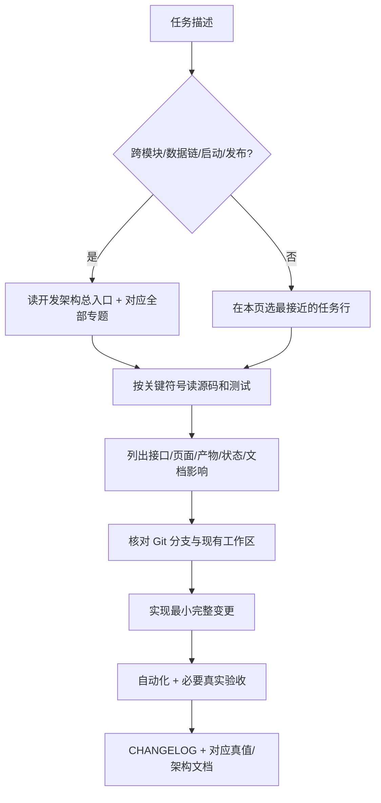

# InvoiceHub Agent 工程任务导航

<a id="quick-lookup"></a>

## 按问题快速定位

每个任务先完整读取 [AGENTS.md](../../AGENTS.md)，再从下表选择全部命中项。**功能规则页是强制约束，任务行提供代码符号、联动范围与最低验收；两者都要读取。** 架构、数据链、跨模块、启动、监控和发布任务还须读取 [架构总入口](../DEVELOPMENT_ARCHITECTURE.md)。目录/配置任务同时核对 [目录规则](FILE_MAP.md#directory-rules)，Git 操作另读 [Git 细则](../GIT_BRANCH_WORKTREE_FORK_GUIDE.md#git-rules)。

| 问题/改动关键词 | 必须读取的功能规则 | 代码、联动与验收入口 |
|---|---|---|
| PDF/OFD/XML/OCR、金额异常、购销方错位 | [提取与分类](rules/INVOICE_EXTRACTION.md) | [3. 发票提取与金额准确性](#task-extraction) |
| 票种、大类、业务样式、同票格式冲突 | [提取与分类](rules/INVOICE_EXTRACTION.md) | [4. 发票分类与同票家族](#task-classification) |
| 成本明细、均价、税额校验、加价与已开数量 | [成本](rules/COST_ANALYSIS.md)、[页面/单据/预览/皮肤](rules/WEB_UI.md) | [5. 成本明细、均价和开票参考](#task-costs) |
| watch_dir、workspace、目录切换与路径归属 | [监控与关闭](rules/MONITORING.md)、[页面/单据/预览/皮肤](rules/WEB_UI.md) | [6. 目录、配置与 TargetProfile](#task-paths) |
| 漏同步、ready、手改、启动慢、停止监控 | [监控与关闭](rules/MONITORING.md) | [7. Monitor、文件事件和后台同步](#task-monitor) |
| 关闭系统、keep_monitor、偏好与诊断 | [监控与关闭](rules/MONITORING.md)、[页面/单据/预览/皮肤](rules/WEB_UI.md) | [8. 设置、偏好、诊断与 WebUI 关闭](#task-settings) |
| 删除所选、回收站/废纸篓、确认与断线结果 | [页面](rules/WEB_UI.md)、[监控](rules/MONITORING.md)、[Windows](rules/WINDOWS.md)、[macOS](rules/MACOS.md) | [勾选工作流](#task-selection-workflow) |
| 临时识别、临时文件线程、拖放排序与源失效 | [页面](rules/WEB_UI.md)、[提取](rules/INVOICE_EXTRACTION.md)、[宿主](rules/TAURI_HOST.md) | [临时识别](#task-temporary) |
| JS/CSS、资源缓存、目录草稿、SSE、滚动与表格 | [页面/单据/预览/皮肤](rules/WEB_UI.md) | [9. 前端页面与静态资源](#task-web) |
| 独立官网、介绍页面与打包白名单 | [页面/单据/预览/皮肤](rules/WEB_UI.md)、[构建与发行](rules/RELEASE.md) | [9.1 独立产品官网](#task-website) |
| 大列表卡顿、索引停止、入库/出库、批量队列 | [页面/单据/预览/皮肤](rules/WEB_UI.md)、[成本](rules/COST_ANALYSIS.md) | [10. 入库单与出库单](#task-documents) |
| 勾选合计、搜索税率、来源追溯、超过100份预览、OFD 缺字、打印空白/漏页 | [页面/单据/预览/皮肤](rules/WEB_UI.md) | [10.1 发票预览与批量打印](#task-preview) |
| 凭证、科目映射、审批、迁移、导出、批次、捷锐 | [做账](rules/BOOKKEEPING.md) | [10.2 业务资料夹与做账 W8/W9](#task-bookkeeping) |
| 明暗切换、no_skin、皮肤 ZIP 与字体资源 | [页面/单据/预览/皮肤](rules/WEB_UI.md) | [11. 皮肤系统](#task-skins) |
| BAT/PS1、PowerShell、端口、中文路径、Tk | [Windows](rules/WINDOWS.md)、[监控与关闭](rules/MONITORING.md) | [12. Windows 正式入口与平台交互](#task-windows) |
| NSOpenPanel、WKWebView、TCC、SwiftUI/Sparkle | [macOS 参考壳](rules/MACOS.md)、[监控与关闭](rules/MONITORING.md) | [12.1 macOS 壳、构建握手与原生桥接](#task-macos) |
| Tauri、desktop/browser、Host RPC、所有权与退出 | [Tauri 宿主](rules/TAURI_HOST.md)、[构建与发行](rules/RELEASE.md) | [13. 公开基线与新平台构建](#task-tauri) |
| 构建、签名、公证、RC、SBOM、receipt、Feed/updater | [构建与发行](rules/RELEASE.md)、[Tauri 宿主](rules/TAURI_HOST.md) | [13.1 About、更新 Feed 与平台安装](#task-release) |
| 路由、返回字段、SQLite、仓储与跨层接口 | [页面/单据/预览/皮肤](rules/WEB_UI.md) | [14. API、SQLite 与存储基础设施](#task-api) |
| 规则重组、文件地图、文档契约与注释维护 | AGENTS.md 与被修改专题 | [15. 测试与文档治理](#task-governance) |

先用本表定位；关键词不明确时运行 `rg -n '<症状或符号>' docs/architecture/`，沿命中规则 → 任务行 → FILE_MAP → 当前源码/测试核实。后端返回字段变更也必须读页面/API 消费规则；涉及宿主、原生能力或成品时，追加对应平台和发行规则。未命中现有行的任务先确认其所属模块，再补导航，不能跳过适用规则。

功能规则只在所属 `rules/*.md` 维护正文；下方历史条目、摘要和实现说明用于定位，不能把摘要当成完整规则，也不能把历史验收当作本次结果。

2026-09-08：[`v0.3.0-alpha.2` 双平台预览](https://github.com/lyc1126/InvoiceHub/releases/tag/v0.3.0-alpha.2) 已按所有者确认的验收范围发布。Windows x64 portable ZIP 与 macOS arm64 preview DMG 同源，包含校验和、收据和平台 Python SBOM；Mac 离线核验与实际默认配置验收通过，隔离 HOME 自动烟测仍未通过，未启用安装 updater 或更新 Feed。精确发布身份和限制见[分支与发布记录](../BRANCH_STATUS.md)。


大列表/单据缓存入口：`services/document_index.py`、`AppState.document_state/document_outbound_preview`、documents index API、`page-documents.js/page-index.js`、`large-lists.css`。最低验收 `tests/test_document_index.py`、`tests/test_documents.py`、前端/Node 及 7,003 条浏览器场景：停止/恢复、变更/删除、目录隔离、旧任务拒绝、健康接口、两款皮肤和恢复入口。解析字段语义变化需递增缓存版本。

首页搜索范围任务：`AppState._filter_invoice_items`、`api/app.py::invoices`、`index.html` 与 `page-index.js` 联动；最低覆盖大量合成记录的 invoice/filename/all、缺省兼容、非法枚举、组合筛选、统计/空结果、重置及旧响应拒绝，并复验默认外观、两款皮肤和 `no_skin=1`。修改脚本必须更新首页版本参数与静态契约。

2026-09-07 图标/桌面整合入口：`services/app_icons.py`、`platform/host_rpc.py`、`src-tauri/src/app_icon.rs`、设置外观和皮肤页；最低检查 `test_app_icon.py`、`test_tauri_host_rpc.py`、`test_desktop_icon.py`、Tauri lifecycle/Windows marker 契约及四款图标 DOM。同步进度与启动恢复需联动 monitoring、API、首页/成本页、Windows 启停模块与各自契约。打包前同时核对最新前端和已完成桌面分支功能，不能仅按某一分支日期判断新旧。

> 作用：把自然语言任务转换成“先读哪里、从哪个符号开工、会影响什么、至少测什么”。
> 公共权威基线：单一脱敏根提交；退休私有提交、Tag、包和验证材料不在公开图中。
> 发行边界：alpha.2 已按公开 Release 所列范围发布，源码实现基线继续跟随 main；源自同一提交的 Windows portable 与 macOS preview 具有相同核心构建身份。自动隔离烟测与签名/原生功能的未覆盖项不因发布而改记为通过。
> 校验规则：精确的当前本地与 GitHub HEAD 以实时 Git 引用和双向差异为准。

## 1. 使用方法

每个新任务仍必须先读仓库根 `AGENTS.md`。涉及识别、汇总、localhost、OCR、成本、启动、发布或旧行为对照时，再按 `AGENTS.md` 读取全部相关真值文档。旧工作区功能或故障回溯按 AGENTS 规定的当前源码/测试与真值 → 当前 CHANGELOG → 旧能力基线 → `docs/legacy/OLD_WORKSPACE_CHANGELOG_INDEX.md` 脱敏路线推进，不能把私有原文带入公开工作树。本页不能替代这些规则，只负责定位工程入口。


```mermaid
flowchart TD
    Request["任务描述"] --> Scope{"跨模块/数据链/启动/发布?"}
    Scope -->|是| Entry["读开发架构总入口 + 对应全部专题"]
    Scope -->|否| Row["在本页选最接近的任务行"]
    Entry --> Code["按关键符号读源码和测试"]
    Row --> Code
    Code --> Impact["列出接口/页面/产物/状态/文档影响"]
    Impact --> Branch["核对 Git 分支与现有工作区"]
    Branch --> Change["实现最小完整变更"]
    Change --> Verify["自动化 + 必要真实验收"]
    Verify --> Docs["CHANGELOG + 对应真值/架构文档"]
```

“最低测试”是下限，不是完整验收替代。跨两个以上业务模块、改变共享字段/状态/公式或用户可见行为时，收尾应运行完整 pytest 和 `compileall`；Windows、浏览器、选择器和打包只在实际执行后才能声明覆盖。

## 2. 通用开工门禁

1. 读取 `AGENTS.md`，确认产品边界、数据不变量和本任务必读真值。
2. 执行 `git status --short --branch --ignored`，确认当前分支、基线、用户修改和 ignored 运行态。
3. 当前公共实现以实时 `origin/main` 为准；功能开发必须记录当前分支和起点，并比较当前分支、`origin/main` 与 GitHub 实际引用。本地 `main` 不能在未核验时被假定为最新。
4. 在 [完整文件地图](FILE_MAP.md) 找到目标文件的上下游和同步检查项。
5. 在 [接口流程](INTERFACES_AND_FLOWS.md) 找页面/API/事件消费者，在 [数据算法](DATA_AND_ALGORITHMS.md) 找公式和失败策略。
6. 修改前写出本次不会改变的真值、接口和产物；这一步决定相邻回归范围。

<a id="task-extraction"></a>

## 3. 发票提取与金额准确性

必读功能规则：[提取与分类](rules/INVOICE_EXTRACTION.md)。

| 导航项 | 内容 |
|---|---|
| 首先阅读 | 数据算法第 7 节；接口流程第 6.4 节；[提取与分类](rules/INVOICE_EXTRACTION.md) |
| 首要入口 | `extraction/parsers.py::extract_invoice_record`、`_record_from_text`、`_record_from_xml`、`_record_from_ofd`、`_normalize_money`、`_extract_pdf_amount_triple`、`_first_money_near`、`_extract_einvoice_value_sequence` |
| 必须联动 | `extraction/__init__.py` 公共导出、`projections/summary.py`、成本元数据、详情/一致性/API 字段；新字段还要改 `domain/models.py` |
| 产物与消费者 | 普通 CSV/XLSX、`GET /api/v1/invoices`、详情、成本校验和一致性报告 |
| 最低自动化 | `tests/test_summary_and_costs.py` 覆盖同页唯一三元组、同行标签、零税、红票、重复明细、两小数拒绝、歧义、不一致、无货币符号和跨页；再跑分类、API 详情/成本与完整 pytest |
| 真实验收 | 有真实版式时做旧/新影子对照，再检查 CSV/XLSX、列表、详情、勾选合计、成本状态与一致性；不能只看页面一格 |
| 高风险提醒 | 不得用文件名补正文核心字段，不得恢复全文最大金额；主体序列不得产出金额；多个三元组、跨页或算术不一致必须放弃 |

<a id="task-classification"></a>

## 4. 发票分类与同票家族

必读功能规则：[提取与分类](rules/INVOICE_EXTRACTION.md)。

| 导航项 | 内容 |
|---|---|
| 首先阅读 | 数据算法第 7.4 节；[提取与分类](rules/INVOICE_EXTRACTION.md) |
| 首要入口 | `extraction/classification.py::classify_invoice`、`canonical_business_type`、`classification_status`；`parsers.py::_pdf_classification`、`_ofd_classification`、`apply_invoice_family_corrections` |
| 必须联动 | `InvoiceRecord`、summary 表头、`AppState.list_invoices/_build_consistency_groups`、成本校验字段、index/detail/consistency JS 与模板 |
| 产物与消费者 | 普通汇总四个分类字段、列表筛选、详情、一致性、成本“发票校验”sheet |
| 最低自动化 | 完整 `tests/test_invoice_classification.py`，加 `tests/test_summary_and_costs.py` 的同票纠偏测试、API 一致性测试、前端契约 |
| 真实验收 | 新业务样式必须区分“合成测试通过”和“真实票验证”；检查当前皮肤与 `?no_skin=1` 的徽标/长文本 |
| 高风险提醒 | 大类与业务样式不能合并；公司/项目/商品同名词不能触发业务类型；非空冲突不能被优先级吞掉 |

<a id="task-costs"></a>

## 5. 成本明细、均价和开票参考

2026-10-09 分页/渐进读取：同时定位 `storage/read_views.py`、`AppState.cost_view`、`CostProjectionService.cache_snapshot`、`MonitorState.try_sync_write_lock` 与 page-costs；最低增加 `tests/test_progressive_loading.py` 和 Node 交互回归，真实验收跨页草稿、完整 TSV、旧完整快照与首次临时结果的只读边界。

必读功能规则：[成本](rules/COST_ANALYSIS.md)、[页面/单据/预览/皮肤](rules/WEB_UI.md)。

| 导航项 | 内容 |
|---|---|
| 首先阅读 | 数据算法第 8、9 节；接口流程第 3.3、6.6 节；[成本](rules/COST_ANALYSIS.md) |
| 首要入口 | `projections/cost_analysis.py::parse_cost_rows_from_words`、`_cost_validation`、`_select_cost_analysis`、`project_spec_summary`、`_invoice_reference_summary`；`projections/costs.py::CostProjectionService`；`AppState.cost_snapshot/save_cost_reference_status` |
| 必须联动 | `cost_analysis.py` 与 `costs.py` 的重复公式/兼容键；`domain/models.py`、成本 CSV/XLSX 五 sheet、状态 JSON、cost API、page-costs、单据入库来源 |
| 产物与消费者 | `watch_dir/成本发票明细.csv`、`成本发票汇总.xlsx`、`成本开票状态.json`、详情/选择成本拆分、单据 |
| 最低自动化 | 完整 `tests/test_summary_and_costs.py`，成本相关 `tests/test_invoice_classification.py` 和 `tests/test_api_contract.py`；页面字段变化再跑 `test_frontend_contract.py` |
| 真实验收 | 页面四标签互斥、TSV 复制、行级加价草稿/保存/刷新、实际工作簿五 sheet；真实业务版式检查校验差异 |
| 高风险提醒 | 库存均价与采购算术均价不能混用；已开快照不能随新增明细漂移；默认 8% 只是行级 fallback；税率固定 13% 是当前开票参考公式。旧 schema 修复、状态 JSON 和工作簿写入必须同 monitor 共用所捕获 profile 写锁，且不能阻塞 health 或把旧 profile 完成事件投到新目录 |

<a id="task-paths"></a>

## 6. 目录、配置与 TargetProfile

必读功能规则：[监控与关闭](rules/MONITORING.md)、[页面/单据/预览/皮肤](rules/WEB_UI.md)。

| 导航项 | 内容 |
|---|---|
| 首先阅读 | 开发架构第 3.4、6 节；数据算法第 4、6 节；接口流程设置接口 |
| 首要入口 | `targets/paths.py::load_config`、`serialize_config_path`、`target_id_for`、`target_profile_for`、`ensure_runtime_layout`；`AppState.update_settings` |
| 必须联动 | Windows 启动/停止脚本的路径解析、monitor control/daemon、CostProjectionService、SkinService、release 默认配置 |
| 产物与消费者 | `config/app.local.json`、runtime、目标 workspace/state/localappdata、普通与成本输出路径 |
| 最低自动化 | `tests/test_paths.py`、设置目录 API 测试、monitoring 路径用例、`tests/test_release.py` |
| 真实验收 | 项目内相对目录、包外绝对目录、中文空格路径、缺失目录、同名文件/目录冲突；原生选择器只在 Windows 实测后声明 |
| 高风险提醒 | 不读取或提交本机配置值；同一配置在 API、daemon、BAT 和打包内必须解析一致；成本产物不能搬到 workspace |

<a id="task-monitor"></a>

## 7. Monitor、文件事件和后台同步

必读功能规则：[监控与关闭](rules/MONITORING.md)。

| 导航项 | 内容 |
|---|---|
| 首先阅读 | 接口流程第 6.1 至 6.5 节；数据算法第 6、13 节；`docs/MONITORING_AND_LOGGING.md` |
| 首要入口 | `monitoring/daemon.py::run_monitor`、`monitoring/sync.py::MonitorSynchronizer.run_sync`、`monitoring/state.py::MonitorState`、`services/monitor_bridge.py::MonitorBridge`、`AppState.run_background_diagnostics` |
| 必须联动 | bridge API、SSE 事件、首页/设置/成本/单据刷新、Windows monitor PS1/BAT、SQLite events |
| 产物与消费者 | lock、stop flag、processed、manual overrides、monitor status、业务日志、bridge stdout/stderr |
| 最低自动化 | 完整 `tests/test_monitoring.py`，启动后台同步和 bridge API 测试；事件变化再跑 SSE API 与前端契约 |
| 真实验收 | daemon start/ready、启动后立即放文件、事件 1 秒合并、60 秒兜底、停止 localhost 后 monitor 仍在、stop-all 退出 |
| 高风险提醒 | PID+lock 才是运行真值；ready 必须在第二次补漏后；周期无变化不能全量解析；正式入口不能退回 FastAPI 内线程 |

<a id="task-settings"></a>

## 8. 设置、偏好、诊断与 WebUI 关闭

必读功能规则：[监控与关闭](rules/MONITORING.md)、[页面/单据/预览/皮肤](rules/WEB_UI.md)。

| 导航项 | 内容 |
|---|---|
| 首先阅读 | 接口流程第 3.1、6.10 节；[监控与关闭](rules/MONITORING.md) |
| 首要入口 | `AppState.settings/preferences/save_preferences/diagnostic_*`、`request_server_shutdown/finalize_server_shutdown`；`api/app.py::shutdown`；`page-settings.js` |
| 必须联动 | settings 模板、settings-actions CSS、common SSE、bridge、server state/PID、两个正式停止 BAT 的固定语义 |
| 产物与消费者 | preferences、support packages、server_state、server.pid、events；设置页所有分类 |
| 最低自动化 | 设置/偏好/诊断/关闭 API 测试 + `tests/test_frontend_contract.py`；涉及 bridge 再跑 monitoring |
| 真实验收 | 两种关闭选择、记住/恢复询问、停止 monitor 失败时 WebUI 保留、响应先返回后进程退出、皮肤与 no-skin 两种页面 |
| 高风险提醒 | 页面偏好不能改变两个停止 BAT；不能假设 PID 文件等于 `os.getpid()`；只在 PID 内容仍等于请求快照时删除 |

<a id="task-web"></a>

## 9. 前端页面与静态资源

2026-10-09 首页分页由 API 筛选/排序后切片，联动 list_invoices、page-index 与 read_views；最低增加 progressive loading 的首批暂停解析与 7,003 条全量统计用例，浏览器核对全选范围、迟到请求、当前资源版本与各皮肤。

必读功能规则：[页面/单据/预览/皮肤](rules/WEB_UI.md)。

| 导航项 | 内容 |
|---|---|
| 首先阅读 | 接口流程第 2 至 5、7 节；[页面/单据/预览/皮肤](rules/WEB_UI.md) |
| 首要入口 | 目标 `web/templates/*.html`、对应 `web/static/js/page-*.js`、`common.js`、`app.css`；API 消费矩阵见接口专题 |
| 必须联动 | 后端字段/错误、页面文案、空/错误/处理中状态、资源 `?v=`、所有引用同一 CSS/JS 的模板和前端契约 |
| 产物与消费者 | 浏览器 DOM、真实 table/TSV、SSE 状态、当前活动皮肤与基础无皮肤样式 |
| 最低自动化 | `tests/test_frontend_contract.py` + 相关 API 契约；JS 运行时可用时对改动文件做语法检查 |
| 真实验收 | 当前 localhost 必须实际送达新 `?v=` 与文件；桌面/390px、当前皮肤/`?no_skin=1`、关键交互、控制台和滚动链 |
| 高风险提醒 | 未保存目录草稿不能被刷新覆盖；普通禁用态不能显示等待光标；SSE 必须同时处理断线和重连；表格不能改成 div 卡片；共享桌面基础 CSS 不得因缺失大括号被包入移动端 `@media`，契约必须检查规则作用域而非只查选择器文本；详情成本区的固定高度 Grid 必须让隐式项目行按 `max-content` 排布并由外层滚动，不能把带 `overflow:hidden` 的项目卡压扁后裁掉规格表 |

共享电源、请求反馈、导航或固定栏变更还需联动 `system_controls.html`、`system-controls.js`、`_template`、settings-actions CSS 与全部普通模板。最低运行 `node --test tests/frontend_interactions.test.cjs`、前端/预览/打印静态契约和页面/关闭 API；浏览器以一个有足够滚动内容的合成目录检查 sticky、一个延迟请求检查转圈，再验证皮肤/恢复入口、取消和失败恢复。合成量仅用于 UI 行为，不构成真实大目录识别吞吐结论。

<a id="task-website"></a>

## 9.1 独立产品官网

必读功能规则：[页面/单据/预览/皮肤](rules/WEB_UI.md)、[构建与发行](rules/RELEASE.md)。

官网入口为 `website/index.html`，样式与交互为 `website/style.css`、`website/app.js`、`website/paper-scene.js`，合成演示数据由 `website/demo-data.js` 提供。先读 `website/README.md` 和 `website/ASSETS.md`，同步 FILE_MAP、README、状态和 CHANGELOG。最低检查是 `node --test website/tests/demo.test.cjs`、修改脚本语法及本地链接，视觉变化另需桌面/手机截图、真实交互和动画/减少动态效果检查。官网不请求业务 API，不加载应用皮肤，不处理真实发票；本轮浏览器访问未获许可，视觉验收保持未执行。

软件入口位于设置 About 模板/脚本、`AppState.about`、`api/app.py` 的 `/website/` 路由及 `version.py::LOCAL_WEBSITE_PATH`；HTTP 与组包共用 `website.py` 白名单。增减官网资源须同步该白名单并检查 Core Build ID、源码快照、Windows portable、Tauri development/alpha/public-preview 与 Swift 参考壳的复制链。最低验收包括 `tests/test_website.py`、About/官网 API、设置静态契约和 build manifest 测试；localhost 实取首页、设置、官网与资源，当前皮肤和恢复入口分开记录。源码复制验收不得当作平台成品验收。

四视图和功能场景变更至少覆盖：筛选后空选择禁用、预览来源逐份保留、同票 PDF 回退与缺 PDF 整批阻断、明细税率/规格/单位分组、概念金额换算的分位守恒、五层画布进入/离开收敛与减少动态效果。Node VM 调度测试只证明控制状态，不替代真实像素或鼠标命中验收。

<a id="task-documents"></a>

## 10. 入库单与出库单

2026-10-09 单据加载性能同时定位 `document_index.py::InboundDetails/build_index/ensure` 与 `AppState.document_state/document_*_preview/*_export_status`；最低增加 `test_document_index.py`、`test_progressive_loading.py` 的无需无关扫描、部分候选只读、缓存失效及停止/恢复用例。首页批量可优先准备勾选票，但不能放宽正式导出的身份复核。

必读功能规则：[页面/单据/预览/皮肤](rules/WEB_UI.md)、[成本](rules/COST_ANALYSIS.md)。

| 导航项 | 内容 |
|---|---|
| 首先阅读 | 接口流程第 3.4、6.8 节；数据算法第 10、12.3 节 |
| 首要入口 | `projections/documents.py::build_inbound_preview/build_outbound_preview/write_*_workbook/rmb_uppercase/_ensure_detail_rows`；AppState 的 `_inbound/_outbound_document_target` 和导出方法 |
| 必须联动 | 两个 Excel 模板、documents API、page-documents、首页 page-index 勾选交接、设置页单据目录/默认值、平台打开文件 |
| 产物与消费者 | `watch_dir/入库单/*.xlsx`、`outbound_invoice_dir/出库单/*.xlsx`；预览与导出状态 |
| 最低自动化 | 完整 `tests/test_documents.py` + 单据/源预览/打印前端契约与 `node --test tests/frontend_interactions.test.cjs`；批量需身份、缺明细、同票副本、停止/未知结果检查；路径配置变化再跑 paths/API |
| 真实验收 | 5 行与超模板行数、合并单元格/格式、覆盖/副本/取消/打开、文件占用、删除后重导、实际 Excel/WPS 打开 |
| 高风险提醒 | 单据不进入 monitor 自动生成；入库逐明细不合并；服务端只接受计算出的受控根内路径 |

<a id="task-preview"></a>

## 10.1 发票预览与批量打印

必读功能规则：[页面/单据/预览/皮肤](rules/WEB_UI.md)。

OFD 专用入口为 `services/ofd_rendering.py`、`tools/ofd-preview/` 与 `scripts/dev/build_ofd_preview.py`，必须联动核心源码指纹、依赖/JDK 锁和 [OFD 预览说明](../OFD_PREVIEW.md)。最低检查 `tests/test_ofd_rendering.py`，并以 `INVOICE_HUB_TEST_OFD_COMPONENT` 显式指向本平台构建组件运行真实 Java/PNG 与混选 API 回归；没有组件时的 skip 不能写成引擎通过。相邻 PDF/XML/图片、续租、源变化、打印和前端错误/系统打开契约继续执行。组件校验变化还需覆盖缓存命中无重复哈希与变更失效；预检查变化需覆盖模板图层和补充平面文字失败保护。依赖裁剪比较相同样本的完整与精简 PNG，发布仍需双平台 runtime/成品与许可验收。

| 导航项 | 内容 |
|---|---|
| 首先阅读 | 数据算法第 12.5 节；接口流程第 2、3.2、6.12 节；AGENTS 全局路径边界；[页面/单据/预览/皮肤](rules/WEB_UI.md)、[macOS 参考壳](rules/MACOS.md)、[Tauri 宿主](rules/TAURI_HOST.md) |
| 首要入口 | `services/file_preview.py`、`services/invoice_printing.py`、`services/document_rendering.py`、`AppState.prepare_invoice_preview/keep_invoice_preview_alive/prepare_invoice_print`、`page-index.js`、`invoice_print.html` |
| 必须联动 | API 路由/错误、预览闲置续租与 `404/410` 恢复、首页 DOM/CSS/静态版本、build manifest capabilities、Swift required routes 和 popup policy、OpenAPI verify、接口/数据/平台文档 |
| 产物与消费者 | 短期内存 job、分页 PNG/XML 文本、受控打印 HTML、macOS 系统打印面板；不产生 SQLite 或投影主数据 |
| 最低自动化 | `test_file_preview.py`、`test_invoice_printing.py`、两份预览/打印前端契约、`test_api_contract.py`、`test_build_manifest.py`、`swift test` |
| 真实验收 | 预览分页/缩放/打开文件和位置；弹窗超过原 15 分钟截止时间后仍可用；后台/恢复前台、后端重启和 job 回收后自动回到原文件/页码；批量打印同票收敛、首次打开非空、横纵混排，并核对 A4 与打印机保留 A5/default margins 时“源页数 = 打印纸数”；真实 WKWebView 系统面板及取消，不实际出纸 |
| 高风险提醒 | preview 不得按同票收敛；续租只能滑动延长闲置期限，弹窗关闭必须停止，不得绕过目录/源文件/缓存边界；print 不得接受任意路径或非 PDF；popup 只能 exact about:blank -> 同端口 print job，不能带通用 bridge；首印必须等待 `load + decode` 和两次渲染帧，不能固定 A4、使用打印态 `100vw/100vh` 或在末页后强制分页 |

<a id="task-bookkeeping"></a>

## 10.2 业务资料夹与做账 W8/W9

必读功能规则：[做账](rules/BOOKKEEPING.md)。

| 导航项 | 内容 |
|---|---|
| 首先阅读 | 接口流程第 3.5 节；数据算法第 3.2、4.5 节；[做账](rules/BOOKKEEPING.md) |
| 首要入口 | `AppState.business_dossier/_scan_business_dossier/bookkeeping_*`；`bookkeeping/repository.py`、`validator.py`、`vouchers.py`、`decisions.py`、`catalogs.py`、`mapping.py`、`batches.py`；首页资料夹容错在 `page-index.js`，做账页在 `page-bookkeeping.js` |
| 必须联动 | 公司资料夹受控路径、profile/catalog/mapping/store 绑定、proposal revision、统一 validator、batch manifest/XLSX、API/页面 blockers、runner facts |
| 产物与消费者 | 公司资料夹 `凭证/` 下 JSON、批次、日志；`/api/v1/business-dossier*`、`/api/v1/bookkeeping/*` 和做账页 |
| 最低自动化 | 资料夹变化至少运行 `tests/test_api_contract.py` 的资料夹/线程池/有界扫描用例与 `tests/test_frontend_contract.py` 的资料夹刷新容错契约；做账变化运行全部 `tests/test_bookkeeping_*.py`、`test_api_bookkeeping.py`、`test_runner_dryrun.py` |
| 真实验收 | W9 profile/科目/辅助/映射人审必须基于目标账套重新采集；真实 Safari apply、读回和 reconcile-only 属 W10，每次 apply 仍需当回合明确授权 |
| 高风险提醒 | 资料夹导航不得变成完整发票扫描或任意本机打开器；截断统计和 `os.scandir` 迭代中断后的累计统计都必须显式标为下界且不能阻塞发票列表。做账不得自动迁移、不绕过 blockers、不猜最新 XLSX、不直接写状态 JSON；测试通过不授权真实账套迁移、审批、导出或导入 |

<a id="task-skins"></a>

## 11. 皮肤系统

必读功能规则：[页面/单据/预览/皮肤](rules/WEB_UI.md)。

新共享控件适配需检查原有两款皮肤的 `.appearance-toggle/.system-power` 稳定尺寸、全页关闭弹窗、批量单据和窄屏布局；Ink Pulse 保留深色单据预览，实际 PDF/图片源票面不反色。更新 `skin.json`、`BUILTIN_SKINS` 与前端/API 契约；实际 HTML 动态 CSS `?v=` 和字节必须匹配。

默认 White/Dark 任务同时检查 `appearance_toggle.html`、`appearance.js`、`common.js` 的 skin 同步通知、设置/皮肤列表及 `website-dark`；最低覆盖 CSS 加载失败/保存失败/双击/草稿保留、首屏注入、恢复入口与 reduced-motion。桌面品牌图标从 `scripts/dev/generate_desktop_icon.py`、`src-tauri/icons/`、`tauri.conf.json` 定位，运行 `tests/test_desktop_icon.py` 和 Tauri scaffold 契约，并目视多尺寸；原生任务栏/Dock/托盘和新包需要另行平台验收。

| 导航项 | 内容 |
|---|---|
| 首先阅读 | 接口流程第 3.6、6.9 节；数据算法第 12.2 节；[页面/单据/预览/皮肤](rules/WEB_UI.md) |
| 首要入口 | `services/skins.py::validate_skin_zip/SkinService`、`api/app.py::_skin_zip_body/active_skin_link`、page-skins、common 首屏水合 |
| 必须联动 | 内置 `skin.json/skin.css/asset-sources.json`、字体/纹理、设置外观分类、所有普通模板和 no-skin 恢复 |
| 产物与消费者 | `runtime/local_state/skins`、服务端 CSS/资产响应、普通页面样式 |
| 最低自动化 | 皮肤相关 `tests/test_api_contract.py` + `tests/test_frontend_contract.py` + `tests/test_paths.py` 的存储隔离 |
| 真实验收 | 导入/替换/启用/重置、恶意 ZIP 拒绝、当前皮肤与 no-skin、桌面/移动关键业务表格不被破坏 |
| 高风险提醒 | 禁止 JS/HTML/脚本/远程资源；先全量校验再写盘；导入目录不能是 watch_dir；内置同 id 不能被覆盖 |

<a id="task-windows"></a>

## 12. Windows 正式入口与平台交互

必读功能规则：[Windows](rules/WINDOWS.md)、[监控与关闭](rules/MONITORING.md)。

Windows 环境加固还需用真实 Winsock abortive close 验证完整 200/204 不等 EOF、截断仍保留 10054；随包 Python 与新 EXE 验证错误 PYTHONHOME 不再污染标准库，spawn 失败不得残留旧握手成功日志，OS 错误只输出代码。对应入口为 BackendHost::launch 与 local_http 的 Windows 回归。

启动探测/浏览器兜底定位 `local_http.rs`、`backend.rs`、`startup_diagnostics.rs` 与 `main.rs`。最低执行 `cargo test --locked --tests` 的 framing、lifecycle、ownership/updater 相邻测试及 `test_tauri_lifecycle_contract.py/test_tauri_host_rpc.py/test_development_documentation.py`。传输须覆盖完整后 reset、204、分片/chunked、连接不关闭、截断、超限、重复 proof、总超时和错误脱敏；surface 须覆盖成功不询问、接受/拒绝、等待时身份失效和浏览器失败。Windows 真机/成品/BAT/原生弹窗与真实浏览器另行验收，合成测试不得替代。

启动诊断任务联动 `api/main.py::check_startup_port`、根 `检查启动环境.bat`、Windows 模块和 `run_start_localhost.ps1`、Tauri `startup_diagnostics.rs/main.rs`。最低验证真实监听 PID、未知/其他环境占用保持存活、无 Python/坏配置仍可诊断、PS7/PS5.1、GUI 原生提示、跨目录单实例、同实例唤回、PE 产品描述和当前成品；不得把插件无法截图计为视觉验收通过。

源码 venv 握手修改定位 `Test-IHProcessIdentity`，最低增加 PS7/PS5.1 的 venv/base 分离身份正向与未知 Python、错误模块/root/config 负向回归，并复验启动复用和 PID 停止两个消费者。

| 导航项 | 内容 |
|---|---|
| 首先阅读 | 接口流程第 6.1、6.10 节；[Windows](rules/WINDOWS.md)；`docs/MAC_WINDOWS_WORKFLOW.md` |
| 首要入口 | 根四个 BAT、`scripts/windows/InvoiceHub.Windows.psm1`、启动/停止/monitor/设置迁移 PS1、`platform/windows.py`、`native_dialogs.py` |
| 必须联动 | config/targets 路径、API 入口、package/build/runtime manifest、server PID/state/log、MonitorBridge、浏览器派发、Windows 锁和 portable 验包 |
| 产物与消费者 | 用户双击入口、`.lnk`、localhost/monitor 进程、runtime 诊断文件、系统壳/选择器 |
| 最低自动化 | paths/monitoring/API/release/update/settings-migration/Windows contract 与 `compileall`；PowerShell parser、UTF-8 BOM、固定路径/PATH PS7 选择、强制 PS5.1 和无 charset UTF-8 health 中文路径动态回归 |
| 真实验收 | 正式根 BAT 启动、首页与 health、连续/并发启动、stale state、外部占端口、只停 WebUI、stop-all、根快捷方式、浏览器拉起、原生选择器 |
| 高风险提醒 | 含非 ASCII 且可能由 PS 5.1 执行的发布 PS1 必须 UTF-8 BOM；固定 Program Files 路径不存在不代表没有 PS7，必须继续解析 PATH/App Execution Alias；PS5.1 不得直接信任无 charset JSON 的 `.Content`，必须按原始 UTF-8 字节解码后继续严格身份检查；自动化 Python 测试不能替代成品 BAT；系统壳派发成功后不要重复开 URL |

<a id="task-macos"></a>

## 12.1 macOS 壳、构建握手与原生桥接

必读功能规则：[macOS 参考壳](rules/MACOS.md)、[监控与关闭](rules/MONITORING.md)。

Windows Tauri 双启动任务定位 `main.rs`、`backend.rs::spawn_backend_liveness_watcher` 和 preferences API；至少验证两种启动偏好、页面关闭后 host/backend/端口释放、单实例及监控保留/停止。ZIP 入口为 `scripts/dev/tauri_windows_portable.py`，构建读取本次工作区的干净快照，不能把旧候选 receipt 当作最新代码验收。

| 导航项 | 内容 |
|---|---|
| 首先阅读 | [平台架构](PLATFORM_ARCHITECTURE.md)第 5 至 8 节；接口流程第 3.2、6.12 节；[macOS 参考壳](rules/MACOS.md) |
| 首要入口 | `BackendPaths.swift`、`LocalBackendController.swift`、`BuildHandshake.swift`、`InvoiceHubSparkleUpdater.swift`、`StartupSurface.swift`、`WebView.swift`、`InvoiceHubAPIClient.swift`、`InvoiceHubMacApp.swift`、`src-tauri/src/main.rs`、`src-tauri/src/backend.rs`、`src-tauri/src/monitor_recovery.rs`、`src-tauri/src/monitor_recovery/windows_marker_store.rs`、`src-tauri/src/monitor_bridge.rs`、`src-tauri/src/update_coordinator.rs`、`scripts/dev/tauri_dev_app.py`、`scripts/dev/tauri_recovery_smoke.py`、`scripts/dev/tauri_public_preview_smoke.py`、开发与正式三个 release 脚本 |
| 必须联动 | Python build/package/runtime manifest/health、OpenAPI 路由、API/做账协议/capabilities、固定端口、Application Support、owned/external、启动方式、升级标记与 monitor 恢复、原生面板和打印 identity；Tauri updater 还要联动 backend 私有 secret、Host RPC runtime gate/candidate、authenticated bridge、platform marker store、coordinator、Windows `on_before_exit`、macOS relaunch 与 ExitRequested；Swift/Sparkle 仅保留参考实现 |
| 产物与消费者 | ordinary development schema-3 arm64 `.app`（本地 ignored、updater-disabled）；L10-E development recovery-smoke `.app`（本地 ignored、不可安装）；正式 arm64 `.app/DMG/Sparkle ZIP`；三类 manifest/SBOM；Application Support 配置/runtime/PID/log；WKWebView 页面 |
| 最低自动化 | Swift recovery contracts 继续覆盖参考壳 marker/gate。Tauri setup/updater 改动至少跑锁定 Rust format/check、Host RPC deferred-commit 单测、authenticated bridge、update coordinator、monitor recovery、Windows marker/source contracts，以及 Python valid/tampered/replayed/non-empty HMAC、empty install body/redaction 和 lifecycle/doc contracts；必须锁定 startup restore 晚于 gate/manage、disabled runtime inert、response flush 早于 commit、writer/latch loss 无副作用、并发操作/普通 Quit 拒绝与 relaunch prepared。L10-E 还必须覆盖 ordinary/recovery staging 可重复性、精确 endpoint/key/字段拒绝、临时路径、关闭自动检查、marker scope、health/monitor 身份和 runner 三条 HTTP allowlist。public-preview 还必须锁定 pending receipt 默认拒绝、仅内部首轮允许、finalized output 与 DMG SHA-256 精确绑定、DMG/receipt 复核、quarantine、没有 development state override、`open -n -W -g` 启动和 shutdown 后 SSE 结束；Windows public-preview 还必须锁定 WebView2 hash、单次 marker、两层 Authenticode、包内 EXE 哈希与安装器/SHA-256/receipt 三项 Actions artifact。它们不替代真实 Feed/update；完整 Windows Tauri target check 仍受 `ring`/`assert.h` 环境限制。其余 build/release/Mac/API/前端门禁按修改面运行，制品模式仍必须互斥 |
| 真实验收 | L9/P1-Q 已覆盖 ordinary development app 的 fixed-port owned backend、health/background、首页/静态资源、desktop 默认，以及真实 Cmd-Q 的 shutdown POST、stopped state、child/PID/端口清理；SSE 未及时退出时命中显式 kill+wait。L10-E 已以一次临时 HOME/state/watch 的 authenticated startup restore 观察到 monitor `running && ready`、marker 删除、显式 stop、本次进程组/PID/固定端口/临时目录清理和 `update_requests=0`。public-preview runner 已对本轮成品执行，但隔离 HOME 身份检查未通过；实际默认配置的 ready、页面和 monitor 启停已另行复核；该样本必须由 mounted-DMG 复制、隔离 HOME、真实 quarantine 和 LaunchServices 启动，不得直接运行 Mach-O 或清除属性。外部终止仍不作可拦截承诺；仍需 owned/external、browser、NSOpenPanel、tray 点击/单实例、预览/打印、真实 Feed/合法与篡改下载、安装/重启、签名/notary/staple、quarantine、首次目录授权、正式旧版到新版且 monitor 恢复 |
| 高风险提醒 | 不只凭 health.ok 连接；正式 core 无效不得回退 checkout；握手和 recovery 请求都必须有界并重验 generation/phase/PID。Updater activation 晚于 gate release 与 app manage；startup restore 失败保留 marker 和诊断界面。普通 development/internal-alpha 必须 updater-disabled；L10-E development 只接受固定不可达 endpoint、无验签能力 key sentinel 和精确三字段 updater 对象，runner 不得调用 check/install 或 bridge start。完整候选只在 host 内，Web 不接收/返回 URL、signature 或 artifact ID；成功响应必须 flush 后才放行 private commit，writer/spawn/latch loss固定 `CommitLost` 且无副作用。Windows installer callback 必须确认 backend 终止，macOS 必须先停 backend/prepare relaunch 再 restart；外部不得获得安装 bridge。不换端口、杀未知进程或以 smoke 冒充真实升级证据 |

<a id="task-tauri"></a>

## 13. 公开基线与新平台构建

必读功能规则：[Tauri 宿主](rules/TAURI_HOST.md)、[构建与发行](rules/RELEASE.md)。

Windows portable 目录发布重试需覆盖短暂 5/32/33 成功、持续失败达到上限和无关错误立即失败；不得把目录拒绝当作验包通过，测试入口为 test_stage_publish_retries_only_bounded_windows_sharing_errors。

| 导航项 | 内容 |
|---|---|
| 首先阅读 | 历史净化执行记录；[Tauri 宿主](rules/TAURI_HOST.md)、[构建与发行](rules/RELEASE.md)；接口流程第 6.11 至 6.13 节 |
| 首要入口 | `version.py`、`release/*`、`HISTORY_SANITIZATION_EXECUTION.md`、`.github` 治理配置；当前 `v0.3` 使用 `scripts/dev/tauri_version_sync.py`、`tauri_doctor.py`、`tauri_bootstrap.py`、`src-tauri/src/backend.rs`、`src-tauri/src/monitor_recovery.rs` 和 `src-tauri/src/host_rpc.rs` |
| 必须联动 | LICENSE/NOTICE/贡献与安全文档、README/状态/架构地图、依赖锁、公开仓库设置、Release 元数据；Tauri lifecycle/updater 改动再联动 `api/app.py` 的 install body/error/origin、`AppState` metadata approval、`platform/host_rpc.py`、monitor 子进程环境、Web consumers 与 Host RPC contracts |
| 产物与消费者 | 新的 `v0.3` 才产生 NSIS、DMG/更新归档、Feed、源码归档、SBOM 和发布收据 |
| 最低自动化 | 公开基线运行文档/许可证、候选内容和 all-ref secret/业务数据扫描；foundation 先跑版本同步、doctor fail-closed 与 pnpm lock 测试；lifecycle/updater 变更再跑 isolated Rust HMAC/identity/OpenAPI/post-preference revalidation/RPC revocation、manifest hash、candidate 主动 TTL/order、`.app/Contents` sibling state-root rejection、macOS custom menu/Cmd-Q 共用 `app.exit(0)` 且拒绝 predefined Quit、L10-R lifecycle lease/ready-only/pending-marker/Unix-symlink contract，以及 Python host-RPC direct no-proxy transport、hosted strict `Cache-Control: no-cache` fresh-200/cache-ETag-304 rejection、host-check immediate-busy/approval-retention、non-host check bypass、install-lock immediate-error/approval-retention/no-second-RPC、empty-install-body/redacted-error TestClient contracts，每个 RC 最多一次完整回归 |
| 真实验收 | `v0.3` 每平台最终 RC 一次安装、启动、目录选择、托盘与更新烟测，失败后仅重跑受影响类别 |
| 高风险提醒 | 退休预公开包、receipt 和 Tag 不得重打、复用或上传。历史净化不授权 Release/Feed。Tauri 不重写业务核心，未知 `127.0.0.1:8766` 占用必须失败。Host proof 与 monitor recovery proof 都只使用 backend-private secret + fresh HMAC，但 secret 绝不可发给候选端口或暴露网页/API/日志；普通 bridge 与 authenticated recovery 不得混淆。strict Feed approval、300 秒候选、两阶段 response-then-private-commit、verified download -> pause -> install -> relaunch、CommitLost、startup restore 和平台退出顺序都必须保持。当前源码 coordinator 已接线，但普通 development/internal-alpha updater-disabled；L10-E 的不可安装恢复样本不能替代真实 Feed、合法/篡改更新、安装和 restart 的独立授权与平台验收。 |

归档身份补充：必须以 `text=auto` 把自动识别的普通文本固定 LF，不能用 `* text` 把二进制强制归类为文本；Windows 组装的 Git archive 必须显式禁用 `core.autocrlf`。最低自动化门禁同时要求 `autocrlf=true` 全新 checkout 无 tracked changes、二进制 blob/checkout/archive 字节一致，以及 true/false 两种 Git 配置实际导出后的 Core Build ID 相同；创建隔离 Git checkout 的动态契约还必须在普通源仓库和 `--depth 1 --no-local` 浅源仓库中都通过。

<a id="task-release"></a>

## 13.1 About、更新 Feed 与平台安装

必读功能规则：[构建与发行](rules/RELEASE.md)、[Tauri 宿主](rules/TAURI_HOST.md)。

| 导航项 | 内容 |
|---|---|
| 首先阅读 | 发行计划、接口流程第 3.1/6.13 节；`docs/release/UPDATE_SYSTEM.md` |
| 首要入口 | `services/update_service.py`、`services/app_state.py::check_for_updates/install_update`、`release/update_metadata.py`、`version.py`、`platform/host_rpc.py`、设置 About 模板/JS/CSS；`v0.3` 增加 Tauri updater 与 Host RPC adapter |
| 必须联动 | package identity、preferences、启动后台 timer、事件、Feed、update install API 的 `{}` body/error、manifest hash、monitor lifecycle 和 Host RPC authorization |
| 产物与消费者 | `v0.3` 生成 GitHub Pages Feed、签名更新资产和 Tauri 安装器 |
| 最低自动化 | 覆盖 fresh Feed approval 与 cache/ETag/`304` rejection、host check/install 非阻塞竞争、candidate TTL/一次消费、空 install body/脱敏 503；L10-D 另锁定 HMAC request/response/replay/空 body、host-only artifact identity、disabled/activation/startup restore、response flush -> execute latch、CommitLost 无副作用、coordinator 顺序/恢复，以及 Windows/macOS 退出源码边界。真实下载验签、monitor stop/recheck、安装/restart 仍需最终 RC 平台样本 |
| 真实验收 | 每平台对安装、取消、停止失败与成功重启进行一次最终 RC 烟测 |
| 高风险提醒 | GET About 不联网；Host RPC token、ownership secret、完整 `Update`、URL/signature/artifact ID 都不得进入 Web/API/log/descendant。`POST /api/v1/update/install` 只接受 `{}` 且只消费 strict fresh approval 对应的 host candidate。源码 coordinator 已采用 response flush 后私有 commit，Tauri 内置 `download` 验签后才 pause，失败尝试 restore；CommitLost 不得触发任何副作用。Windows `Update::install()` 直接退出前必须确认 backend 终止，macOS 则先终止 backend并 prepare 后 `request_restart`。这些源码边界不能替代最终 RC 的真实篡改/取消/停止失败/成功重启样本。 |

L6-RRRRR 追加门禁：hosted check 锁竞争必须在 busy 后直接返回，不能写 `updates.checked` 或等待 SQLite；该样本与 install 私有 RPC 抛错后的 `finally` 释放是不同的阻断机制，均需由 Host RPC Python 并发契约覆盖。

<a id="task-api"></a>

## 14. API、SQLite 与存储基础设施

必读功能规则：[页面/单据/预览/皮肤](rules/WEB_UI.md)。

| 导航项 | 内容 |
|---|---|
| 首先阅读 | 接口流程第 1、3 至 5 节；数据算法第 5、12.1 节 |
| 首要入口 | `api/app.py::create_app`、`storage/repository.py::SQLiteRepository`、`storage/files.py`、`domain/models.py` |
| 必须联动 | AppState/服务、前端消费者、SSE 游标、文件编码、错误码和契约文档 |
| 产物与消费者 | OpenAPI/HTTP、SQLite、JSON/CSV、SSE |
| 最低自动化 | 完整 `tests/test_api_contract.py` + 命中业务测试；schema/事件变化再跑 monitoring/frontend |
| 真实验收 | 只有用户可见/进程时序变化才需要 localhost/浏览器；纯仓储变更仍需并发和坏数据边界测试 |
| 高风险提醒 | 路由不复制业务算法；SQLite settings/cache 当前无主要消费者；新增表不能变成发票主存储；原子写失败不能吞掉 |

<a id="task-governance"></a>

## 15. 测试与文档治理

规则结构调整须核对本页快速索引、被移动规则、两份 Agent 入口及文档契约；无需为文档任务加载无关产品模块。

| 导航项 | 内容 |
|---|---|
| 首先阅读 | 本页快速索引、架构总入口及被修改的专题；AGENTS 开工、验收、Git 与收尾规则；旧功能/故障回溯再读 `docs/legacy/OLD_WORKSPACE_CHANGELOG_INDEX.md` |
| 首要入口 | `tests/` 对应契约；`tests/test_development_documentation.py`；`CHANGELOG.md` Unreleased；脱敏历史索引 |
| 必须联动 | 新文件 -> FILE_MAP；接口/流程 -> INTERFACES；算法/schema -> DATA；任务影响 -> 本页；复杂原因及跨功能衔接注释 -> COMMENT_RATIONALE；`CHANGELOG.md` 新增记录 -> 中文；旧记录回溯 -> 脱敏索引 |
| 最低自动化 | 文档契约测试、所有本地 Markdown 链接、`git diff --check`；代码任务按风险加业务测试与 compileall |
| 真实验收 | 文档任务不冒充运行验收；测试任务也不能凭单测宣称 BAT/浏览器/选择器/包已通过 |
| 高风险提醒 | 不维护固定测试总数或易漂移行数；CHANGELOG 历史记录可以保留当时数字，但快速入口不能把旧数字当当前事实。代码变更必须识别不由局部代码自明的衔接；跨功能交接处的注释要说明上游、下游、顺序/不变量与失败后果，而非逐字复述代码。原始非公开 Changelog 只能在私有归档人工查证，禁止复制、链接、暂存、提交或写入公开工作树。 |

## 16. 常用测试命令

Windows 项目环境：

```powershell
# 单个专题
.\.venv\Scripts\python.exe -m pytest tests\test_monitoring.py -q

# 多条相邻链路
.\.venv\Scripts\python.exe -m pytest tests\test_api_contract.py tests\test_frontend_contract.py -q

# 完整自动化与编译门禁
.\.venv\Scripts\python.exe -m pytest
.\.venv\Scripts\python.exe -m compileall src tests
```

macOS 壳增量：

```bash
macos/InvoiceHubMac/.backend-venv/bin/python -m pytest
macos/InvoiceHubMac/.backend-venv/bin/python -m compileall src tests
(cd macos/InvoiceHubMac && swift test)
bash -n macos/InvoiceHubMac/script/build_and_run.sh
```

不要把旧文档中的固定通过数量当成当前预期；以本次 pytest 收集和结果为准。测试失败时先判断是否由本轮触发，但不能删除或放宽测试来掩盖真实回归。

## 17. 收尾导航

| 发生的变化 | 必须更新 |
|---|---|
| 任意项目文件变化 | `CHANGELOG.md` 的 `Unreleased` |
| 行为、结构、入口或验收口径 | `IMPLEMENTATION_STATUS.md` 与相关真值；README 仅按 AGENTS 首页定点维护约定更新 |
| 旧能力迁移或缺口闭环 | `docs/MIGRATION_GAP_CHECKLIST.md` |
| 新增/删除/重命名工程文件 | `FILE_MAP.md` |
| API、页面消费、状态或流程 | `INTERFACES_AND_FLOWS.md` |
| 模型、schema、公式、算法 | `DATA_AND_ALGORITHMS.md` |
| 任务影响或最低门禁变化 | `AGENT_TASK_MAP.md` |
| 新的复杂原因/风险 | 所属功能规则与 `COMMENT_RATIONALE_MAP.md`；全局不变量再写回 `AGENTS.md` |
| 平台入口、选择器、进程所有权或构建握手 | `PLATFORM_ARCHITECTURE.md`、`MAC_WINDOWS_WORKFLOW.md`、平台 README |

最终必须再次运行 `git status --short --branch --ignored`，按 modified/deleted/untracked/ignored/warning 分类；明确哪些测试已运行、哪些未运行，以及是否覆盖真实默认配置、正式 BAT、浏览器、原生选择器和打包产物。

## 18. 相关入口

- [开发架构总入口](../DEVELOPMENT_ARCHITECTURE.md)
- [平台架构](PLATFORM_ARCHITECTURE.md)
- [完整文件地图](FILE_MAP.md)
- [接口与运行流程](INTERFACES_AND_FLOWS.md)
- [数据结构与算法](DATA_AND_ALGORITHMS.md)
- [注释与设计原因地图](COMMENT_RATIONALE_MAP.md)


<a id="task-temporary"></a>

## 临时识别工作区

原文件预览联动 `FilePreviewService`，最低增加 `test_file_preview.py`、打印相邻回归及临时预览 HTTP/Node 测试；浏览器覆盖队列/历史、PDF翻页、XML纯文本、失效清空、返回与窄屏。只改临时预览消费时无需重跑未变的原生选择器实现，但原生/成品未覆盖必须披露。

入口：`services/temporary_recognition.py`、`api/temporary_recognition.py`、`temporary_recognition.html`、`temporary-recognition.js/css`、首页与设置模板。原生联动 Python/Rust Host RPC、native_dialogs 和 Tauri main；不接入普通/成本投影或 monitor。

最低验收：`test_temporary_recognition.py`、`temporary_recognition.test.cjs`、`test_tauri_host_rpc.py`、API/前端/文档契约；Rust check；三份合成票的排序、渐进进度、历史改名、源删除/移动/替换拒绝、复制、自动打开设置、取消/重复点击/迟到响应；默认外观、两款皮肤和 no_skin 的桌面/390px。真实原生多选/OS拖入及平台成品未跑必须披露。

<a id="task-selection-workflow"></a>

## 勾选工作流（2026-10-09）

| 导航项 | 内容 |
|---|---|
| 修改入口 | AppState.prepare_invoice_trash/commit_invoice_trash、services/invoice_trash.py、platform/trash.py；cost_analysis.selection_cost_breakdown；page-index.js/page-detail.js |
| 必须联动 | 同源API、活动目录及monitor锁、源签名、幂等日志、投影重建、来源详情返回、静态版本、接口/数据/文件/注释地图 |
| 最低验收 | selection_workflow Python/Node；API、成本、预览、打印、渐进读取和临时识别相邻回归；JS语法、文档契约；桌面/390px、两皮肤/no_skin、焦点、删除取消；原生Trash用合成文件验证，Windows未实测必须披露 |
| 高风险提醒 | 不删除真实资料验收；不能从回收站降级永久删除，不扩大家族选择；网络结果不明只GET日志，重启不重放；100项是名称窗口与后端批次限制，不应截断完整选择 |
