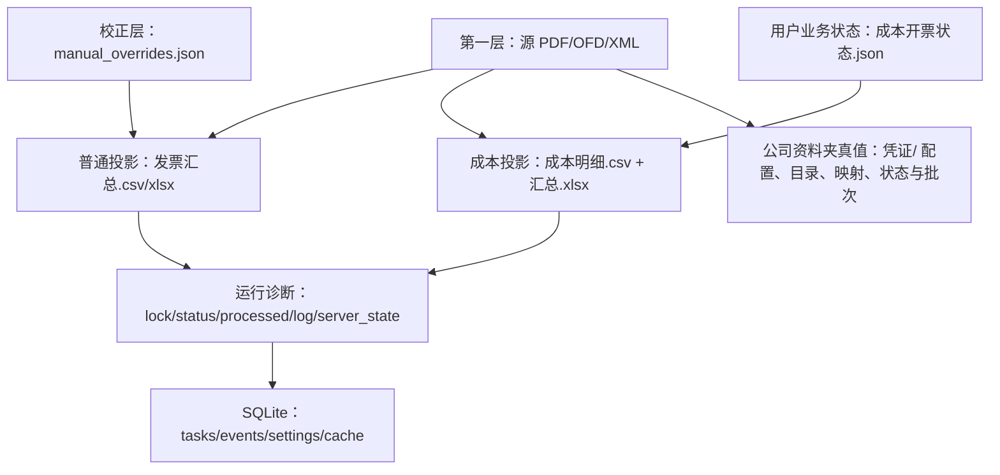

# InvoiceHub 数据结构与算法

> 公共权威基线：经过审计的单一脱敏根提交；旧私有提交、Tag、包和验证材料不属于公开图。
> 当前发行边界：候选树、Git 对象和托管面验证通过前保持 private。`v0.3` Tauri 只增加壳/安装协议，不重写业务数据链。
> 校验规则：精确的当前本地与 GitHub HEAD 以实时 Git 引用和双向差异为准。
> 阅读目标：理解数据为什么这样组织、算法保护什么业务事实，以及失败时为什么宁可留空或待核对。

## 1. 先建立真值层级

InvoiceHub 不是“把发票导入数据库”的系统。它是以文件为事实、以投影方便查询和操作的本地工具。



| 层级 | 数据 | 能否重建 | 规则 |
|---|---|---|---|
| 业务事实 | 源 PDF/OFD/XML | 否，必须保护 | 删除同步绝不删除；字段提取以正文/结构证据为准 |
| 人工校正 | `manual_overrides.json`、允许的 Excel 三字段手改 | 不应无声丢失 | 只覆盖销售方、开票金额、发票号码；重建后重新应用 |
| 用户业务状态 | `成本开票状态.json` | 不能仅从源票恢复 | 保存已开数量、行级加价和已开金额快照；工作簿仅作兼容兜底 |
| 做账业务状态 | 公司资料夹 `凭证/` 下的配置、目录、映射、状态、批次和日志 | 否，必须保护 | 严格 schema、跨进程写锁、revision/CAS；异常时保留原文件并停止写入 |
| 可重建投影 | 普通 CSV/XLSX、成本明细 CSV、成本汇总 XLSX | 是 | 缺失、源变化或 schema 过期时重建 |
| 运行状态 | PID、lock、processed、monitor/server status、日志、偏好 | 部分可恢复 | 多个文件各有用途，不能把诊断快照当唯一进程真值 |
| SQLite | task/event；预留 settings/cache 仓储 | 可按用途恢复 | 不存发票主数据 |

“源发票是事实”不等于自动识别永远正确。人工校正是显式覆盖层，不改源文件；下次重建先重新提取，再把覆盖层应用到投影。

## 2. Python 数据结构为什么这样选

| 结构 | 当前使用位置 | 适用原因 | 维护提醒 |
|---|---|---|---|
| Pydantic `BaseModel` | `InvoiceRecord`、`TargetProfile`、成本快照、任务/事件 | 定义跨层稳定字段，可校验并序列化给 API | 字段变化会影响 API、CSV/XLSX、JS 和测试 |
| `@dataclass(frozen=True)` | `AppConfig`、`Layout`、`ClassificationResult`、`SourceChangeSet`、皮肤包 | 内部确定性值对象，构造后不应被随意改写 | 适合内部算法，不自动成为 HTTP 契约 |
| 普通 `dict` | CSV 行、JSON、API payload、提取候选 | 字段来自中文表头或兼容旧结构，形状可能分阶段补齐 | 访问时清洗类型；不要假设外部 JSON 一定完整 |
| `set` | 发票家族金额集合、路径 token、候选分类、变化集合 | 去重并快速判断 0/1/多值冲突 | 输出前排序，避免非确定性页面/测试结果 |
| `defaultdict(list/int)` | 同票分组、成本维度分组、表格列单元格、重复计数 | 减少分组算法中的样板分支 | 分组键就是业务口径，改键必须写回文档和测试 |
| `Decimal` | 金额、数量、税、均价、加价率 | 避免二进制浮点累积误差，支持明确舍入 | 计算过程保留 Decimal，API 边界才转 float/字符串 |
| `queue.Queue` | monitor Watchdog 事件 | 线程安全地把观察器回调交给 daemon 主循环 | 事件只作触发，最终变化仍由文件签名确认 |
| `sqlite3.Row` | SQLiteRepository 查询 | 可按列名读取，降低列顺序耦合 | JSON 列读出后仍要 `json.loads` 和缺省处理 |
| `RLock` | `AppState` 重建、目录切换、重命名、关闭状态 | 同线程可能进入共享用例，且重建不能交错破坏投影 | 不要在锁内加入无界网络等待或用户交互 |

## 3. 领域模型

### 3.1 路径与运行模型

- `TargetProfile`：`id/watch_dir/workspace_dir/state_dir/localappdata_dir`。它把单活动目录的业务数据与运行档案隔离。
- `RuntimePaths`：项目级 `runtime_dir`、SQLite、server PID/state/stdout/stderr、浏览器和预检日志。
- `AppConfig`：内部 dataclass，保存 root、配置文件、host/port、watch/outbound/runtime、默认加价率和发布能力。
- `Layout`：内部 dataclass，把运行配置解析成确定路径。

### 3.2 发票与成本模型

- `InvoiceRecord`：源文件身份、两维分类、发票号/日期/购销方、价税三项、税率、重复状态和更新时间。
- `CostSyncStatus`：源票、已解析、已校验、缺失、待处理、未解析、待核对数量，以及 `empty/fresh/pending/not_generated/needs_review`。
- `InvoiceReferenceRow`：开票参考完整计算结果。中文别名字段对应业务分组键，其余字段保存数量、均价、加价、已开/未开与快照金额。
- `CostAnalysisSnapshot`：`GET /api/v1/cost-analysis` 的稳定响应，包括三条输出路径、四类可见数据、校验、统计和同步状态。
- `TaskStatus`、`EventEnvelope`：任务和 SSE/诊断事件契约。

做账模型使用稳定 `posting_key = SHA256(company_id + event_type + anchor_business_key)` 识别业务事件；科目、日期、规则、证据和完整分录进入 `proposal_revision_hash`，不能进入 posting key。这样规则变化只产生同一事件的新 revision，不会制造第二个可执行事件。审批和导出均复用 `VoucherExecutabilityValidator` 的结构化 `blockers[]`。

Pydantic 模型不是数据库表。它们主要是跨模块和 API 契约；源发票主数据仍不进入 SQLite。

## 4. 文件格式与位置

### 4.1 普通汇总

位置：`TargetProfile.workspace_dir/发票汇总.csv` 与 `发票汇总.xlsx`。

固定列顺序：

```text
文件名, 文件路径, 发票类型, 特定业务类型, 类型识别状态, 类型识别说明,
发票号码, 开票时间, 销售方, 购买方, 开票金额, 税率, 除税价, 税金,
重复发票, 手改状态
```

CSV 使用 UTF-8 BOM 方便 Excel/WPS；XLSX 的活动 sheet 为“发票汇总”。`summary_schema_needs_refresh()` 同时检查 CSV 和 XLSX 表头，旧 schema 不能只修一份。

### 4.2 成本三件套

三者固定在当前 `watch_dir`：

1. `成本发票明细.csv`：每一条票面明细占一行，不能因页面合并显示而省略票头字段。
2. `成本发票汇总.xlsx`：五个 sheet，依次为“发票明细 / 销售方汇总 / 项目规格汇总 / 开票参考 / 发票校验”。
3. `成本开票状态.json`：开票参考行状态、行级加价、锁定标记和已开参考金额快照。

成本明细固定字段：

```text
销售方, 购买方, 发票号码, 开票日期, 备注项目名称, 内部项目名称,
规格型号, 单位, 数量, 单价(除税), 平均单价(含税), 金额(除税),
税率, 税金, 价税合计, 发票代码(**内文字), 源文件
```

### 4.3 TargetProfile 状态

| 文件 | 位置 | 内容/真值角色 |
|---|---|---|
| `.invoice_monitor.lock` | `state_dir` | daemon PID、目标和启动信息；与 PID 存活共同构成 monitor 真值 |
| `monitor_status.json` | `state_dir` | ready、observer、最近同步/事件/心跳；是诊断快照 |
| `processed_files.json` | `state_dir` | 源路径到 `mtime_ns/size` 和上次票头摘要的映射 |
| `manual_overrides.json` | `state_dir` | 路径身份到三项允许手改字段的映射 |
| `.invoice_stop` | `workspace_dir` | daemon 协作停止标志 |
| `文件变化监控日志.txt` | `workspace_dir` | STARTUP/EVENT/PERIODIC/MANUAL/NOTIFY 业务动作 |
| `bridge_stdout.log/stderr.log` | `state_dir` | daemon 子进程标准输出诊断 |

### 4.4 项目级运行态

- `server.pid`：正式启动器记录的包装进程 PID；关闭时必须按请求快照比对后再删。
- `server_state.json`：localhost 的 `ready/stopping/stopped` 诊断，不代表 monitor 存活。
- `invoice_hub.db`：任务与事件主消费者所在数据库。
- `local_state/preferences.json`：页面偏好和系统关闭方式。
- `local_state/documents/defaults.json`：入/出库单手填默认值。
- `local_state/skins`：导入皮肤和启用状态。
- `local_state/support_packages`：脱敏诊断支持包。

macOS 将这组可写运行态映射到用户的 Application Support，而不是 `.app/Contents`；TargetProfile 和投影语义不变。Windows 正式 core 仍使用包内运行态布局。平台差异只影响根位置，不改变各文件的真值角色。

### 4.5 业务资料夹与做账真值

业务资料夹是当前公司资料的导航边界，不替代 `watch_dir`。当活动扫描目录位于公司资料夹子目录时，`/api/v1/business-dossier` 可以暴露成本发票、银行流水、进项抵扣、开具发票和成本产物等受控入口；open API 仍要求目标位于当前业务资料夹或 `watch_dir` 内。它的元数据统计不是发票业务扫描：一次 `os.scandir` 深度遍历最多检查 4,000 个目录项或 1.25 秒，跳过隐藏项和符号链接，并在同一遍中得出快捷子目录与统计，避免为每个链接重复递归。达到边界或遇到不可读目录时返回 `scan.complete=false`，此时 `stats` 和目录 `file_count` 都只是可诊断的下界，不能用于业务汇总或做账判断。

公司资料夹 `凭证/` 下的核心文件包括：

| 文件/目录 | 真值角色 |
|---|---|
| `账套配置.json` | company、ledger environment、稳定 identity 和目录 SHA 绑定 |
| `科目表.json`、`辅助核算档案.json` | 可执行性校验使用的当前目录事实 |
| `科目映射.json` | resolver 规则、来源和资源 revision；保存前必须零写预览 |
| `凭证生成状态.json` | posting key、proposal revision、决定、审批、批次和单调 revision |
| `批次/<batch_id>/manifest.json` | 不可变授权边界，绑定 facts、目录、行号、签名和 XLSX SHA256 |
| `批次/<batch_id>/凭证导入.xlsx` | 与 manifest 精确绑定的导入文件 |
| `日志/` | 诊断和迁移证据，不作为状态替代品 |

状态 v1 到 v2 和映射 v1 到 v2 都是 preview/apply 两阶段迁移。apply 必须在同一写锁内重验源 SHA、preview hash、source revision、profile/目录/映射绑定、待重确认数、命令身份和备份 SHA；不得在启动时自动迁移。

`config/app.local.json` 可能含包外业务绝对路径。文档和发布包只能说明字段结构，不复制本机值；core 构建必须生成脱敏默认配置。

## 5. SQLite schema 与真实使用情况

连接启用 WAL 和 foreign keys，并把 `row_factory` 设为 `sqlite3.Row`。

```sql
CREATE TABLE IF NOT EXISTS settings (
  key TEXT PRIMARY KEY,
  value TEXT NOT NULL,
  updated_at TEXT NOT NULL
);

CREATE TABLE IF NOT EXISTS tasks (
  task_id TEXT PRIMARY KEY,
  task_type TEXT NOT NULL,
  status TEXT NOT NULL,
  detail_json TEXT NOT NULL,
  requested_at TEXT NOT NULL,
  completed_at TEXT
);

CREATE TABLE IF NOT EXISTS events (
  seq INTEGER PRIMARY KEY AUTOINCREMENT,
  event_type TEXT NOT NULL,
  task_id TEXT,
  payload_json TEXT NOT NULL,
  error_json TEXT NOT NULL,
  created_at TEXT NOT NULL
);

CREATE TABLE IF NOT EXISTS cache (
  key TEXT PRIMARY KEY,
  payload_json TEXT NOT NULL,
  updated_at TEXT NOT NULL
);
```

| 表 | 当前仓储能力 | 当前主要消费者 | 结论 |
|---|---|---|---|
| `tasks` | create/update/get | 手动重建、发票重命名、任务查询 API | 已投入使用 |
| `events` | append/list-after/bounds | monitor、AppState、SSE、诊断 | 已投入使用 |
| `settings` | get/set 和 JSON 包装 | 当前没有主要业务调用者 | 仓储已实现，不能宣称设置已迁入 SQLite |
| `cache` | 只有表结构，仓储没有主要读写 API | 无 | 预留能力，不是发票缓存真值 |

事务由 `session()` 上下文在正常返回时 commit，最后总会 close。当前没有跨表外键；`events.task_id` 是关联信息但没有数据库级 foreign key。SQLite 任何时候都不能新增发票主表来替代源文件，除非产品边界和 `AGENTS.md` 先正式变更。

## 6. 路径身份与变化检测

### 6.1 `target_id`

输入是活动 `watch_dir`，输出是 16 个十六进制字符：

```text
canonical = resolve(watch_dir) 或 abspath fallback
key       = canonical.casefold()
target_id = SHA1(UTF8(key))[0:16]
```

`casefold()` 让 Windows 大小写差异不产生两份档案。截断是目录命名便利，不是安全令牌，也不能用来验证用户权限。

边界：相对路径先按项目根解析；项目内路径写回配置时序列化为 `./...`，包外路径保留绝对形式。关联测试：`tests/test_paths.py`、设置目录 API 测试。

### 6.2 文件签名与集合差

每个源文件签名只含 `mtime_ns + size`，不是内容哈希：

```text
previous = processed_files.json 的路径映射
current  = 当前递归扫描的 PDF/OFD/XML 路径映射

added   = current.keys - previous.keys
deleted = previous.keys - current.keys
updated = intersection 中 mtime_ns 或 size 不同的路径
```

这样 60 秒周期检查不必重读全部发票正文。代价是极端情况下“内容改变但 mtime 和 size 完全相同”不会被识别；手动强制重建可绕过。Watchdog 事件也不直接决定修改结果，只触发同一签名检查，避免重复/临时事件导致无谓全量解析。

关联测试：`test_monitor_sync_rebuilds_outputs_and_processed_state`、坏 processed 恢复、daemon 文件事件测试。

## 7. 票头提取与准确性算法

### 7.1 合法金额和邻近标签

金额清洗先去逗号和货币符号，再找数字候选，并拒绝：

- 没有小数点/逗号/货币证据的 8 到 20 位纯数字；这通常是发票号或对象号。
- 整数部分超过 12 位或绝对值达到 `1,000,000,000,000`。
- 不能构造有限 `Decimal` 的文本。

纯文本提取不会扫描“全文最大数字”。普通标签 fallback 按页逐行查找，只接受标签同行的合法金额，或下一非空逻辑行中的独立 `¥/￥` 货币值；不再使用可跨越票头、汇总与明细区域的 160 字符窗口。严格模式下，同行整数候选还必须有小数、千分位或紧邻货币符号。

```text
for each trusted label occurrence:
    inspect the same logical line after the label
    if a valid amount exists: return value
    inspect only the next non-empty logical line
    if it contains exactly one standalone currency amount: return value
return empty
```

失败策略是空值，不用文件名补金额。测试覆盖发票号污染、号码片段污染、同行/紧邻真实金额和跨逻辑区域拒绝。

跨平台 Windows 发布验收所用的合成 PDF 因为只能使用内置 Latin 字体，带有一对精确的 `InvoiceHub synthetic release fixture` / `Synthetic data only; not a real invoice` 标记；只有这对标记同时存在时，提取器才允许其专用英文标签。普通英文业务文本即使包含 `Invoice number`、`Buyer`、`Seller` 或 `Total amount` 也不会产生发票号、主体、金额、日期或税率字段。这样测试夹具可验证 PDF 链路，却不会把非中国税票的通用商业单据扩展为生产识别面。

### 7.2 PDF 页内唯一金额三元组与主体序列解耦

某些 PDF 文本顺序不是视觉顺序，汇总金额可能先于发票号码，购销方之后又可能出现重复单价和明细金额。PDF 文本提取使用 `\f` 保留页边界，`_extract_pdf_amount_triple()` 按以下证据链工作：

1. 每页独立查找 `价税合计` 或显式 `（小写）` 锚点，不跨 `\f` 页分隔符。
2. 每个锚点只检查后续最多 2000 字符、48 个逻辑行，并限制最多 24 个候选，防止组合爆炸和远区污染。
3. 只收带 `¥/￥` 且通过合法金额格式校验的值；保持票面文本顺序枚举 `除税额 < 税额 < 总额`。
4. 仅保留满足 `abs(除税额 + 税额 - 总额) <= 0.02` 的组合，总额必须是第三个真实票面候选，不能由程序相加伪造。
5. 按候选位置去重后必须恰好一个三元组；多个可行组合、算术不一致、候选过多、跨页、无货币符号或无锚点都返回空证据，再尝试明确标签 fallback。

`_extract_einvoice_value_sequence()` 只负责主体：先锁定独占一行的 20 位发票号，后四行确认日期，再在 18 行内找两个可靠购买方/销售方。它不再扫描或返回金额，尤其不能把销售方后的两个普通小数映射为除税额和税额。证据优先级是结构化 XML/OFD 字段、PDF 唯一算术三元组、明确标签同行/紧邻货币值、空值；成本坐标明细只做独立校验，不反向覆盖票头，人工覆盖仍在投影阶段最后应用。

测试覆盖既有集中值顺序、汇总三元组位于身份字段之前、重复明细金额、零税、负数红票、两个普通小数拒绝、算术不一致、多个可行组合、无货币符号和跨页拒绝。

### 7.3 OFD `CustomTag -> ObjectRef -> TextObject`

OFD 本质上是 ZIP。结构化路径为：

```text
Content.xml: TextObject(ID) -> TextCode 文本
CustomTag.xml: 业务字段路径 -> 一个或多个 ObjectRef(ID)
join: 字段路径 -> TextObject 文本序列
```

票头和成本明细都优先走该映射。`ObjectRef` 可能有多个，成本明细会按行数对齐分段值；只有结构化映射不可用，票头才回退 OFD 全文/坐标分类。临时解压不得落入 `watch_dir`，当前实现主要以内存 ZIP 读取避免污染。

测试：OFD 结构化票头、OFD CustomTag 成本明细、OFD 明确分类字段。

### 7.4 两维分类和同票纠偏

分类器分别收集发票大类候选和特定业务候选：

```text
major candidates    = title + explicit structured type fields
business candidates = explicit labels + structured business fields + title wrapper

if candidate count > 1: value = empty, status = conflict
elif candidate count == 1: value = only candidate
else: value = empty or documented standard default
```

未知业务标签会清空业务类型并进入 `needs_review`。公司名、项目名和商品名不属于业务标签上下文；`XT` 只在显式业务字段中精确匹配。

同票按 20 位号码家族分组。购销方可靠性优先级是 XML、OFD、PDF；空值或明显脏值可被更可靠候选纠正。分类只用唯一非空家族值补空；不同非空值形成冲突说明，不覆盖各来源原值。人工覆盖是在投影阶段后置应用，因此不会被同票纠偏覆盖。

测试：`tests/test_invoice_classification.py` 和 `test_same_invoice_family_*` 系列。

## 8. 成本明细坐标与候选算法

### 8.1 PDF 表头、动态列边界和基线聚类

输入是 PDF word box：`x0/y0/x1/y1/text`。算法不是使用固定横坐标：

1. 标准化表头别名，识别项目、规格、单位、数量、单价、金额、税率、税额及“忽略列”。
2. 以每个已识别表头为锚，在 `y0 ± 6` 的窗口尝试拼接最多四段文字。
3. 候选必须同时有 `item_name + amount + tax_rate + tax_amount`；按识别列数最多、位置更靠上选择可靠表头。
4. 按相邻表头中心点中点生成动态列边界。
5. 明细 word 按纵向中心、容差 3 聚成基线；按 word 横向中心落入列。
6. `价税合计/合计` 行作为停止边界；建筑发生地、证件号等专属列标记为 ignored。
7. 项目名称跨行可在 18 像素内合并；金额/税额先出现时暂存，8 像素内与随后项目行归并。

```text
if reliable_header_missing:
    return no rows + explicit review issue
for baseline in detail_area:
    cells = assign_by_dynamic_columns(baseline)
    if starts_new_item: finish previous; attach near pending values
    else if near current item: merge continuation/value cells
finish last row
```

边界原则：无可靠表头时绝不猜明细。金额和税额都缺失且数量也缺失的伪行会被丢弃。测试覆盖标准、建筑、旅客、货运、不动产、税额基线提前和无表头拒绝。

### 8.2 明细校验与同票候选评分

每个格式候选都计算：

```text
amount_ok = 所有明细金额存在 AND abs(sum(detail.amount) - header.amount) <= 0.02
tax_ok    = 所有明细税额存在 AND abs(sum(detail.tax) - header.tax) <= 0.02
score     = int(amount_ok) + int(tax_ok)  # 0..2
```

同一家族依次分析 XML/OFD/PDF，但最终选择键是：校验分数、是否有行、是否非失败/跳过、格式优先级。也就是说，结构化格式不是无条件胜出；一个金额税额都失败的 XML 不能压过校验通过的 PDF。完全并列时才按 XML > OFD > PDF。

未选中的尝试仍用于诊断；最佳候选未通过时，说明中附同票候选摘要。测试：`test_same_family_prefers_candidate_passing_amount_and_tax`、并列格式优先测试、结构化 XML 优先测试。

## 9. 成本均价和开票参考

### 9.1 库存加权均价与采购算术均价

对同一分组的明细行：

```text
库存平均单价(除税) = sum(金额(除税)) / sum(数量)
库存平均单价(含税) = sum(金额(除税) + 税金) / sum(数量)

每行采购含税单价 = (行金额(除税) + 行税金) / 行数量
采购参考平均单价(含税) = sum(每行采购含税单价) / 有效行数
```

第一组回答“当前库存每单位实际承载多少总成本”，必须按数量加权。第二组回答“不同采购行的典型报价是多少”，每条采购行权重相同。任一必需行缺金额/税/正数量时相关均价返回空，不能把坏行默认为 0。

### 9.2 开票参考分组键

业务键由四个字段组成，不含销售方和发票号：

```text
values = normalize_space([
  发票代码(**内文字), 内部项目名称, 规格型号, 单位
])
reference_key = SHA1(UTF8(join(values, "\x1f"))).hexdigest()
```

状态读取同时接受 SHA1、旧 `|` 明文键和规范化明文键；保存时迁移到 SHA1 并移除同一行别名。这样旧项目状态可继续使用，又避免分隔符碰撞成为新主键。

### 9.3 行级加价、13% 销项税与快照

设库存加权除税均价为 `P`，数量为 `Q`，行级加价率为 `m`：

```text
参考除税单价 = P * (1 + m)
参考除税金额 = P * Q * (1 + m)
参考税金     = 参考除税金额 * 0.13
参考价税合计 = 参考除税金额 + 参考税金
参考含税单价 = P * (1 + m) * 1.13
```

`8%` 只是没有行状态时的 fallback。用户输入百分数会除以 100；负值、非有限数和非数字拒绝。已开数量必须在 `[0,Q]`。

保存状态时：

```text
ratio = invoiced_quantity / Q
if 已开数量改变 or 旧快照缺失:
    locked_part = current_total * ratio
else:
    locked_part = old_locked_part
uninvoiced_part = max(0, current_total - locked_part)
```

因此后续同键新增成本明细会增大当前总量和未开部分，但已开参考金额、税金和价税合计保持当次快照。只改加价率也不会重算已有已开快照。若 JSON 缺状态，系统可从既有工作簿“开票参考”sheet 恢复兼容字段。

测试：快照锁定、汇总增长、行级加价、旧 SHA1/旧字段/工作簿恢复、非法数量与 API 400。

## 10. 人民币大写算法

`rmb_uppercase()` 先按 `ROUND_HALF_UP` 取到分，再拆整数、角、分。整数按四位一组：

```text
groups = integer repeatedly divmod 10000
group units = ["", "万", "亿", "兆"]
each group uses [仟, 佰, 拾, 个]
between zero group or short lower group insert one "零"
```

四位组内部只在非零数字之间补一个“零”。整数为零但有分角时仍正确生成“人民币零元...”；负数前加“负”；零金额输出“人民币零元整”。模板合计小写保持 Decimal 单元格和金额格式。

测试：`test_rmb_uppercase_keeps_expected_zero_positions`、入/出库导出合计测试。

## 11. 两阶段文件重命名事务

目标格式由已经解析并校验的 `日期_销售方&购买方_金额元.扩展名` 构成。算法先强制重建，避免使用陈旧汇总，然后：

```text
1. 为每个源文件生成目标；无可靠日期/购销方/金额则 skip
2. 按规范化目标路径分组；多个源指向同名目标全部 skip
3. 迭代排除被非计划源占用的已有目标
4. 第一阶段：所有源 -> 唯一隐藏临时名
5. 第二阶段：所有临时名 -> 最终目标名
6. 迁移 manual_overrides 路径身份
7. 重新汇总并写 task/event
```

为什么不能直接逐个改名：A 的目标可能正是 B 的源名，直接改会因顺序产生覆盖或失败。两阶段先释放所有原名。任一阶段失败都按逆序回滚；回滚本身失败会进入详细错误，不能宣称成功。重命名后重建失败时文件已经改名，接口明确返回“重命名完成但重建失败”，便于人工恢复。

测试：手改字段迁移与重建、重复目标名跳过；真实业务目录重命名仍需单独用户验收。

## 12. 原子替换、ZIP 和路径边界

### 12.1 原子文件替换

JSON/CSV 先写同目录 `.tmp`，再 `os.replace(tmp,target)`；单据工作簿写带 PID 的临时 `.xlsx` 后替换。好处是读者通常只看到旧完整文件或新完整文件，不看到半写正文。

边界：同目录替换减少跨卷问题，但 Windows 上目标被 Excel 占用可能抛 `PermissionError`；调用者必须返回“文件被占用”而不是删除目标。进程在 replace 前崩溃可能留下临时文件，后续维护只能精确清理确认过的临时项。

### 12.2 皮肤 ZIP 安全验证

验证顺序刻意在写盘前完成：

1. 请求体、单文件、解压总量和文件数量上限。
2. 过滤常见打包垃圾，允许一个共同外包目录。
3. 拒绝绝对路径、Windows 盘符/协议样式、空段、`.`、`..`、重复路径。
4. 拒绝符号链接、加密条目、脚本/可执行/HTML/JS 和未知扩展名。
5. 校验 `skin.json` 必填字段、id 正则、CSS entry 和内置 id 冲突。
6. CSS 拒绝 `@import`、外链 scheme、`data:`、`javascript:`、反斜线和包内缺失资源。
7. 通过后才写 `runtime/local_state/skins`；内置皮肤始终只读。

安全测试在 `test_skin_import_rejects_unsafe_zip_content` 及相邻导入/替换测试。

### 12.3 单据导出路径包含校验

服务端不接受客户端提交任意输出路径。目标始终由发票号、日期和受控根计算，再验证：

```text
resolved_target == resolved_root
OR resolved_target.is_relative_to(resolved_root)
```

入库根是 `watch_dir/入库单`，出库根是 `outbound_invoice_dir/出库单`。打开文件和打开目录重复执行同一校验；前端隐藏字段不能绕过。测试：`test_open_document_api_does_not_accept_arbitrary_path` 和出库目录范围测试。

### 12.4 确定性构建清单

`deterministic_build_id()` 对声明的共享 core 输入按仓库相对路径排序，依次散列路径、内容长度和内容，并忽略 `.DS_Store`、`.pyc` 与 `__pycache__`。当前输入覆盖共享 `src`、`web`、随包捷锐 runner、`docs/jierui` facts 和 `pyproject.toml`；本机配置、运行态、发票和平台构建缓存不进入散列。Windows 与 macOS 必须以同一 RC_SHA 计算出相同 core build ID。

`invoice-hub-build.json` 记录 core build ID、API 契约、`w9-ledger-review-v1`、完整 capabilities、source commit 和 built_at。`invoice-hub-package.json` 再绑定产品版本、平台、架构、包类型、package ID、Python 版本、依赖锁 SHA、更新通道/地址/白名单与 core build；它的 `source_commit` 必须与 build manifest 完全相同，且 package ID 必须由平台/架构/包类型唯一推导，不能只靠格式正确。`python/invoice-hub-runtime.json` 或 Mac runtime 中的同名清单绑定运行时树 SHA、解释器路径、平台/架构/Python 和 smoke modules。三者任一缺失、值漂移或使用非 40 位 clean source commit，正式启动/验证必须 fail closed，不能把 development fallback 当作发布身份。

CycloneDX 1.6 SBOM 由平台哈希锁确定性生成，组件版本和 lock SHA 必须匹配 package/runtime manifest。逐文件 SHA 清单用于验证包解压后的内容完整性；它和 SBOM 都是发行证据，不是签名、公证或 Sparkle EdDSA 的替代物。

### 12.5 源文件预览与批量打印短期作业

预览与打印不是新的发票投影，也不是 SQLite 表。它们是 AppState 进程内的短期 job，均有最大作业数、选中记录数、页数、单页像素和总缓存字节上限；目录切换时清空，过期后返回明确的过期错误。print 保持从创建时起算的 15 分钟 TTL；preview 的 15 分钟改为闲置超时，成功的内容/打开访问与专用 keep-alive 均会滑动续租。弹窗关闭后前端停止续租，因此无人使用的票面仍会自动释放。

- preview 先复核 `invoice_key + source_path`，再按用户选择顺序保存 `FilePreviewEntry`；PDF/OFD/图片以 PNG 分页缓存，XML 作为受限文本读取。SVG 仅在拒绝 DTD、实体、脚本、外链、外部 `url()` 和事件属性后才允许渲染。前端保留打开弹窗时的勾选快照，只在 job `404/410` 时自动重建并恢复同名展示路径/文件序号和页码；`409 source_changed` 不属于可透明恢复错误。
- print 先按同票家族收敛，选择当前 `watch_dir` 内可访问的 PDF；只把渲染后的页面和页序元数据放入 `InvoicePrintJob`，不写发票字段、路径或图片到 SQLite、CSV/XLSX/JSON 投影。
- 打开预览文件或位置时重新验证 job 文件仍位于当前 `watch_dir`，不能相信客户端提交路径。所有票面响应和打印 HTML 都使用 `Cache-Control: private, no-store`。

打印作业的固定限制和浏览器排版约束：

- 单次最多 100 条勾选记录、200 个 PDF 页面；150 DPI RGB PNG，单页最多 3000 万像素。
- 单作业最多 128 MiB，进程缓存最多 256 MiB、最多 8 个作业；print 从创建起 15 分钟过期，切换活动 `watch_dir` 时立即清空。
- 原 PDF 每页都保留，页面方向由 PDF 页宽高决定；所有源都成功才发布作业，避免一批中静默漏掉失败票。
- 首次打印必须等待全部 PNG 完成 `load`、`decode()` 和两次 `requestAnimationFrame`；网络加载事件本身不能证明打印合成层已有非空票面。
- 命名 `@page` 只声明方向，纸型沿用打印机或用户选择；票面盒按实际页框 `100% × 100%` 排版，不使用固定 A4 或打印态 `100vw/100vh`，分页只在第二张及后续真实票面前使用 `break-before`。
- OFD/XML 只有在同一 20 位号码家族存在当前目录 PDF 时才能回退；`window.print()` 和 `beforeprint/afterprint` 只能描述对话框生命周期，不能证明用户最终打印或设备成功。

### 12.6 更新元数据、缓存与升级标记

从 `v0.3` 起，`latest.json` 的 schema 记录通道、最新版本、UTC 发布时间、最低 API 契约、发行说明、对应源码和受影响平台的签名安装产物。源码记录 `source_commit/core_build_id`；每份产物绑定 HTTPS URL、正整数大小、SHA-256、精确 package ID、同一 `source_commit` 与同一 core build ID。更新元数据由同一对象生成，禁止人工维护漂移副本。

公开 Feed 的身份不是命令行手填值。`v0.3` finalizer 从实际资产、签名证据、收据和源码归档重算身份，再从指定 Git checkout 的固定 release Tag commit 用 `git archive` 重建受控树并逐项比较 source commit、tree SHA、文件数与 core build，绝不读取 checkout 工作树。Tauri updater 验签、下载、安装和重启必须由 host 负责，并在安装前安全停止 monitor；Host RPC token 不返回网页，且只接受固定 localhost origin 的枚举命令。任何平台资产、源码归档、Tag 和收据的版本、source commit、core build、package ID、大小、SHA 或签名冲突都不得生成 Feed。

更新服务只接受编译进包内的 HTTPS Feed 和主机白名单，重定向后再次校验；连接预算 3 秒、端到端预算 5 秒、响应上限 256KB。缓存位于 `runtime/local_state/update-cache.json`，保存 ETag、上次有效 feed/result 和最近尝试时间；离线、无效或未来最低契约失败只更新错误状态，不清除最后有效元数据，也不获得成功结果的 24 小时 TTL。

`preferences.json` 保持 `startup_surface=browser|desktop` 与 `auto_check_updates=bool`。`v0.3` Tauri 新安装默认 desktop，导入的显式偏好保持原值并在下次启动生效，browser 模式隐藏主窗口、只打开一次默认浏览器并常驻托盘。安装协调标记只用于跨 host 重启的 monitor 协调，不保存发票、解析结果或安装授权；停止失败、取消或安装失败均不改变运行状态。

## 13. 失败策略总表

| 场景 | 当前策略 | 禁止策略 |
|---|---|---|
| 票头金额证据不足 | 留空、合计标缺失 | 抓全文最大数或用文件名编号 |
| 分类未知/冲突 | 留空并 `needs_review/conflict` | 选第一个候选掩盖冲突 |
| PDF 无可靠成本表头 | 无明细并进入发票校验 | 按固定位置或行号硬猜 |
| 同票多格式差异 | 评分选候选，保留尝试诊断 | 多格式全部计入库存 |
| 周期扫描无变化 | heartbeat，不重解析 | 每 60 秒全量重建 |
| processed JSON 损坏 | 备份后从汇总/源快照重建 | 直接把坏状态当无变化 |
| monitor stale lock | 仅 PID 不存活时隔离清理 | 只凭 lock 存在认定运行 |
| WebUI 关闭时 monitor 停止失败 | 保留 WebUI并返回失败 | 无复核直接结束进程 |
| Excel/单据被占用 | 明确提示并保留原文件 | 强删或覆盖打开中的文件 |
| 皮肤包异常 | 写盘前拒绝 | 解压后再清理危险文件 |
| 做账状态 JSON schema/版本异常 | 保留原文件、写诊断、停止后续写入 | 当空状态覆盖或启动时自动迁移 |
| 做账授权证据漂移 | 使审批/导出授权失效并返回 blockers | 沿用旧 revision、旧 SHA 或客户端批准状态 |
| macOS health/manifest 不一致 | 拒绝连接并显示预期/实际诊断 | 只凭 `health.ok=true` 接入 |
| 更新 Feed 离线/超时 | 显示离线，保留最后有效 ETag/feed，本地业务继续 | 阻塞启动、清空可用缓存或无限等待 |
| 更新 URL/重定向不在白名单 | `UPDATE_HOST_REJECTED`，不下载 | 接受客户端覆盖 URL 或任意跳转 |
| Windows 请求 desktop surface | 读时归一为 browser，写时 422 | 保存一个当前包无法实现的启动方式 |
| Sparkle 安装前 monitor 停止失败 | 延后 relaunch 并保留诊断；取消/失败恢复 | 带着旧 monitor 替换 core 或静默丢失监控 |
| 预览 job 闲置过期/后端重启/容量回收 | 弹窗打开时续租；`404/410` 自动以原勾选快照重建并保留文件/页码；仍失败再显示重试 | 无限循环重建、绕过源签名/目录边界或将票面持久化 |
| 预览目录切换或源文件变化 | 清除/拒绝旧 job，要求用当前列表重新选择 | 通过 keep-alive 或自动重建继续展示过期身份 |
| 打印 job 过期 | 明确要求重新选择；清除内存作业 | 使用旧 job 或将票面写入持久投影 |
| macOS 打印 popup origin/路径不匹配 | 拒绝导航或 bridge 消息 | 让子窗口继承目录/后端控制 bridge |
| owned 后端退出超时 | 保留 process/PID/ownership 真值，等待确认退出 | 超时后无条件删 PID 或降级 external |

## 14. 修改算法时的最低联动

- 票头/分类：`parsers.py`、`classification.py`、summary、API/详情/一致性、成本元数据、分类与汇总测试。
- 成本结构/公式：`cost_analysis.py` 与 `costs.py` 双向核对，成本 CSV/XLSX/API/页面/状态 JSON 和全部成本测试。
- 路径/运行态：`targets/paths.py`、Windows 脚本、monitor、release、路径/监控/发布测试。
- 状态与事件：SQLite schema/仓储、AppState/monitor 生产者、SSE、前端重连与 API 契约。
- 单据：预览、模板、动态行、服务端路径限制、页面导出分支和 `test_documents.py`。
- 做账：公司资料夹仓储、validator、proposal revision、映射/迁移、批次 manifest、API/页面和全部 bookkeeping/runner 测试。
- 业务资料夹：根目录推导、受控打开范围、首页入口和 API 契约；不得改变发票扫描源。
- 构建握手/macOS：build manifest、health、Swift required capabilities、脚本 verify、路径/所有权状态机和 Swift/Python 契约测试。
- 发布/更新：版本单一真值、平台依赖锁、三类 manifest、SBOM、Feed/appcast parity、About API/页面、Windows 旁路迁移、Sparkle monitor 恢复和双平台手册。

完整导航见 [Agent 任务地图](AGENT_TASK_MAP.md)，接口关系见 [接口与运行流程](INTERFACES_AND_FLOWS.md)，平台边界见[平台架构](PLATFORM_ARCHITECTURE.md)，建议源码注释点见 [注释与设计原因地图](COMMENT_RATIONALE_MAP.md)。


返回 [开发架构总入口](../DEVELOPMENT_ARCHITECTURE.md)。
