# InvoiceHub 接口与运行流程

> 公共权威基线：经过审计的单一脱敏根提交；旧私有历史和发布资产不属于公开图。
> 当前发行边界：候选树、Git 对象和托管面验证已通过，仓库已公开；旧私有历史、Tag 和资产仍不得公开或上传。Tauri 2 `v0.3` 才替换平台壳并新增 Host RPC/updater 行为。
> 校验规则：精确的当前本地与 GitHub HEAD 以实时 Git 引用和双向差异为准。
> 状态说明：OCR 服务类接口与 Windows desktop surface 属于“未启用能力”；当前尚未创建公开 Tag、Release 或 Feed。Tauri 开发分支已有代码级 host 生命周期、Host RPC 和 update-install API，且 L6 已运行隔离 TestClient runtime contract。schema-3 development assembly 已构建且隔离烟测一个 macOS arm64 `.app`；裸 checkout 仍无 manifest 而 fail-closed，development updater 禁用，真实 updater 与平台 release smoke 尚未进行。

Tauri L9/P1-Q 只验证一次 development-profile 组装、启动和真实 Cmd-Q 退出流：host 用编译绑定的 manifest/launcher 启动 owned child，child 固定监听 `127.0.0.1:8766`，health/background ready 后加载首页和静态资源。`INVOICE_HUB_DEV_STATE_ROOT` 只对 development host 可用，必须显式、绝对、已存在、canonicalize 后与 bundle/core 和完整 `.app` 容器双向不包含，`Contents` sibling 同样拒绝，且不传给 Python child。clean-commit 样本的前台 Cmd-Q 经自定义菜单触发 `app.exit(0)` 与 `ExitRequested`，随后 shutdown POST 200、`server_state=stopped`、monitor 未运行、host/backend/PID/8766 清理完成；打开的 SSE 连接由既定 `kill + wait` 兜底。外部 AppleScript quit、tray 点击等不是该样本；该流也未调用真实 Feed/安装、原生 picker、browser、单实例或打印，不能推断为任何发布接口已验收。

## 1. 从页面到真值的完整链路

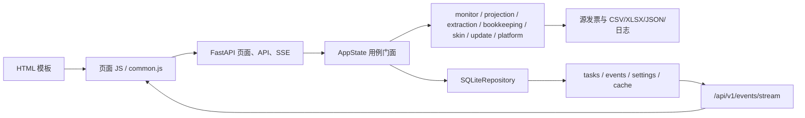
```mermaid
flowchart LR
    Page["HTML 模板"] --> JS["页面 JS / common.js"]
    JS --> HTTP["FastAPI 页面、API、SSE"]
    HTTP --> State["AppState 用例门面"]
    State --> Service["monitor / projection / extraction / bookkeeping / skin / update / platform"]
    Service --> File["源发票与 CSV/XLSX/JSON/日志"]
    State --> Repo["SQLiteRepository"]
    Repo --> DB["tasks / events / settings / cache"]
    DB --> SSE["/api/v1/events/stream"]
    SSE --> JS
```

理解接口时要分清三层：`api/app.py` 只负责 HTTP 适配和错误码；`AppState` 负责用例编排和并发保护；提取、投影、monitor、皮肤及平台模块负责具体行为。不要在路由里复制业务算法。

## 2. 页面路由矩阵

| 路由 | 模板与脚本 | 主要数据接口 | SSE / 特殊规则 | 主要测试 |
|---|---|---|---|---|
| `GET /` | `index.html` + `page-index.js` | settings、invoices、selection-summary、bridge、目录选择/保存 | 监听公共事件；保留未保存目录草稿 | `test_api_contract.py`、`test_frontend_contract.py` |
| `GET /costs` | `costs.html` + `page-costs.js` | preferences、cost-analysis、reference-status、bridge/rebuild、open-summary | 自动事件合并刷新；四个互斥真实表格视图 | 成本 API、成本前端契约 |
| `GET /documents` | `documents.html` + `page-documents.js` | documents/state、preview、defaults、export/status/open、出库目录接口 | 只在相关汇总事件后刷新；目录草稿不被覆盖 | `test_documents.py`、前端契约 |
| `GET /bookkeeping` | `bookkeeping.html` + `page-bookkeeping.js` | setup、profile、catalog、voucher、mapping、migration、batch | 服务端 blockers 是执行真值；W8/W9 页面不开放真实 Safari apply | 做账 API/状态/映射/导出测试 |
| `GET /ocr` | `ocr.html` + `page-ocr.js` | preferences、ocr/service-status、选择器、候选列表、extract-text | core 中只提供禁用态和候选文件浏览 | API/前端静态契约 |
| `GET /consistency` | `consistency.html` + `page-consistency.js` | consistency-report | 可切换只看差异；当前未连接公共 SSE | 分类、API、前端契约 |
| `GET /settings` | `settings.html` + `page-settings.js` | 聚合 settings、preferences、about/update、bridge、documents、skins、costs、OCR、diagnostics、shutdown | 监听公共事件；About 本地加载；支持 `?no_skin=1` | API、更新服务与设置页契约 |
| `GET /skins` | `skins.html` + `page-skins.js` | skins 列表、导入、替换、启用、重置 | 上传体必须是原始 ZIP；不执行包内代码 | 皮肤 API 与前端契约 |
| `GET /backend` | `backend.html` 内联脚本 | health、settings、bridge/status | 不注入皮肤，不进入普通首要导航 | API/前端契约 |
| `GET /invoices/{invoice_key}` | `detail.html` + `page-detail.js` | invoice detail、manual-fields、open-file、open-location | `invoice_key` 是当前汇总位置键，不是长期主键 | 详情与成本拆分 API 测试 |
| `GET /invoices/print/{job_id}` | `invoice_print.html` 内联打印脚本 | print job、逐页 PNG | 不注入活动皮肤；全部图片完成 `load + decode` 和两次渲染帧后调用 `window.print()`；票面跟随实际页框；私有 no-store；macOS 子窗口只允许该同端口受控路径 | 打印服务/前端契约、真实浏览器分页与 macOS 策略测试 |
| `GET /favicon.ico` | 静态响应 | 无业务数据 | `include_in_schema=false`，但仍属于 FastAPI 路由契约 | API 静态契约 |

所有普通页面由 `_template()` 做有限占位替换，不是 Jinja2 模板引擎。活动皮肤由服务端在 `</head>` 前注入；`/backend` 和带 `?no_skin=1` 的请求跳过注入。

## 3. HTTP API 总表

### 3.1 健康、设置、偏好与诊断

| 方法与路径 | AppState 入口 | 主要请求/返回 | 消费者与错误 |
|---|---|---|---|
| `GET /api/v1/health` | `health` | 运行状态、路径/PID、build/API/协议/能力，以及 `product_version/package_id/platform/architecture/package_type` 与 package manifest 状态 | 双平台启动器、设置页、macOS 严格握手；当前健康可先于后台同步完成 |
| `GET /api/v1/about` | `about` | 纯本地返回产品、package、build、公开链接和最近更新状态 | 设置“关于”；绝不触发网络 I/O |
| `POST /api/v1/update/check` | `check_for_updates` | JSON 只允许布尔 `force`；返回 `idle/checking/up_to_date/available/offline/invalid/unsupported` 与候选 artifact | 同源写请求；线程池执行；URL/主机不可由客户端覆盖 |
| `POST /api/v1/update/install` | `install_update` | 只接受空 JSON 对象 `{}`；只消费本进程已批准且与 allowlisted Feed 最新版本完全一致的 host candidate | Tauri 配置时要求精确 host origin；当前 host 清除候选后 fail closed，直到 recovery/relaunch coordinator 完整实现；版本/URL/路径/签名一律拒绝；Host RPC 失败固定 `503 Update installation unavailable`，不得泄露 token 或候选元数据 |
| `GET /api/v1/settings` | `settings` | 主机端口、活动 TargetProfile、普通/成本产物、最近目录、偏好、bridge、诊断路径 | 首页、设置页、backend |
| `PUT /api/v1/settings` | `update_settings` | `{watch_dir}`；有效目录才切换，停止旧 monitor，写配置并触发后台同步 | 首页、设置页；业务失败通常返回 `ok=false` 而非 HTTP 4xx |
| `GET /api/v1/preferences` | `preferences` | 成本显示、路径显示、单据策略、OCR 候选目录、关闭方式、`startup_surface`、`auto_check_updates` 及 `desktop_available` | costs/documents/OCR/settings 与 macOS 壳 |
| `PUT /api/v1/preferences` | `save_preferences` | 允许字段的部分更新 | 强制同源写；非法值 `400`；Windows desktop 返回 `422`；写 `runtime/local_state/preferences.json` |
| `GET /api/v1/diagnostics/summary` | `diagnostic_summary` | 配置、产物、运行态、bridge、事件和日志摘要 | 设置页诊断 |
| `GET /api/v1/diagnostics/config-health` | `config_health` | 路径槽位、目录和配置健康项 | 设置页诊断 |
| `POST /api/v1/diagnostics/support-package` | `export_support_package` | 支持包路径、大小和清单 | 设置页；不含源发票或投影正文 |
| `POST /api/v1/settings/validate-watch-dir` | `validate_watch_dir` | `{watch_dir}` -> `can_monitor/summary/format_counts` 等 | 首页、设置页；只检查，不保存 |
| `POST /api/v1/settings/pick-watch-dir` | `pick_watch_dir` | 原生选择器结果 | 首页、设置页；返回值只是待保存草稿 |
| `POST /api/v1/settings/recent-watch-dirs/remove` | `remove_recent_watch_dir` | `{watch_dir}` -> 最近目录 | 不允许删除当前活动项；结果由页面提示 |
| `POST /api/v1/settings/rename-invoice-files` | `rename_invoice_files` | 任务、扫描/重命名/跳过统计和逐文件结果 | 设置页；内部任务记入 SQLite，算法见数据专题 |

### 3.2 发票列表、预览、打印、详情与选择合计

| 方法与路径 | AppState 入口 | 主要请求/返回 | 消费者与错误 |
|---|---|---|---|
| `GET /api/v1/invoices` | `list_invoices` | 查询筛选；返回 `items/stats/snapshot/target_id/watch_dir` | 首页；读取普通汇总并应用手改覆盖 |
| `POST /api/v1/invoices/selection-summary` | `invoice_selection_summary` | `{items:[{invoice_key,source_path}]}`；返回去重张数、三项金额和成本拆分 | 首页弹窗；JSON/字段错误 `400`，过期选择 `409` |
| `POST /api/v1/invoices/preview-jobs` | `prepare_invoice_preview` | `{items:[{invoice_key,source_path}]}`；返回短期 job、按所选顺序的文件元数据和页面/text URL | 首页预览；选择过期 `409`，渲染/来源问题返回结构化 `4xx/503`，响应 no-store |
| `POST /api/v1/invoices/preview-jobs/{job_id}/keep-alive` | `keep_invoice_preview_alive` | 轻量刷新预览 job 的 15 分钟闲置截止时间；返回 `job_id/expires_at/idle_timeout_seconds` | 只在预览弹窗打开期间调用；已过期 `410`、后端重启后未知 job `404`，响应 no-store |
| `GET /api/v1/invoices/preview-jobs/{job_id}/files/{file_number}/pages/{page_number}` | `invoice_preview_page` | 返回分页 `image/png` 与尺寸/方向头 | 只读取本 job 文件；过期 `410`、页不存在 `404`，响应 no-store |
| `GET /api/v1/invoices/preview-jobs/{job_id}/files/{file_number}/text` | `invoice_preview_text` | 返回 XML 受限纯文本与编码/截断头 | 只用于 text 类型；不解析或执行 XML 内容 |
| `POST /api/v1/invoices/preview-jobs/{job_id}/files/{file_number}/open-file` | `open_invoice_preview_file` | 打开 job 内的受控源文件 | 路径必须仍在当前 `watch_dir`；不能传任意本机路径 |
| `POST /api/v1/invoices/preview-jobs/{job_id}/files/{file_number}/open-location` | `open_invoice_preview_location` | 打开 job 内源文件所在目录 | 同样复核当前目录边界 |
| `POST /api/v1/invoices/print-jobs` | `prepare_invoice_print` | `{items:[{invoice_key,source_path}]}`；返回短期打印 job、同票收敛和分页元数据 | 首页批量打印；只接受可打印 PDF，过期选择 `409`，不可打印/容量问题返回结构化错误 |
| `GET /api/v1/invoices/print-jobs/{job_id}/pages/{page_number}` | `invoice_print_page` | 返回打印页 `image/png` | print 模板和 macOS 打印子窗口；job/页不存在或过期明确失败，响应 no-store |
| `GET /api/v1/invoices/{invoice_key}` | `invoice_detail` | 票头、可编辑字段、源文件状态、一致性和本票成本拆分 | 详情页；位置不存在 `404` |
| `PATCH /api/v1/invoices/{invoice_key}/manual-fields` | `update_manual_fields` | 仅 `销售方/开票金额/发票号码` | 详情页；不存在 `404`，解析 JSON 后在线程池写手改状态和 CSV/XLSX |
| `POST /api/v1/invoices/{invoice_key}/open-file` | `open_invoice_file` | 打开源文件，返回文件信息 | 首页/详情；不存在 `404` |
| `POST /api/v1/invoices/{invoice_key}/open-location` | `open_invoice_location` | 打开源文件所在目录 | 详情；不存在 `404` |

`invoice_key` 当前来自汇总行下标。它只能和 `source_path` 一起用于短期页面选择；列表重建后不能把旧位置键当成同一张票。

selection-summary 路由异步解析 JSON，随后将同步 `AppState.invoice_selection_summary()` 卸载到 Starlette 线程池。该方法会读取普通汇总、手改状态和当前成本 CSV 并执行聚合；不得再放回事件循环直接执行，否则文件 I/O 阻塞时 health 也无法调度。

同样，`manual-fields` 在 JSON 解析后在线程池执行。其写入与当前 profile 的 monitor 写锁串行化；若写入期间活动 profile 已切换，旧目录的手改真值可以完成，但不能清新目录缓存或发送新目录的刷新事件。

preview 和 print 都以短期内存 job 输出，不能把 PNG、XML 文本或打印页写进 SQLite。preview 保留每条选中源文件的顺序，print 才按同票家族收敛；所有 job 创建先复核短期选择身份，随后每个打开动作再核验路径仍处于当前 `watch_dir`。预览的 15 分钟是闲置超时：分页、文本、受控打开和 keep-alive 成功时都滑动刷新；弹窗打开期间按超时的三分之一定时续租，回到前台时立即检查。定时器节流、后端重启或容量回收导致 `404/410` 时，页面使用打开弹窗时的勾选快照自动重建，尽量保留当前文件和页码；关闭弹窗即停止续租。目录切换和源文件签名变化仍阻断旧 job，不能被自动恢复绕过。预览/打印页、文本和打印 HTML 均设置 `no-store`，不允许缓存包含业务票面的响应。

### 3.3 成本分析

| 方法与路径 | AppState 入口 | 主要请求/返回 | 消费者与错误 |
|---|---|---|---|
| `GET /api/v1/cost-analysis` | `cost_snapshot` | 必含 watch/source/target、成本三路径、items/project_summary/invoice_reference/checks、状态统计、兼容 `reference_markup_rate`、`sync` | 成本页、设置页；在线程池读取，旧 schema 修复受 profile 写锁保护 |
| `POST /api/v1/cost-analysis/reference-status` | `save_cost_reference_status` | `{items:[{key,invoiced_quantity,reference_markup_rate_percent,reference_markup_locked}]}` | 成本页；JSON 解析后在线程池写状态 JSON/工作簿，非法/超量数量或加价率 `400` |
| `POST /api/v1/cost-analysis/open-summary` | `open_cost_summary` | 打开当前 `watch_dir/成本发票汇总.xlsx` | 成本页；缺失时返回结构化失败 |

`cost_snapshot` 的 schema 自愈和 `reference-status` 的状态/工作簿写入都使用所捕获 `TargetProfile` 的 monitor 写锁。完成前若活动 profile 改变，只保留旧 profile 自己的落盘结果，不清当前缓存且不发送当前 profile 的事件；这两条文件 I/O 路径不能在事件循环中等待锁。

### 3.4 单据

| 方法与路径 | AppState 入口 | 主要请求/返回 | 错误/消费者 |
|---|---|---|---|
| `GET /api/v1/documents/state` | `document_state` | 入/出库可选发票、目录、最近目录、默认值 | 单据页、设置页 |
| `POST /api/v1/documents/pick-outbound-dir` | `pick_outbound_invoice_dir` | 原生选择器结果 | 仅生成待保存草稿 |
| `POST /api/v1/documents/validate-outbound-dir` | `validate_outbound_invoice_dir` | `{outbound_invoice_dir}` -> 可读性、格式统计和 warning | 单据页/macOS bridge；只检查，不保存 |
| `PUT /api/v1/documents/outbound-dir` | `update_outbound_invoice_dir` | `{outbound_invoice_dir}` | 保存出库发票来源目录 |
| `POST /api/v1/documents/recent-outbound-dirs/remove` | `remove_recent_outbound_invoice_dir` | 删除历史目录记忆 | 当前目录受到保护 |
| `PUT /api/v1/documents/defaults` | `save_document_defaults` | 入库/出库允许字段 | 写 `runtime/local_state/documents/defaults.json` |
| `GET /api/v1/documents/inbound/preview` | `document_inbound_preview` | 查询 `invoice_number`；返回逐明细预览和合计 | 无票 `404`，预览规则错误 `400` |
| `POST /api/v1/documents/inbound/export-status` | `inbound_document_export_status` | `{invoice_number}` | 返回存在、占用、目标/文件夹路径；`404/400` |
| `POST /api/v1/documents/inbound/export` | `export_inbound_document` | `{invoice_number,defaults,mode}`；`mode=copy` 可导出副本 | `404/400`；占用以 `ok=false` 返回 |
| `POST /api/v1/documents/inbound/open` | `open_inbound_document` | `{invoice_number}` | 只打开受控目录内已导出文件；`404/400` |
| `POST /api/v1/documents/inbound/open-location` | `open_inbound_document_location` | `{invoice_number}` | 只打开受控目录；`404/400` |
| `GET /api/v1/documents/outbound/preview` | `document_outbound_preview` | 查询 `invoice_number`；解析出库发票明细 | 无票 `404`，目录/解析规则错误 `400` |
| `POST /api/v1/documents/outbound/export-status` | `outbound_document_export_status` | `{invoice_number}` | 与入库同语义，根目录改为 `outbound_invoice_dir/出库单` |
| `POST /api/v1/documents/outbound/export` | `export_outbound_document` | `{invoice_number,defaults,mode}` | `404/400`；原子写 Excel |
| `POST /api/v1/documents/outbound/open` | `open_outbound_document` | `{invoice_number}` | 只打开受控目录内文件 |
| `POST /api/v1/documents/outbound/open-location` | `open_outbound_document_location` | `{invoice_number}` | 只打开受控目录 |

### 3.4.1 Tauri 私有握手与原生选择器

这不是新的浏览器公开能力。未来 bundle 的 Rust host 在创建 WebView 前，先以固定
`127.0.0.1:8766` 启动自己的 backend child，并向仅该 child 知道的 256 位 secret
提出新 challenge。`GET /api/v1/internal/desktop-host-proof` 不进入 OpenAPI；它只在
secret 已捕获到 app state 且 challenge 是合法 64 位小写 hex 时返回 `204` 和
`X-InvoiceHub-Desktop-Host-Response: HMAC-SHA256(secret, challenge)`。Host 在本地以
常量时间验签，然后复核 child PID、manifest identity、`/` 和 OpenAPI 路径加方法；
读取不受信任的 `startup_surface` 偏好后，host 必须再次使用新的 challenge/HMAC 和同一
identity 检查确认 child 仍被拥有，才 arm 授权或创建 surface。未知监听者永远不会收到 secret
或 WebView。

四个既有 picker route 仍只把选择结果交回既有 `AppState` 草稿流程：

| 路径 | Tauri host mode 的额外边界 |
|---|---|
| `POST /api/v1/settings/pick-watch-dir` | 必须精确 `Origin: http://127.0.0.1:8766` |
| `POST /api/v1/documents/pick-outbound-dir` | 必须精确 `Origin: http://127.0.0.1:8766` |
| `POST /api/v1/ocr/pick-file` | 必须精确 `Origin: http://127.0.0.1:8766` |
| `POST /api/v1/ocr/pick-folder` | 必须精确 `Origin: http://127.0.0.1:8766` |

在非 Tauri mode，它们保留既有同源写入检查。Tauri host 只将 token 传给其直接启动的
Python backend；backend 启动时捕获 token 并从 descendant 环境清除。该 Python client 的 picker 面只将四种固定 picker enum
发送到随机 loopback Host RPC listener，更新面独立地只允许 `update_check` / `update_install` 两个固定 enum；token 不会经过页面、
Tauri command/event、API 响应或日志；Rust dialog 最多等待 120 秒，Python 以 125 秒预算保留响应余量。
Host RPC 失败统一变为不含 token、URL 或 secret 的 `503 Native picker unavailable`；非
Tauri 的 Tk 行为不变。授权先在 handshake 后 arm，backend child 退出后由 100 ms 有界
Rust liveness watcher 撤销，watcher 不能重新授权已退出 child。握手完成后 host 才读取
`GET /api/v1/preferences` 的严格 `{ok, preferences.startup_surface,
allowed.desktop_available}` 形状并重新证明 ownership：desktop 创建空 IPC WebView，browser
只由 host-only opener 打开固定 localhost origin；托盘和第二实例重开同一 surface，desktop
close 只隐藏窗口且不会调用 monitor stop。当前这条流程只做 source/contract verification，
尚未打开真实 native picker、浏览器、托盘或窗口。

`BackendHost` 在 Tauri `setup` 内先保持为局部 owned child：tray 或已选 desktop/browser
surface 的任一可失败初始化失败时，host 必须在返回原 setup error 前调用同一结构化
`keep_monitor` shutdown，并在失败或超时时以 `kill + wait` 清理 child；只有全部初始化成功后
才可以 `app.manage` backend 与 `startup_surface`。setup error 不经过正常 `ExitRequested`，因此
不得依赖 exit handler 或 `Drop` 承担这一路径的清理。

macOS 应用菜单的 Quit 是自定义普通菜单项，显式绑定 `CmdOrCtrl+Q`；它与托盘 Quit
只调用同一个 `app.exit(0)` 请求。不得使用会绑定 Cocoa `terminate:` 的 predefined
Quit，因为该路径和外部 AppleScript quit 都可能绕过 Tauri `ExitRequested`。Host 收到
`ExitRequested` 后，才调用结构化 `keep_monitor` shutdown；失败或超时后显式
`kill + wait` owned child，无法确认退出则 `prevent_exit`。Force Quit、SIGKILL、注销和
断电不属于这一有序退出协议。

### 3.5 业务资料夹与做账

| 方法与路径 | AppState/服务入口 | 当前语义 | 错误与安全边界 |
|---|---|---|---|
| `GET /api/v1/business-dossier` | `business_dossier` | 返回当前公司资料夹、扫描目录、常用子目录、成本产物链接和 `scan` 元数据 | 单次有界扫描最多 4,000 个目录项或 1.25 秒；不跟随符号链接；迭代 `OSError` 返回 `unreadable_entries`，`scan.complete=false` 时统计/目录文件数是已累计下界，且不改变活动 `watch_dir` |
| `POST /api/v1/business-dossier/open` | `open_business_dossier` | 打开当前业务资料夹或 watch_dir 内受控路径 | 同步目录工作经线程池执行；越界、缺失或不可打开时结构化失败 |
| `POST /api/v1/bookkeeping/generate` | `bookkeeping_generate` | 从当前公司资料和投影确定性生成/重算凭证草稿 | 不自动审批、迁移或导出 |
| `GET /api/v1/bookkeeping/setup` | `bookkeeping_setup` | profile、目录绑定、迁移与 readiness 汇总 | 绑定不一致时 fail closed |
| `PUT /api/v1/bookkeeping/profile` | `save_bookkeeping_profile` | 保存账套环境与稳定身份绑定 | 复核 company/ledger/catalog SHA |
| `GET /api/v1/bookkeeping/accounts` | `bookkeeping_accounts` | 当前科目表 | 只读公司资料夹真值 |
| `GET /api/v1/bookkeeping/aux-values` | `bookkeeping_aux_values` | 当前辅助核算档案 | 只读公司资料夹真值 |
| `GET /api/v1/bookkeeping/vouchers` | `bookkeeping_vouchers` | 凭证列表、revision、审批和 blockers | 客户端状态不能替代 validator |
| `POST /api/v1/bookkeeping/vouchers/{voucher_key}/review` | `bookkeeping_voucher_review` | 按当前 revision 复核单张提案 | 过期/不可执行返回结构化 blockers |
| `PUT /api/v1/bookkeeping/vouchers/{voucher_key}/decision` | `save_bookkeeping_decision` | 保存 W9 业务、税务、付款、项目和科目决定 | 资源级 CAS；同 posting key 产生新 revision |
| `GET /api/v1/bookkeeping/mapping-rules` | `bookkeeping_mapping_rules` | 当前映射规则与 resolver 状态 | manual/ai_confirmed 来源可见 |
| `POST /api/v1/bookkeeping/mapping-rules/preview` | `preview_bookkeeping_mapping_rules` | 零写影响预览 | 绑定来源投影和资源 revision |
| `POST /api/v1/bookkeeping/mapping-rules` | `save_bookkeeping_mapping_rules` | 保存后只定向重算语义变化项目 | 不静默覆盖人工规则 |
| `POST /api/v1/bookkeeping/mapping-migration/preview` | `preview_mapping_migration` | v1 到 v2 确定性预览 hash | 不写状态 |
| `POST /api/v1/bookkeeping/mapping-migration/apply` | `apply_mapping_migration` | 同一写锁内重验并迁移映射 | 要求 source/preview/revision/binding/backup SHA |
| `POST /api/v1/bookkeeping/recompute` | `recompute_bookkeeping` | 显式重算指定凭证 | 相同 proposal 不改文件、不重置 blocked/rejected |
| `POST /api/v1/bookkeeping/export-import-file` | `export_bookkeeping_import_file` | 生成不可变 batch manifest 与 XLSX | 单账套、单期间、精确 item/revision/store revision |
| `GET /api/v1/bookkeeping/export-status` | `bookkeeping_export_status` | 查询批次与授权状态 | 文件或绑定事实变化使授权失效 |
| `POST /api/v1/bookkeeping/migration/preview` | `preview_bookkeeping_migration` | 凭证状态 v1 到 v2 预览 | 不自动迁移 |
| `POST /api/v1/bookkeeping/migration/apply` | `apply_bookkeeping_migration` | 显式 confirm、源 SHA 和 preview hash 绑定迁移 | 保留审批/导出/冲突项，revision 单调增加 |
| `POST /api/v1/bookkeeping/import-batches/{batch_id}/dry-run` | `dry_run_import_batch` | batch-bound W8 dry-run | 不执行真实 Safari apply |
| `POST /api/v1/bookkeeping/import-batches/{batch_id}/begin` | `begin_import_batch` | exported -> importing | 绑定 manifest 和当前授权 |
| `POST /api/v1/bookkeeping/import-batches/{batch_id}/finalize` | `finalize_import_batch` | 按 observation hash 幂等整批回写 | success/failed/unknown 证据严格互斥 |
| `PATCH /api/v1/bookkeeping/import-result` | 废弃路由 | 固定 HTTP 410 `BATCH_FINALIZE_REQUIRED` | 禁止逐张绕过 batch finalize |
| `GET /api/v1/bookkeeping/state` | `bookkeeping_state` | 公司、store revision、草稿和批次总览 | 页面只读后再发显式动作 |

### 3.6 皮肤

| 方法与路径 | AppState 入口 | 主要请求/返回 | HTTP 语义 |
|---|---|---|---|
| `GET /api/v1/skins` | `skins` | 内置/导入皮肤、活动皮肤和运行态路径 | 设置页、皮肤页、服务端首屏注入 |
| `POST /api/v1/skins/import` | `import_skin` | 原始 ZIP body | 类型错误 `415`，体积超限 `413`，包校验错误按 `SkinServiceError` |
| `POST /api/v1/skins/replace` | `replace_skin` | 原始 ZIP body，按 manifest id 替换 | 不存在/冲突等由服务错误码表达 |
| `POST /api/v1/skins/{skin_id}/replace` | `replace_skin(...expected_skin_id)` | ZIP 的 id 必须与路径 id 一致 | 防止替换错对象 |
| `POST /api/v1/skins/{skin_id}/enable` | `enable_skin` | 启用指定皮肤 | 未找到返回服务层错误码 |
| `POST /api/v1/skins/reset` | `reset_skin` | 恢复无皮肤 | 默认可恢复入口 |
| `GET /api/v1/skins/{skin_id}/files/{file_path:path}` | `skin_file` | CSS/字体/图片内容，正确 media type | 路径必须停留在皮肤根内 |

### 3.7 Monitor bridge、OCR、事件、任务与关闭

| 方法与路径 | AppState 入口 | 当前语义 | 消费者/错误 |
|---|---|---|---|
| `GET /api/v1/bridge/status` | `bridge_status` | PID + lock 真值，返回 `running/ready/observer_active`、路径和最近状态 | 首页、设置页、backend |
| `POST /api/v1/bridge/health-check` | `bridge_health_check` | bridge 结构化诊断 | 首页 |
| `POST /api/v1/bridge/rebuild` | `bridge_rebuild` | 同步重建普通汇总和成本分析，记录 task/event | 首页、成本、设置 |
| `POST /api/v1/bridge/start` | `bridge_start` | 启动独立 daemon，等待 `ready` | 首页、设置；启动不就绪返回 `ok=false` |
| `POST /api/v1/bridge/stop` | `bridge_stop` | 请求 daemon 停止，超时后可强制终止 | 首页、设置；不停止 WebUI |
| `POST /api/v1/bridge/open-log` | `open_monitor_log` | 打开业务监控日志 | 设置页 |
| `POST /api/v1/bridge/open-runtime-dir` | `open_runtime_dir` | 打开当前运行状态目录 | 设置页 |
| `GET /api/v1/ocr/settings` | `ocr_settings` | OCR 能力与候选目录 | OCR/设置；未启用能力 |
| `PUT /api/v1/ocr/settings` | `ocr_settings` | 当前不保存专用 OCR 配置，只回传状态 | 兼容占位 |
| `GET /api/v1/ocr/service-status` | `ocr_service_status` | `enabled=false` 等禁用状态 | OCR/设置 |
| `POST /api/v1/ocr/service-start` | `ocr_service_status` | 不启动服务，只回传禁用状态 | 兼容占位 |
| `POST /api/v1/ocr/service-stop` | `ocr_service_status` | 不停止独立 OCR，只回传禁用状态 | 兼容占位 |
| `POST /api/v1/ocr/open-log-dir` | `open_ocr_log_dir` | 打开候选诊断目录 | OCR 页 |
| `POST /api/v1/ocr/pick-file` | `pick_ocr_file` | 原生文件选择器 | OCR 页 |
| `POST /api/v1/ocr/pick-folder` | `pick_ocr_folder` | 原生目录选择器 | OCR/设置 |
| `POST /api/v1/ocr/list-files` | `list_ocr_files` | 枚举候选目录支持文件 | OCR 页 |
| `POST /api/v1/ocr/extract-text` | `ocr_extract_text` | 当前返回未内置提示 | OCR 页 |
| `POST /api/v1/ocr/local-smoke` | 路由常量响应 | 始终 `ok=false`，说明 core 未内置 OCR | 未启用能力 |
| `GET /api/v1/consistency-report` | `consistency_report` | `only_mismatch` 查询；同票多格式字段对照 | 一致性页 |
| `GET /api/v1/tasks/{task_id}` | `get_task` | SQLite task 状态与 detail | 不存在 `404` |
| `GET /api/v1/events/stream` | `event_stream` | SSE；`after` 优先于 `Last-Event-ID`，无游标从最新事件后监听 | `common.js`；15 秒空闲心跳注释 |
| `POST /api/v1/server/shutdown` | `request_server_shutdown` | `{shutdown_behavior,remember}`；返回 `ok`、`scheduled/idempotent` 和确认后的行为，再延迟结束 WebUI | `remember` 非布尔或行为非法 `400`，关闭失败 `500`；macOS 原生停止固定 `keep_monitor + remember=false` |

health 的当前 API 契约是 `2026-08-02-release-update-v1`，做账协议是 `w9-ledger-review-v1`。构建清单与 health 都必须包含完整能力集合；除既有预览、打印、分类、合计、monitor 与关闭能力外，`release.package-identity.v1`、`settings.startup-surface.v1` 和 `updates.metadata-check.v1` 也是 macOS 严格握手必需能力。

## 4. HTTP 错误模型

| 状态码 | 触发场景 | 处理原则 |
|---|---|---|
| `400` | 非法 JSON/字段、过量选择、非法数量/加价率、单据规则错误、关闭选择错误 | 页面显示业务信息，不把它误报为断网 |
| `404` | 发票位置键、任务或单据候选不存在 | 刷新当前快照后让用户重选 |
| `409` | `invoice_key + source_path` 已过期、皮肤 id 冲突等 | 不对新对象执行旧操作 |
| `413` | 皮肤 ZIP 请求体超过上限 | 在解压前拒绝 |
| `415` | 皮肤上传 media type 不是允许的 ZIP/二进制类型 | 不尝试猜测正文 |
| `500` | WebUI 关闭等无法安全完成的内部错误 | 保留 WebUI，允许用户查看状态并重试 |

部分旧式 AppState 操作使用 HTTP `200 + {ok:false,message}` 表达可诊断业务失败，例如目录不可用、打开文件失败和 monitor 未 ready。前端必须同时检查 HTTP 状态和 `payload.ok`。

## 5. SSE 事件契约

事件保存在 SQLite `events`，每条包含 `seq/event_type/task_id/payload/error/ts`。客户端首次无游标连接从当前 `max_seq` 后开始，避免回放全部历史；显式 `after` 用于测试或受控回放；浏览器重连使用 `Last-Event-ID`。

| 事件族 | 当前事件 | 典型生产者/消费者 |
|---|---|---|
| 服务生命周期 | `server.started`、`server.background_ready`、`server.background_failed`、`server.background_stale`、`server.background_worker_retire_timeout`、`server.shutdown_requested`、`server.shutdown_failed`、`server.stopped` | AppState；`background_stale` 与 retire timeout 只作诊断，不触发当前目录的普通同步刷新 |
| monitor 生命周期 | `monitor.started`、`monitor.stopped`、`monitor.heartbeat`、`monitor.sync_completed`、`monitor.sync_failed` | daemon/synchronizer；`common.js` 监听状态与同步事件 |
| bridge | `bridge.started`、`bridge.stopped`、`bridge.start_failed`、`bridge.rebuild_completed`、`bridge.rebuild_failed` | MonitorBridge/AppState；页面在重建完成后刷新 |
| 发票与成本 | `invoice.changed`、`invoice.manual_fields_updated`、`invoice.files_renamed`、`manual_edit.synced`、`cost_analysis.updated`、`cost_analysis.reference_status_updated` | 首页、成本、单据按需刷新 |
| 配置和单据 | `settings.watch_dir_updated`、`settings.preferences_updated`、`settings.recent_watch_dir_removed`、`documents.*` | 设置页、单据页和事件诊断 |
| 皮肤与平台动作 | `skin.imported/replaced/enabled/reset`、`invoice.local_file_*`、`cost_analysis.summary_opened` | 主要用于诊断与审计，不都触发页面重载 |

`common.js.connectEvents()` 显式监听重建、目录切换、成本状态、monitor、发票变化和手改同步；它同时实现 `onerror` 可见断线状态与 `onopen` 重连刷新。页面可按原因过滤，不能假定所有事件都要重取所有接口。

## 6. 关键运行时序

### 6.1 正式启动与后台首轮同步

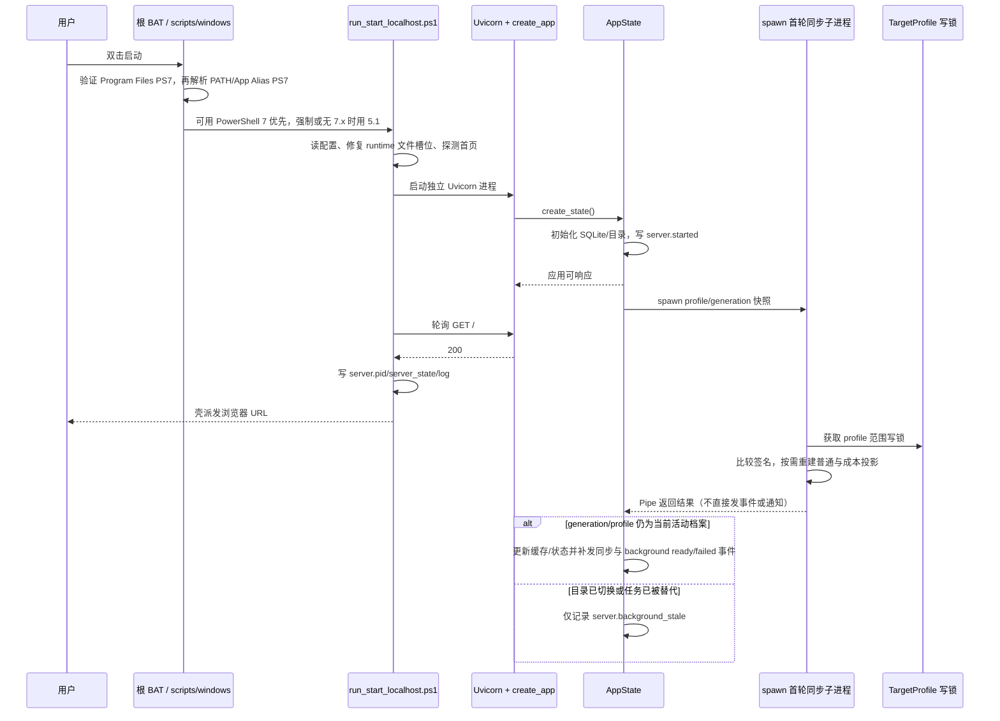
```mermaid
sequenceDiagram
    participant U as 用户
    participant BAT as 根 BAT / scripts/windows
    participant PS as run_start_localhost.ps1
    participant API as Uvicorn + create_app
    participant S as AppState
    participant Child as spawn 首轮同步子进程
    participant Lock as TargetProfile 写锁
    U->>BAT: 双击启动
    BAT->>BAT: 验证 Program Files PS7，再解析 PATH/App Alias PS7
    BAT->>PS: 可用 PowerShell 7 优先，强制或无 7.x 时用 5.1
    PS->>PS: 读配置、修复 runtime 文件槽位、探测首页
    PS->>API: 启动独立 Uvicorn 进程
    API->>S: create_state()
    S->>S: 初始化 SQLite/目录，写 server.started
    S-->>API: 应用可响应
    S->>Child: spawn profile/generation 快照
    PS->>API: 轮询 GET /
    API-->>PS: 200
    PS->>PS: 写 server.pid/server_state/log
    PS-->>U: 壳派发浏览器 URL
    Child->>Lock: 获取 profile 范围写锁
    Child->>Child: 比较签名，按需重建普通与成本投影
    Child-->>S: Pipe 返回结果（不直接发事件或通知）
    alt generation/profile 仍为当前活动档案
        S->>S: 更新缓存/状态并补发同步与 background ready/failed 事件
    else 目录已切换或任务已被替代
        S->>S: 仅记录 server.background_stale
    end
```

`/` 返回 200 不表示后台投影已完成；`health.background_status` 和事件用于区分 `initializing/running/ready/failed`。正式 BAT 不能只把 `%ProgramFiles%\PowerShell\7\pwsh.exe` 当成 PS7 真值：固定路径不可用时继续通过 `where.exe pwsh.exe` 解析 `PATH`/Microsoft Store App Execution Alias，并验证主版本为 7；`INVOICE_HUB_FORCE_PS51=1` 仍直接选择 5.1。当前启动脚本实现以首页 200 为就绪探测，随后 `Get-IHHealth` 必须从原始响应流按 UTF-8 解码再解析 JSON，因为 PS5.1 会在 `application/json` 无 charset 时错误解释 `.Content`；中文空格路径还原后仍执行完整 PID、配置、runtime、build/package 身份校验。长期启动真值约束仍要求同时关注端口、PID 和 stale state，修改启动链时必须按 `AGENTS.md` 做相邻回归。

startup child、monitor daemon 与手动 `bridge/rebuild` 对同一 TargetProfile 都共用 `state_dir/.invoice_sync.lock` 的 profile 范围 OS 写锁，锁覆盖读取、决策、投影和 monitor 状态的完整写入段。子进程运行时显式关闭普通 sync SSE 与桌面通知；父进程只在 generation 和完整 profile 身份仍匹配时，才重建当前缓存、补发 `invoice.changed/cost_analysis.updated/monitor.sync_*` 与 `server.background_ready/failed`。身份不匹配时不改当前缓存或状态，只写含 captured/active target 的 `server.background_stale`。被替代的子进程和等待结果都有有界终止/等待；无法按时退出仅产生 `server.background_worker_retire_timeout` 诊断，不能把旧结果复活为当前目录状态。

`python -m invoice_hub.api.main` 会先经包级 `api.__init__`。该导出必须保持惰性，CLI 解析 root/config 并写入启动环境后才导入模块级 FastAPI app；否则 `app.py` 的默认实例与 CLI 再次调用工厂会各自产生 AppState 和后台 startup sync。

### 6.2 Monitor daemon 启动与 ready 握手

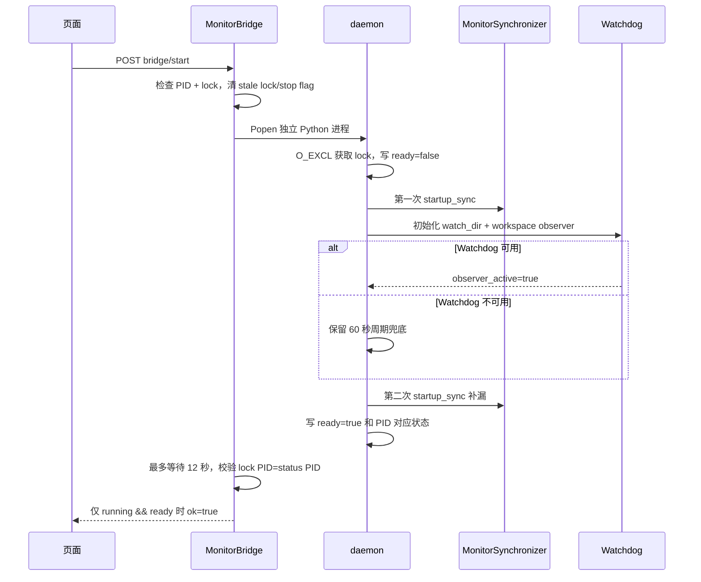
```mermaid
sequenceDiagram
    participant UI as 页面
    participant B as MonitorBridge
    participant D as daemon
    participant S as MonitorSynchronizer
    participant W as Watchdog
    UI->>B: POST bridge/start
    B->>B: 检查 PID + lock，清 stale lock/stop flag
    B->>D: Popen 独立 Python 进程
    D->>D: O_EXCL 获取 lock，写 ready=false
    D->>S: 第一次 startup_sync
    D->>W: 初始化 watch_dir + workspace observer
    alt Watchdog 可用
        W-->>D: observer_active=true
    else Watchdog 不可用
        D->>D: 保留 60 秒周期兜底
    end
    D->>S: 第二次 startup_sync 补漏
    D->>D: 写 ready=true 和 PID 对应状态
    B->>B: 最多等待 12 秒，校验 lock PID=status PID
    B-->>UI: 仅 running && ready 时 ok=true
```

两次同步夹住观察器初始化窗口。删除其中任一次都会重新引入“首次扫描结束、观察器尚未接管”的漏文件风险。

### 6.3 文件事件合并与周期补漏

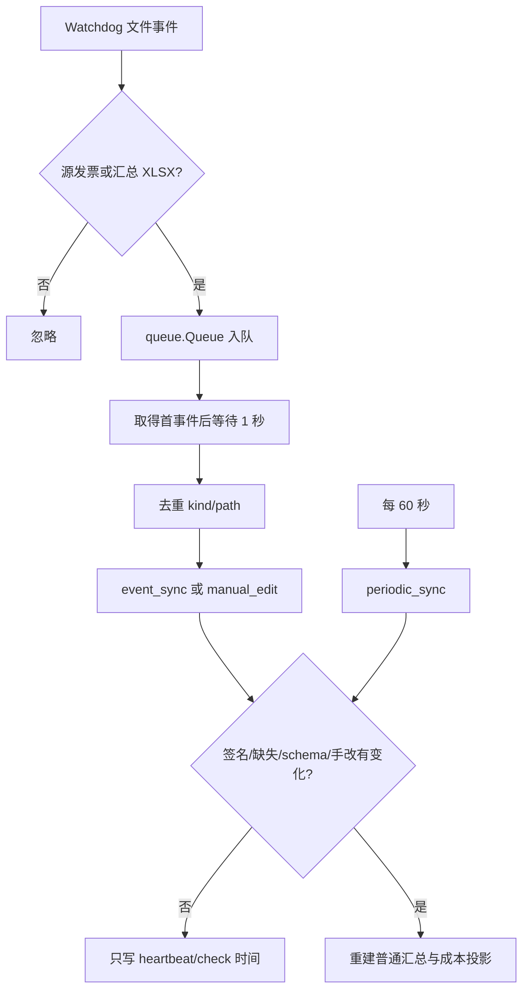
```mermaid
flowchart TD
    E["Watchdog 文件事件"] --> K{"源发票或汇总 XLSX?"}
    K -->|否| Ignore["忽略"]
    K -->|是| Q["queue.Queue 入队"]
    Q --> D["取得首事件后等待 1 秒"]
    D --> M["去重 kind/path"]
    M --> S["event_sync 或 manual_edit"]
    P["每 60 秒"] --> S2["periodic_sync"]
    S --> C{"签名/缺失/schema/手改有变化?"}
    S2 --> C
    C -->|否| H["只写 heartbeat/check 时间"]
    C -->|是| R["重建普通汇总与成本投影"]
```

### 6.4 提取、同票纠偏与普通投影

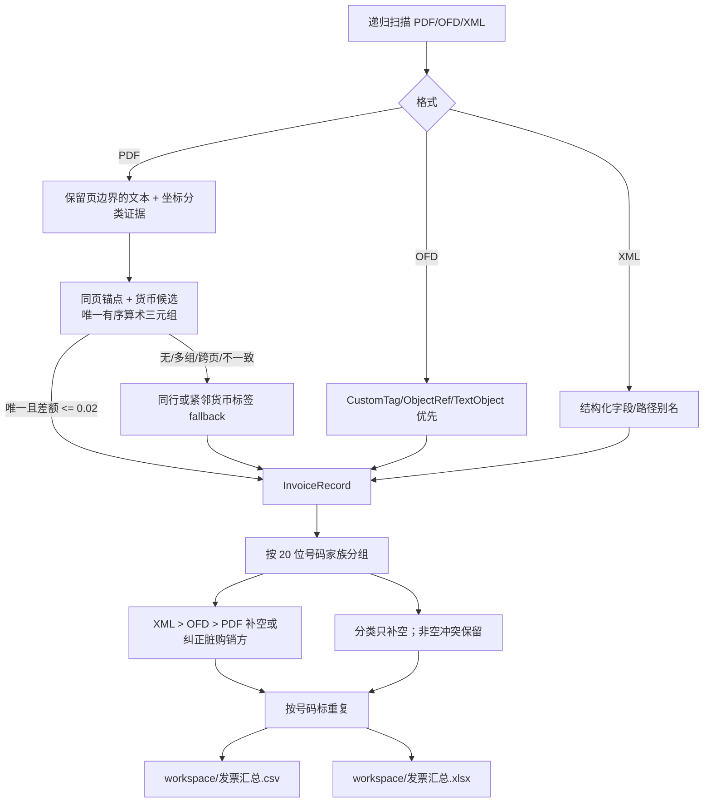
```mermaid
flowchart TD
    Scan["递归扫描 PDF/OFD/XML"] --> Parse{"格式"}
    Parse -->|PDF| PDF["保留页边界的文本 + 坐标分类证据"]
    Parse -->|OFD| OFD["CustomTag/ObjectRef/TextObject 优先"]
    Parse -->|XML| XML["结构化字段/路径别名"]
    PDF --> Triple["同页锚点 + 货币候选<br/>唯一有序算术三元组"]
    Triple -->|"唯一且差额 <= 0.02"| Record["InvoiceRecord"]
    Triple -->|"无/多组/跨页/不一致"| Label["同行或紧邻货币标签 fallback"]
    Label --> Record
    OFD --> Record
    XML --> Record
    Record --> Family["按 20 位号码家族分组"]
    Family --> Party["XML > OFD > PDF 补空或纠正脏购销方"]
    Family --> Class["分类只补空；非空冲突保留"]
    Party --> Dup["按号码标重复"]
    Class --> Dup
    Dup --> CSV["workspace/发票汇总.csv"]
    Dup --> XLSX["workspace/发票汇总.xlsx"]
```

PDF 的 20 位号码、日期和两个主体序列不再产出金额；结构化 XML/OFD 金额字段保持最高证据级，PDF 只在页内唯一三元组成立时使用三项金额，否则回退明确标签或留空。该变更只修正既有 `amount/pretax_amount/tax_amount` 值，不改变 CSV/XLSX 列、Pydantic 字段或 HTTP 响应结构。成本坐标明细继续独立校验票头，不能反向覆盖；普通投影最后应用人工覆盖。

### 6.5 Excel 手改自动同步

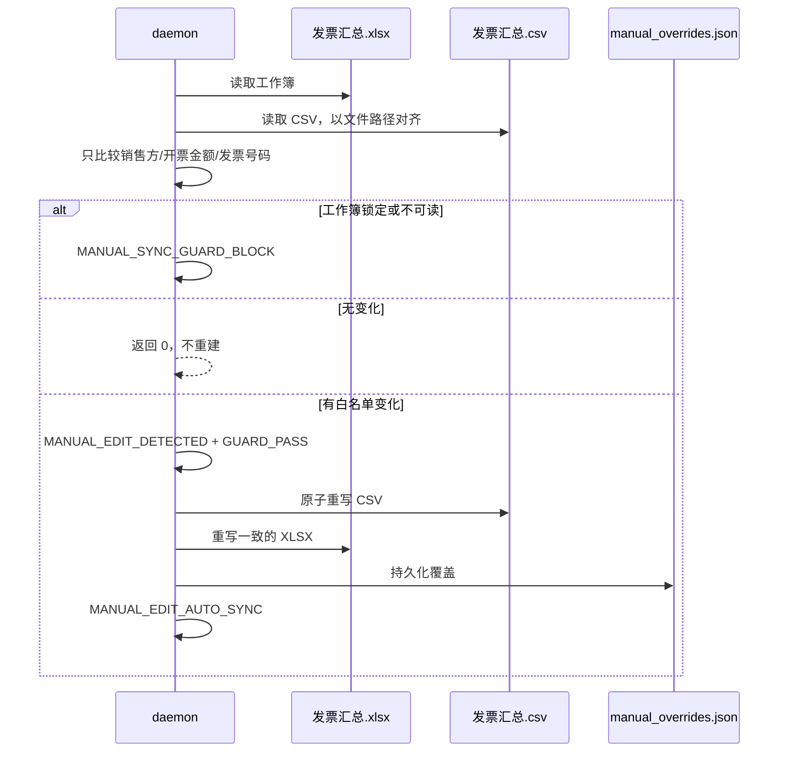
```mermaid
sequenceDiagram
    participant D as daemon
    participant X as 发票汇总.xlsx
    participant C as 发票汇总.csv
    participant O as manual_overrides.json
    D->>X: 读取工作簿
    D->>C: 读取 CSV，以文件路径对齐
    D->>D: 只比较销售方/开票金额/发票号码
    alt 工作簿锁定或不可读
        D->>D: MANUAL_SYNC_GUARD_BLOCK
    else 无变化
        D-->>D: 返回 0，不重建
    else 有白名单变化
        D->>D: MANUAL_EDIT_DETECTED + GUARD_PASS
        D->>C: 原子重写 CSV
        D->>X: 重写一致的 XLSX
        D->>O: 持久化覆盖
        D->>D: MANUAL_EDIT_AUTO_SYNC
    end
```

重建完成后还会调用 `apply_manual_overrides_to_summary()`，因此自动提取不能覆盖已保存手改字段。

### 6.6 成本重建、状态恢复和开票参考

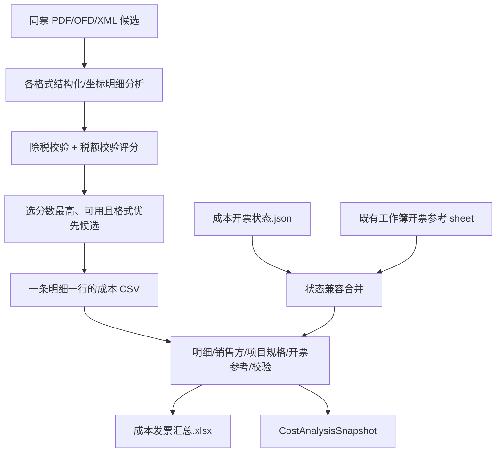
```mermaid
flowchart TD
    Files["同票 PDF/OFD/XML 候选"] --> Analyze["各格式结构化/坐标明细分析"]
    Analyze --> Score["除税校验 + 税额校验评分"]
    Score --> Best["选分数最高、可用且格式优先候选"]
    Best --> Detail["一条明细一行的成本 CSV"]
    Status["成本开票状态.json"] --> Merge["状态兼容合并"]
    WorkbookOld["既有工作簿开票参考 sheet"] --> Merge
    Detail --> Sheets["明细/销售方/项目规格/开票参考/校验"]
    Merge --> Sheets
    Sheets --> Workbook["成本发票汇总.xlsx"]
    Sheets --> API["CostAnalysisSnapshot"]
```

### 6.7 首页勾选合计

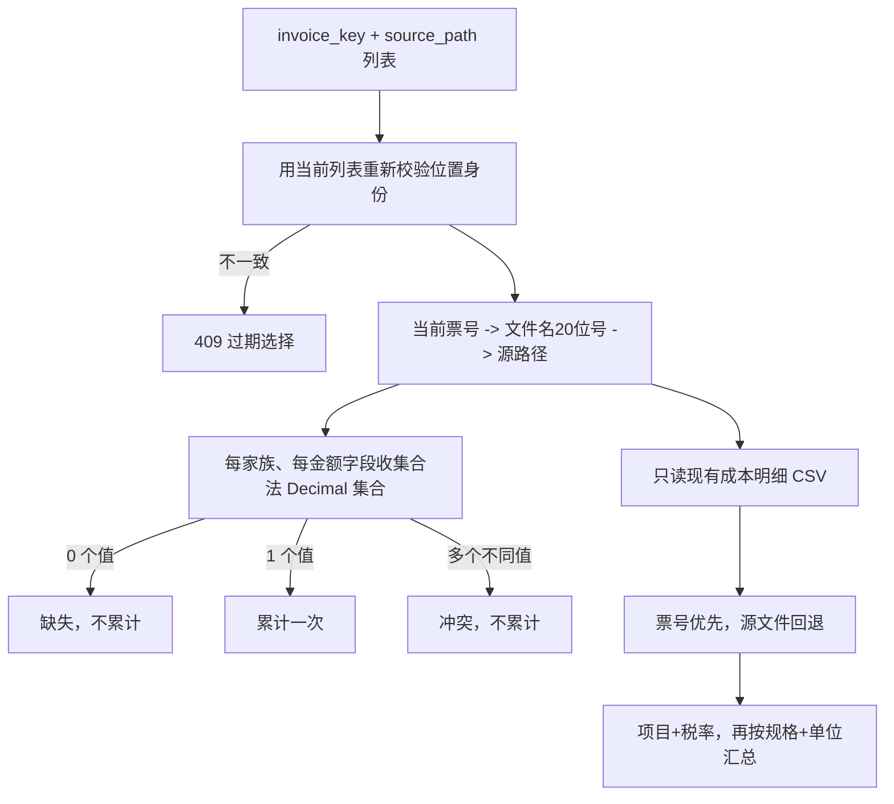
```mermaid
flowchart TD
    Req["invoice_key + source_path 列表"] --> Validate["用当前列表重新校验位置身份"]
    Validate -->|不一致| Stale["409 过期选择"]
    Validate --> Family["当前票号 -> 文件名20位号 -> 源路径"]
    Family --> Money["每家族、每金额字段收集合法 Decimal 集合"]
    Money -->|0 个值| Missing["缺失，不累计"]
    Money -->|1 个值| Add["累计一次"]
    Money -->|多个不同值| Conflict["冲突，不累计"]
    Family --> Cost["只读现有成本明细 CSV"]
    Cost --> Match["票号优先，源文件回退"]
    Match --> Group["项目+税率，再按规格+单位汇总"]
```

### 6.7.1 首页通用源文件镜像预览

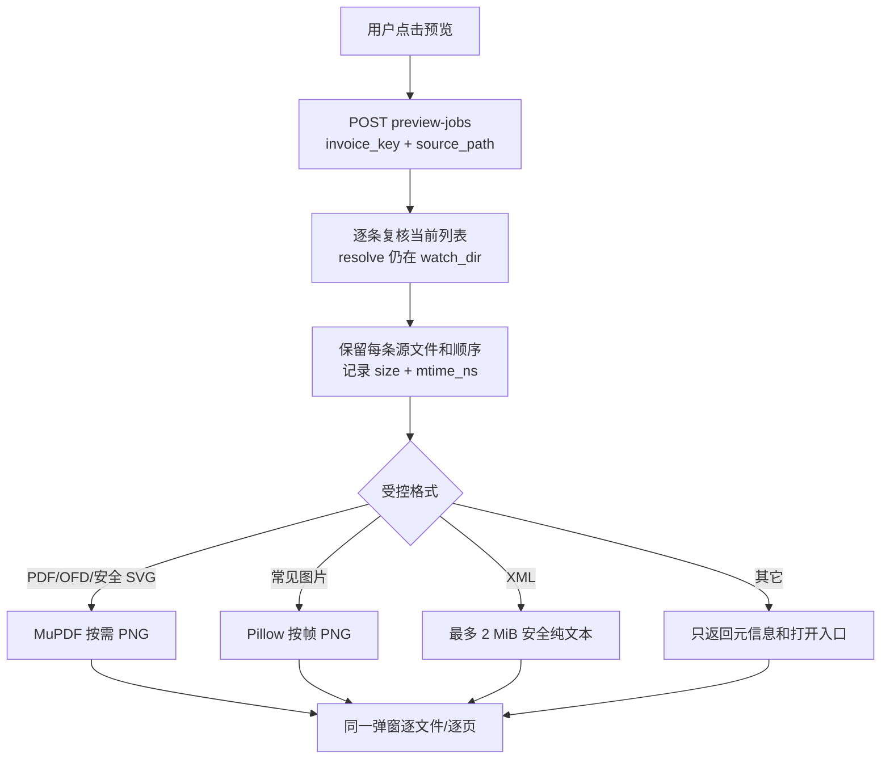
```mermaid
flowchart TD
    Click["用户点击预览"] --> Request["POST preview-jobs\ninvoice_key + source_path"]
    Request --> Validate["逐条复核当前列表\nresolve 仍在 watch_dir"]
    Validate --> Signature["保留每条源文件和顺序\n记录 size + mtime_ns"]
    Signature --> Type{"受控格式"}
    Type -->|"PDF/OFD/安全 SVG"| MuPDF["MuPDF 按需 PNG"]
    Type -->|"常见图片"| Pillow["Pillow 按帧 PNG"]
    Type -->|"XML"| Text["最多 2 MiB 安全纯文本"]
    Type -->|"其它"| Metadata["只返回元信息和打开入口"]
    MuPDF --> Modal["同一弹窗逐文件/逐页"]
    Pillow --> Modal
    Text --> Modal
    Metadata --> Modal
```

浏览器只得到不透明作业、文件序号、相对显示名和同源内容 URL，不得到绝对路径。每次内容/打开请求都会检查作业时限和文件签名；单文件失败不阻止用户切换其它文件。切换活动 `watch_dir` 会清空预览与打印缓存。

### 6.7.2 浏览器批量打印

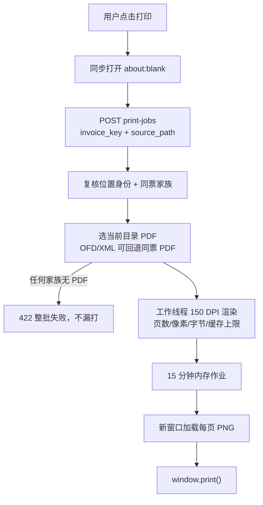
```mermaid
flowchart TD
    Click["用户点击打印"] --> Popup["同步打开 about:blank"]
    Popup --> Request["POST print-jobs\ninvoice_key + source_path"]
    Request --> Validate["复核位置身份 + 同票家族"]
    Validate --> Choose["选当前目录 PDF\nOFD/XML 可回退同票 PDF"]
    Choose -->|任何家族无 PDF| Fail["422 整批失败，不漏打"]
    Choose --> Render["工作线程 150 DPI 渲染\n页数/像素/字节/缓存上限"]
    Render --> Job["15 分钟内存作业"]
    Job --> Page["新窗口加载每页 PNG"]
    Page --> Native["window.print()"]
```

每个原 PDF 页面独占一张打印机当前纸型的横向或纵向纸；多页发票不会为追求“一票一页”而丢页。打印页在首次调用前等待全部 PNG 解码和两次渲染帧，避免冷缓存下浏览器先捕获空票面；命名 `@page` 只声明方向，`.print-sheet` 使用页框 `100% × 100%` 而非固定 A4 或打印态 `100vw/100vh`，只在第二张及后续真实票面前 `break-before`，避免 A5/default margins 下的尾部空白页与预览持续重排。服务只记录作业创建、失败和打印页打开，浏览器不会可靠返回用户取消、打印机离线或实体出纸结果。首页必须在异步请求前同步打开空白窗口，否则浏览器会把完成后的新窗口视为非用户手势并拦截。

### 6.8 入库单/出库单预览与导出

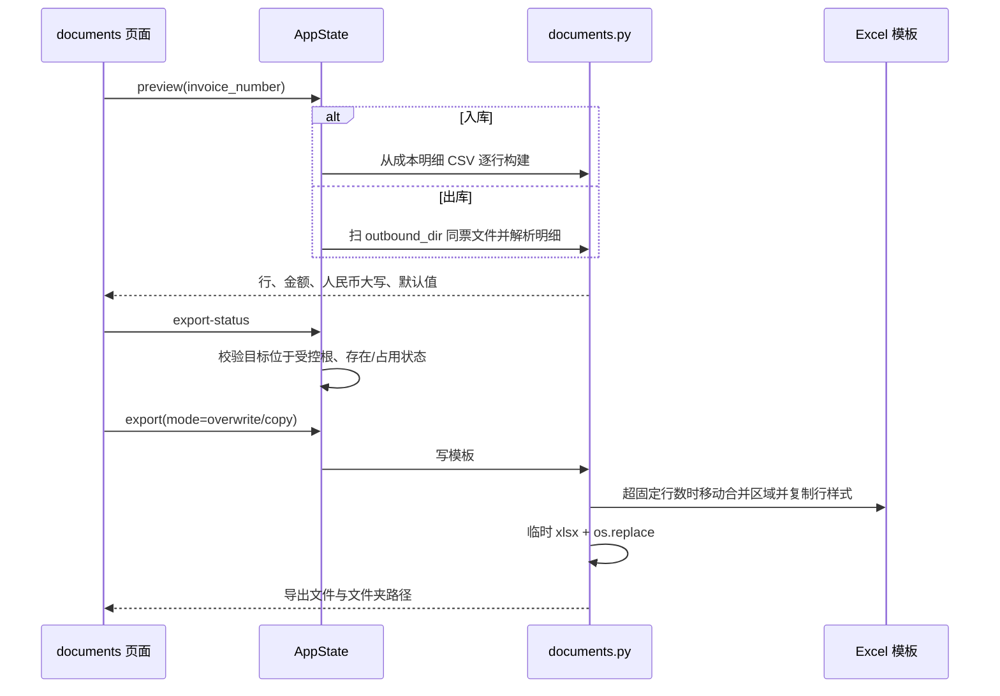
```mermaid
sequenceDiagram
    participant UI as documents 页面
    participant S as AppState
    participant P as documents.py
    participant T as Excel 模板
    UI->>S: preview(invoice_number)
    alt 入库
        S->>P: 从成本明细 CSV 逐行构建
    else 出库
        S->>P: 扫 outbound_dir 同票文件并解析明细
    end
    P-->>UI: 行、金额、人民币大写、默认值
    UI->>S: export-status
    S->>S: 校验目标位于受控根、存在/占用状态
    UI->>S: export(mode=overwrite/copy)
    S->>P: 写模板
    P->>T: 超固定行数时移动合并区域并复制行样式
    P->>P: 临时 xlsx + os.replace
    P-->>UI: 导出文件与文件夹路径
```

### 6.9 皮肤 ZIP 导入和恢复

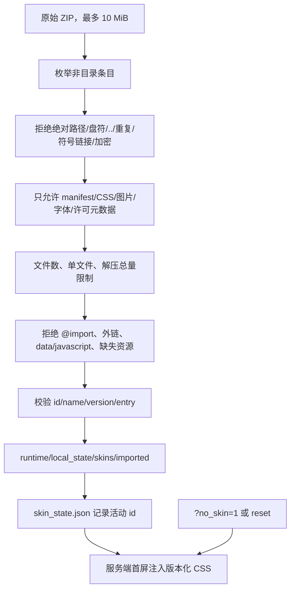
```mermaid
flowchart TD
    Upload["原始 ZIP，最多 10 MiB"] --> Entries["枚举非目录条目"]
    Entries --> Path["拒绝绝对路径/盘符/../重复/符号链接/加密"]
    Path --> Type["只允许 manifest/CSS/图片/字体/许可元数据"]
    Type --> Limits["文件数、单文件、解压总量限制"]
    Limits --> CSS["拒绝 @import、外链、data/javascript、缺失资源"]
    CSS --> Manifest["校验 id/name/version/entry"]
    Manifest --> Store["runtime/local_state/skins/imported"]
    Store --> Enable["skin_state.json 记录活动 id"]
    Enable --> Page["服务端首屏注入版本化 CSS"]
    Recover["?no_skin=1 或 reset"] --> Page
```

### 6.10 WebUI 关闭

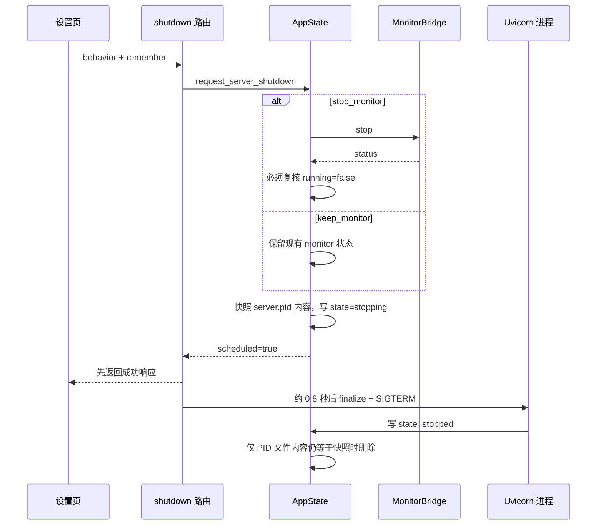
```mermaid
sequenceDiagram
    participant UI as 设置页
    participant API as shutdown 路由
    participant S as AppState
    participant M as MonitorBridge
    participant P as Uvicorn 进程
    UI->>API: behavior + remember
    API->>S: request_server_shutdown
    alt stop_monitor
        S->>M: stop
        M-->>S: status
        S->>S: 必须复核 running=false
    else keep_monitor
        S->>S: 保留现有 monitor 状态
    end
    S->>S: 快照 server.pid 内容，写 state=stopping
    S-->>API: scheduled=true
    API-->>UI: 先返回成功响应
    API->>P: 约 0.8 秒后 finalize + SIGTERM
    P->>S: 写 state=stopped
    S->>S: 仅 PID 文件内容仍等于快照时删除
```

停止 monitor 失败时不能调度 WebUI 退出。PID 内容比较防止关闭旧实例时误删并发启动的新实例 PID。

### 6.11 Windows 自包含包构建

本流程适用于新的 Windows RC 构建。每个公开候选必须以其自身的包 SHA、依赖锁、source commit、core build ID 和环境建立证据；文档或治理设置不能替代这些证据，也不授权复用退休预公开包。

```mermaid
flowchart LR
    Config["机器配置 JSON"] --> Init["remote tip = HEAD = 独立 RC_SHA"]
    Init --> Commit["clean RC_SHA"]
    Config --> TestEnv["隔离 Python 3.14.6 + 两份锁 + 当前 RC .pth"]
    TestEnv --> Tests["release gate + full pytest/compileall/JS"]
    Tests --> Archive["Git archive 白名单快照"]
    Lock["Windows x64 哈希锁"] --> Runtime["只读 base-python + 离线 wheelhouse"]
    Runtime --> ProductRuntime["复制产品 runtime + 删除 Doc"]
    ProductRuntime --> Install["固定时间安装产品锁"]
    Install --> Normalize["删除 Scripts + 规范 RECORD"]
    Normalize --> RuntimeManifest["pip/import 检查 + runtime manifest + tree SHA"]
    Archive --> Assemble["确定性组装"]
    RuntimeManifest --> Assemble
    Assemble --> Meta["build/package manifest + SBOM + files SHA"]
    Meta --> Zip1["ZIP build A"]
    Meta --> Zip2["ZIP build B"]
    Zip1 --> Equal{"SHA-256 相同?"}
    Zip2 --> Equal
    Equal -->|是| Verify["静态 + 包内 Python 验包"]
    Equal -->|否| Stop["阻断发布"]
    Verify --> Offline["断网 wheelhouse 重装 + 再次双组装"]
    Offline --> Parity{"联网/离线 SHA 相同?"}
    Parity -->|是| Machine["正式 BAT/PS7/PS5.1/Tk/monitor 真机验收"]
    Parity -->|否| Stop
```

机器配置固定版本、Python、架构、包名、锁、staging、证据目录和两次/离线策略，但故意不保存会自引用的 `RC_SHA`；初始化器要求发布协调方单独交付的 40 位 SHA 与远端发布分支 tip、detached HEAD 相同。原生命令的输出必须先完整捕获并立即保存 `$LASTEXITCODE`，通过后才允许使用 `Select-Object -First 1` 等可能提前终止上游的处理；不得用预设退出码制造假通过，完整消费的 `Tee-Object` 实时日志不受此限制。源码测试环境独立安装产品锁和 test-tools 锁，只在自身 site-packages 用受边界校验的 `.pth` 绑定当前 RC `src`，确保 monitor/API 子进程仍导入同一源码；成品 runtime 不携带 pytest 或该绑定。产品 runtime 每次从保留官方 `Doc` 的只读 `base-python` 重建，只删除产品 `Doc`；哈希锁安装期间强制固定 `SOURCE_DATE_EPOCH` 并恢复调用者环境，随后删除内嵌 staging 路径的顶层 `Scripts`、结构化规范对应 RECORD，再执行 `pip check`、import smoke 和 runtime manifest。验包器必须反向拒绝任何大小写变体的 `python/Doc` 与 `python/Scripts`；`tests` 只允许出现在 `python/Lib/site-packages/**/tests/**`，项目源码、web、脚本、基础 runtime 和其它位置仍 fail closed。获准的依赖测试继续执行依赖范围的秘密与绝对路径扫描，并进入 runtime tree、逐文件 manifest、SBOM/依赖锁身份和 ZIP SHA；不得裁剪 wheel、改写其 RECORD、按包名硬编码例外或从哈希排除。Task 4 还必须保存 ZIP 成员与 wheel 锁 SHA 的来源闭环。构建收据追加机器配置 SHA 与 online/offline 模式。构建器不读取本机 `config/app.local.json`、未跟踪文件、真实业务数据或运行态。包内脱敏默认配置固定指向相对 `./发票文件` 与 `./运行状态`；Windows 运行时、依赖锁、package/build identity 和 SBOM 必须互相闭环。自动化、联网/离线同哈希和静态验包仍不能替代真实 Windows BAT、Tk、浏览器、monitor 与失败矩阵。

Windows 的精确 commit 源码快照必须在 `.gitattributes` 以 `text=auto` 固定自动识别的普通文本为 LF、保持二进制 `-text` 的前提下，以 `git -c core.autocrlf=false archive` 导出。发布契约必须先以 `core.autocrlf=true` 做全新 checkout 并要求无 tracked changes、二进制 blob/checkout 字节相同，再以 true/false 的实际 archive 复算 Core Build ID 并要求二进制字节与身份都一致；构建主机的 Git 配置不得改变发行身份或工作树清洁度。该隔离 checkout 契约必须同时兼容完整源仓库和 GitHub Actions 的浅源仓库；临时 fetch 应显式接受已知浅边界，不能通过要求 CI 拉取完整历史来掩盖测试夹具依赖。

### 6.12 macOS 壳启动、所有权与严格握手

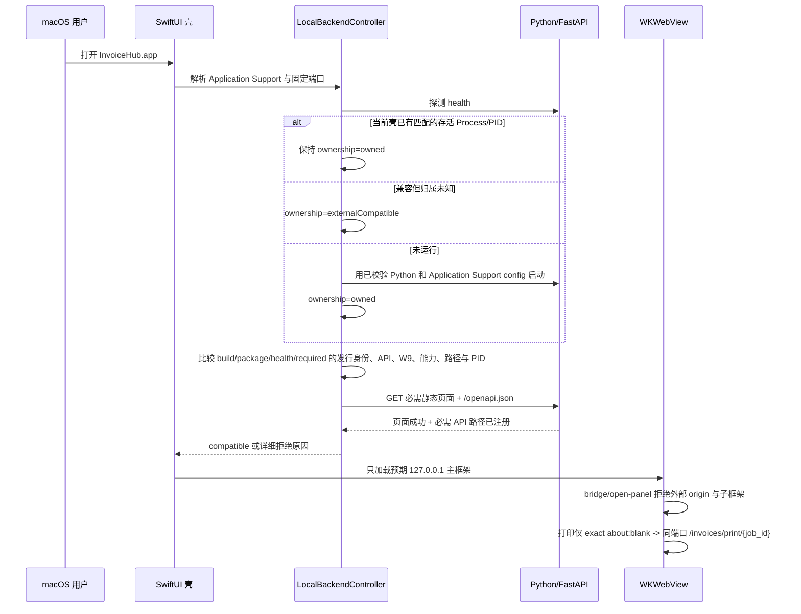
```mermaid
sequenceDiagram
    participant U as macOS 用户
    participant A as SwiftUI 壳
    participant L as LocalBackendController
    participant P as Python/FastAPI
    participant W as WKWebView
    U->>A: 打开 InvoiceHub.app
    A->>L: 解析 Application Support 与固定端口
    L->>P: 探测 health
    alt 当前壳已有匹配的存活 Process/PID
        L->>L: 保持 ownership=owned
    else 兼容但归属未知
        L->>L: ownership=externalCompatible
    else 未运行
        L->>P: 用已校验 Python 和 Application Support config 启动
        L->>L: ownership=owned
    end
    L->>L: 比较 build/package/health/required 的发行身份、API、W9、能力、路径与 PID
    L->>P: GET 必需静态页面 + /openapi.json
    P-->>L: 页面成功 + 必需 API 路径已注册
    L-->>A: compatible 或详细拒绝原因
    A->>W: 只加载预期 127.0.0.1 主框架
    W->>W: bridge/open-panel 拒绝外部 origin 与子框架
    W->>W: 打印仅 exact about:blank -> 同端口 /invoices/print/{job_id}
```

`externalCompatible` 可以浏览共享页面，但不能通过 Swift 或设置页关闭后端，也不能从原生菜单、侧栏或壳内首页/设置页启动或停止 monitor、安装 Sparkle 更新或恢复更新 monitor；WKWebView 不提供 install bridge，handler 仍会二次拒绝。这是当前壳的所有权保护，不把无认证 localhost API 误描述为跨客户端权限边界。正式模式的 core 只从 `Contents/Resources/invoice-hub-core` 解析，资源无效时不允许用当前目录或 checkout 兜底。兼容握手不执行 `/api/v1/documents/state`、`/api/v1/bookkeeping/state` 等会读取真实业务目录的数据接口，所有探测都有时限。print path 只通过 `/openapi.json` 登记校验，探测不创建 job 或读取票面。owned 服务的一次 monitor/rebuild 失败只改变动作结果，不丢失所有权；每个异步结果还要重验发起时 generation、phase、health 和 Process/PID，过期结果不得复活 stopped 或覆盖新的 starting/stopping。更新 marker 的启动恢复仅在成功启动已转为 verified owned running 且 release startup gate 之后才可尝试；失败和 external 路径继续由启动收尾释放 gate。显式 shutdown 失败保留进程和 PID。App 真正退出时可终止 owned 子进程，但必须在确认进程已退出后才能 CAS 删除 PID 并清 ownership。

发行验证有且只有两种互斥模式。`--expect-internal-adhoc` 要求 staging App、实际解压的 Sparkle ZIP App、只读 DMG 内 App 与 DMG 容器全部为 ad-hoc，并拒绝 Developer ID Authority/Team ID；`--expect-notarized` 保持 Developer ID、Team ID、Hardened Runtime、公证与 staple 门禁。内部构建必须在调用验证器前对 DMG 容器执行 `codesign --force --sign -`，不能把无签名容器称作“内部未签名成功包”。固定 Mac Python runtime 在 manifest 前只裁剪三个 shell helper 与 pip/distlib 六个 Windows launcher，随后分别扫描全树的 Windows shell/binary；三份 App 的验包器仍独立拒绝全部平台污染，不能因上游来源而放行。

### 6.13 About、更新检查与安装

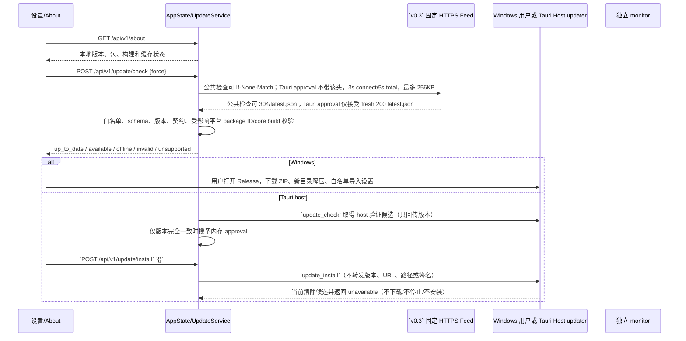
```mermaid
sequenceDiagram
    participant UI as 设置/About
    participant API as AppState/UpdateService
    participant Feed as `v0.3` 固定 HTTPS Feed
    participant Platform as Windows 用户或 Tauri Host updater
    participant Monitor as 独立 monitor
    UI->>API: GET /api/v1/about
    API-->>UI: 本地版本、包、构建和缓存状态
    UI->>API: POST /api/v1/update/check {force}
    API->>Feed: 公共检查可 If-None-Match；Tauri approval 不带该头，3s connect/5s total，最多 256KB
    Feed-->>API: 公共检查可 304/latest.json；Tauri approval 仅接受 fresh 200 latest.json
    API->>API: 白名单、schema、版本、契约、受影响平台 package ID/core build 校验
    API-->>UI: up_to_date / available / offline / invalid / unsupported
    alt Windows
        UI->>Platform: 用户打开 Release，下载 ZIP、新目录解压、白名单导入设置
    else Tauri host
        API->>Platform: `update_check` 取得 host 验证候选（只回传版本）
        API->>API: 仅版本完全一致时授予内存 approval
        UI->>API: `POST /api/v1/update/install` `{}`
        API->>Platform: `update_install`（不转发版本、URL、路径或签名）
        Platform-->>API: 当前清除候选并返回 unavailable（不下载/不停止/不安装）
    end
```

`v0.3` 起，自动检查只在有效发行 package manifest 且 `auto_check_updates=true` 时延迟执行；失败不会阻塞 localhost、扫描或汇总，也不会覆盖上次有效 ETag/feed/result。Tauri host 只将随机 Host RPC token 传给其直接启动的 Python backend，backend 启动时捕获并从 descendant 环境清除；token 不得进入网页、Tauri command/event、API 响应或日志，携带 token 的 private loopback transport 必须显式禁用环境代理。更新命令面只有 `update_check/update_install`，backend ownership 使用新 challenge 的 HMAC-SHA256，而不是发送 bearer proof 给端口监听者。网页不得获知 token，也不能把安装或原生能力变成任意 URL、路径或命令代理。`latest.json` 与平台更新元数据由同一工具从真实产物、收据、源码归档与固定 release Tag commit 的受控树生成，并通过版本、URL、长度、签名、source commit、tree SHA、文件数和 core build 一致性校验后才可上线。同一进程具备 Tauri host marker 与 private RPC 时，API、设置页和后台 timer 的 `check_for_updates` 调用都属于 strict delegated-install preflight；只有非 Tauri/非 host 检查不获取 `_host_update_lock` 并保留 `UpdateService.check` 的 cache/ETag/nonblocking-busy 语义。host 检查锁竞争时立即返回不持久化 busy 结果，不访问 metadata/candidate 且不清除既有 approval；install 锁竞争立即以脱敏 `HostRpcError` 失败，不消费 approval 或发送第二次 private RPC。host approval 必须在该 session 取得显式携带 `Cache-Control: no-cache`、不带 ETag 的 fresh allowed Feed `200` body 并重新验证，缓存、`304`、离线和错误不授予 approval。Host updater metadata builder 固定 5 秒总时限；listener loop 主动清除到期 candidate。当前 host 的 install 路径再清除候选并 fail closed，直到 recovery/relaunch coordinator 能在任何失败后恢复既有 monitor/进程状态。未来 coordinator 才可按下载+Minisign、monitor stop/recheck、安装/restart 顺序实施。

hosted check 的 lock-contended 分支在 busy 结果后直接返回，不能落入统一的 `updates.checked` 事件写入；这使响应不依赖 SQLite，其他检查与成功路径仍记录事件。

## 7. 接口变更检查表

修改任一接口、事件、页面状态或产物字段时，按以下链路检查：

1. `api/app.py` 的方法、路径、错误码和响应时序。
2. `AppState` 或对应服务的业务返回。
3. 使用该字段的模板、页面 JS、可见文案和空/失败/处理中状态。
4. SSE 生产者、`common.js` 监听和页面按原因刷新策略。
5. CSV/XLSX/JSON/SQLite 的字段与真值位置。
6. `tests/test_api_contract.py`、相关业务测试和 `tests/test_frontend_contract.py`。
7. 静态文件变更时全部模板的 `?v=` 以及真实 localhost 资源送达。
8. 同步更新本页、[数据结构与算法](DATA_AND_ALGORITHMS.md) 和 [Agent 任务导航](AGENT_TASK_MAP.md)。
9. 平台壳或构建握手变化时同步更新[平台架构](PLATFORM_ARCHITECTURE.md)和 macOS/Windows 工作流。
10. 更新 Feed 或安装流程变化时同步更新 `docs/release/UPDATE_SYSTEM.md`、双平台发布手册与元数据一致性测试。

## 8. 相关入口

- [开发架构总入口](../DEVELOPMENT_ARCHITECTURE.md)
- [平台架构](PLATFORM_ARCHITECTURE.md)
- [完整文件地图](FILE_MAP.md)
- [数据结构与算法](DATA_AND_ALGORITHMS.md)
- [Agent 任务导航](AGENT_TASK_MAP.md)
- [注释与设计原因地图](COMMENT_RATIONALE_MAP.md)
