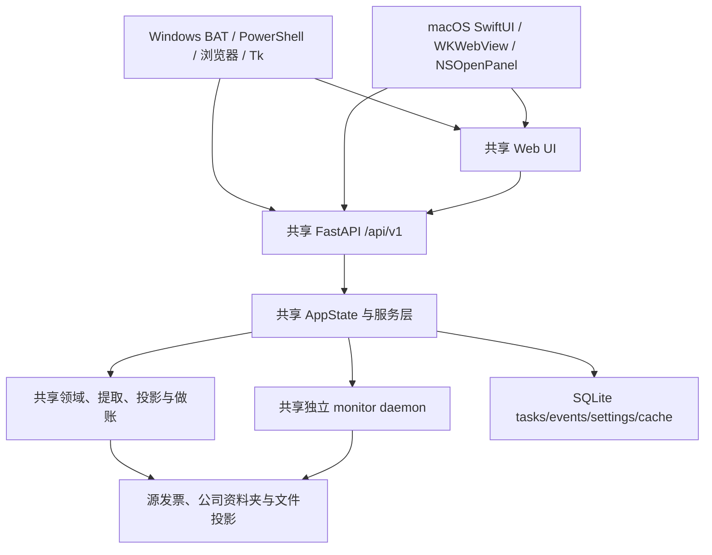
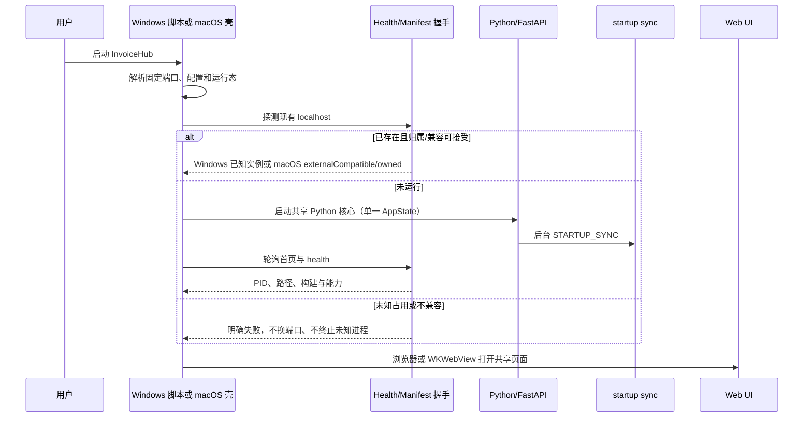

# InvoiceHub 平台架构：共享核心、Windows 与 macOS

> 文档状态：当前跨平台实现的权威附录
> 更新日期：2026-08-17
> 公共基线：单一脱敏根提交。退休的私有提交、Tag、包和验证材料不属于公开发行输入。
> 当前发行状态：候选树、保留 Git 对象和托管面验证已完成，仓库现为 public；`codex/tauri2-unified-desktop` 已建立并含通过受控 Rust lock/compile/test 的 `v0.3.0-alpha.1` Tauri foundation 与代码级 lifecycle/Host RPC 边界。一个 macOS arm64 development `.app` 已构建并完成隔离 L9 smoke；另一个 internal-alpha arm64 `.app/.dmg` 已通过独立 verifier 和隔离启动烟测；尚无 Release。

本页只解释平台边界。领域模型、API、投影和 monitor 的详细契约分别见[开发架构总入口](../DEVELOPMENT_ARCHITECTURE.md)、[接口与运行流程](INTERFACES_AND_FLOWS.md)和[数据结构与算法](DATA_AND_ALGORITHMS.md)。

## 1. 架构结论

InvoiceHub 只有一套业务核心，两套桌面入口：

- 共通核心是 Python/FastAPI、`/api/v1`、Web UI、TargetProfile、文件真值、CSV/XLSX/JSON 投影、SQLite 辅助状态和独立 monitor daemon。
- 现有 Windows 源码入口使用 BAT/PowerShell、系统浏览器和 Python/Tk 原生选择器；未来安装器选择由新 RC 发行规则决定。
- 既有 macOS SwiftUI/WKWebView 壳继续作为共享核心边界与开发参考，但不构成公开发布资格或未来 Tauri 证据。
- `v0.3` 使用 Tauri 2 统一窗口、托盘、单实例、原生面板、打印、后端生命周期和 updater；它仍复用 Python/FastAPI/Web/monitor，不在 Rust 中复制发票、成本、投影或做账逻辑。
- 发票识别、分类、成本、单据、做账、业务资料夹、状态语义和 API 不得按平台复制实现。

### 1.1 单仓库源码与互斥成品

Windows 和 macOS 不是两个长期分叉的源码仓库。任一系统执行 `git clone` 都会获得共享核心、Windows 入口和 macOS 壳，平台选择发生在开发/构建入口，而不是通过删除另一平台源码实现。这个设计让两端持续使用相同的业务算法、API 和 core build ID。

成品边界则必须互斥并 fail closed：

- Windows 真机固定参数由机器可读 JSON 提供，并在 effectful 步骤前与 `version.py`、锁和派生路径核对；动态 RC_SHA 由发布协调方独立交付，初始化器要求 remote tip、detached HEAD 与该 SHA 相等。源码测试 Python 独立消费产品/test 两份锁，并只在自身 site-packages 用受边界校验的 `.pth` 绑定当前 RC `src`；正式 runtime 从只读 `base-python` 重建，删除产品 `Doc`，固定安装时间，再删除不可迁移的 `Scripts` 并规范 RECORD；它只消费产品锁且不携带测试源码绑定。构建器只收集 `src/`、`web/`、`scripts/windows/`、结构性 facts/runner、Windows 锁和固定根文件；ZIP 验证器不再按宽泛顶层目录放行，而是使用精确文件/子树白名单，并显式拒绝 `macos/`、Swift/bundle、Mac 锁、`python/bin` runtime 和大小写变体的 `python/Doc`、`python/Scripts`。
- macOS 构建器只把共享核心、Mac 锁和 arm64 Python 放入 `.app`；runtime 准备阶段在 manifest 前精确移除 python-build-standalone 固定携带的三个 shell helper 与 pip/distlib 六个 Windows launcher，然后全树拒绝任何其它 BAT/CMD/PS1/PSM1 或 EXE/DLL/PYD/MSI/MSIX。同一个布局验证仍分别作用于 staging App、Sparkle ZIP 解包 App 和 DMG 挂载 App，并在整个 `Resources` 中拒绝 `scripts/windows`、Windows 锁、BAT/PowerShell 和 `.exe/.dll/.pyd/.msi/.msix`。验证器对这些已签名 App 执行的 Python/pip/import/content scan 同时使用 `PYTHONDONTWRITEBYTECODE=1` 与 `-B` 禁写字节码，保证普通验证可重复且不破坏 seal；不能忽略 `-I` 会屏蔽环境变量的语义。内部模式还必须在验证前对 DMG 容器做 ad-hoc 签名，并用互斥的 `--expect-internal-adhoc` 验证三份 App 加 DMG 都无 Developer ID Authority/Team ID；正式模式使用 `--expect-notarized`，不弱化 Developer ID/Team ID/Hardened Runtime/notary 门禁。
- 新的多平台 RC 仍必须来自同一 clean `RC_SHA` 并具有同一 core build ID；平台 package ID、依赖锁、runtime manifest、启动器和成品名保持不同。退休预公开包不属于新 RC 输入或公开证据。源码共存不是包体混合，某个平台的真机结果也不能替代另一个平台验收。

## 2. 共通核心

| 边界 | 共通实现 | 平台不得改变的事实 |
|---|---|---|
| HTTP | FastAPI `src/invoice_hub/api/app.py` | 页面和桌面壳都只消费同一 `/api/v1` 契约 |
| 编排 | `services/AppState` | 分类、合计、关闭、做账、单据和资料夹语义一致 |
| 领域 | `domain/`、`extraction/`、`bookkeeping/` | `InvoiceRecord`、分类证据、凭证安全协议不分叉 |
| 投影 | `projections/` | 源文件是真值，CSV/XLSX/JSON 可重建；SQLite 不是发票主库 |
| 路径 | `targets/TargetProfile` | 单活动 `watch_dir`，每个目标有独立 workspace/state/localappdata |
| 监控 | `monitoring/` + `MonitorBridge` | 独立 daemon、PID+lock 真值、两次启动同步、ready 握手 |
| 前端 | `web/templates` + `web/static` | 分类、勾选合计、关闭弹窗、皮肤和恢复入口共用 |
| 更新检查 | `services/update_service.py` + `release/provenance.py` + `release/update_metadata.py` | `v0.3` 起由同仓库 Pages Feed 和 Tauri updater 处理，About 仍本地读取 |
| 发布身份 | `version.py` + `release/*manifest.py` + `release/provenance.py` | 版本、package ID、source commit、build ID、依赖锁、Tag 和平台身份必须闭环 |

当前契约为 `2026-08-02-release-update-v1`，做账协议为 `w9-ledger-review-v1`。除既有业务能力外，当前平台握手还要求：

- `invoices.file-preview.v1`
- `invoices.batch-print.v1`
- `invoices.classification.v1`
- `invoices.selection-summary.v1`
- `monitor.ready-handshake.v1`
- `release.package-identity.v1`
- `server.shutdown-choice.v1`
- `settings.startup-surface.v1`
- `updates.metadata-check.v1`

## 3. 平台责任矩阵

| 责任 | Windows | macOS | 共通点与边界 |
|---|---|---|---|
| 用户入口 | 当前源码为根 BAT 转发 `scripts/windows`；`v0.3` 为 Tauri host | 既有 SwiftUI `.app` 仅作开发/边界参考；`v0.3` 为 Tauri host | 都启动或连接同一 FastAPI 核心 |
| 页面容器 | 当前源码可用系统外部浏览器；`v0.3` 可为 Tauri WebView | 既有 `WKWebView` 行为供迁移对照 | 页面 DOM、JS、CSS 和 `/api/v1` 相同；打印子窗口不继承通用原生 bridge |
| 目录/文件选择 | Python/Tk 子进程，项目根为 cwd | Swift `NSOpenPanel` bridge / `WKUIDelegate` | 选择结果只形成草稿，保存仍经过后端设置接口 |
| 运行态根 | 包内 `运行状态` 与 TargetProfile | 既有 macOS 壳使用 Application Support；`v0.3` 两端均使用用户可写运行态 | 源码/包资源只读，用户状态与构建内容分离 |
| localhost 控制 | 当前 Windows 源码使用 PowerShell；`v0.3` 由 Tauri host 管理 | `v0.3` 同样由 Tauri host 管理 | 固定 `127.0.0.1:8766`；未知占用者都必须明确失败，不能换端口规避 |
| 后端所有权 | 正式脚本按进程命令、PID 和端口判断 | `owned` / `externalCompatible` 明确区分 | 只允许管理可证明属于当前入口的进程 |
| 监控控制 | BAT/页面调用共享 bridge | 原生命令/页面调用共享 bridge；externalCompatible 禁用壳内启动/停止 | 关闭窗口或 WebUI 不等于停止 monitor |
| 关闭 WebUI | 结构化 shutdown 或正式停止 BAT | `/api/v1/server/shutdown`，固定 `keep_monitor`、`remember=false` | monitor 停止必须是单独、明确的用户动作 |
| 启动方式 | `v0.3` 新安装默认 `desktop` | `v0.3` 新安装默认 `desktop`，可选 `browser`，下次启动生效 | 已导入的显式偏好保持原值；关闭窗口/浏览器不停止 monitor |
| 更新 | 当前只保留 Tauri check/preflight；install 明确不可用 | 当前只保留 Tauri check/preflight；install 明确不可用 | recovery/relaunch coordinator 完整实现前不得下载、停 monitor、安装或重启；不静默迁移业务数据 |
| 构建兼容 | package/build/runtime manifest、正式启动 health | 三类 manifest、health、必需页面/API 严格握手 | 构建身份和能力不允许只凭 `health.ok` 判断 |
| 发布形态 | `v0.3` 为 Windows 10/11 x64 NSIS `.exe` | `v0.3` 为 macOS 13+ arm64 `.dmg` 和更新归档 | 都不得携带本机配置、真实发票、运行态或业务资料 |
| 验收 | `v0.3` 最终 RC 一次安装、启动、目录选择、托盘和更新烟测 | 同左 | Python/API/投影测试只能证明共享核心，不替代平台实测 |

### 3.1 Tauri 生命周期与 development `.app` 边界

裸 `src-tauri/` checkout 只保留可审查的 fail-closed 边界：`main.rs` 找不到经编译绑定 manifest 时以状态 `78` 退出，在插件初始化、端口连接和 WebView 创建之前停止。`scripts/dev/tauri_dev_app.py` 仅为 development profile 复制 allowlisted core、生成 schema-3 manifest 和显式 venv launcher，并把 manifest/launcher SHA-256 绑定到本地 arm64 `.app`。该 app 已完成一次隔离 L9 smoke；它不是 DMG、更新归档或 release 输入。有效 development manifest 才会固定使用 `127.0.0.1:8766`，拒绝未知占用，启动自己的 backend child，并以 backend-private 256 位 secret 与 fresh HMAC challenge 证明归属。初次 child PID、manifest identity、`/` 和 OpenAPI 精确方法通过后，host 读取 startup preference 并以新的 challenge/HMAC 和 identity 再次确认 ownership；只有第二次检查通过才创建空 IPC capability 的 WebView。

该一次 smoke 使用 development-only 的显式、已存在、绝对外置 state root，不读写真实 Application Support；host 会 canonicalize 它并拒绝其位于 bundle/core 内或包住 bundle/core。它确认 health/background ready、首页/静态资源和 `desktop_available=true` 的默认 desktop。外部 AppleScript quit 曾绕过 shutdown POST 并留下 stale server state，该外部路径仍不作有序退出承诺；P1-Q 随后在 clean-commit 样本上以真实 Cmd-Q 确认 shutdown POST 200、stopped state、monitor 未运行、host/backend/PID/端口清理，SSE 未及时退出时由显式 kill+wait 兜底。development manifest 明确禁用 updater，且 state-root override 不会传给 Python child。browser、tray 点击、单实例、native picker、打印、下载/验签/安装、DMG、Developer ID、公证和 Windows 均未覆盖。

Host RPC 是 host 的随机 loopback listener；host 只将 token 传给其直接启动的 Python backend，backend 启动时捕获并从 descendant 环境清除。网页没有 token、Tauri command 或 event 通道，token 也不进入 API 响应或日志；backend 的 picker 面只能发起四种固定 picker enum，更新面独立地只能发起 `update_check` / `update_install` 两个固定 enum。同一进程具备 Tauri marker 与 private RPC 时，API、设置页和后台 timer 的公开更新检查都是 strict delegated-install preflight；只有非 Tauri/非 host 检查不获取 `_host_update_lock` 并保留 cache/ETag/nonblocking-busy 语义。host 检查锁竞争立即返回不持久化 busy，且不会调用 metadata/candidate 或清除既有 approval；install 锁竞争立即抛脱敏 `HostRpcError`，不消费 approval 或发第二次 RPC。当前取得 install 锁后也只清除候选并返回不可用，直到 recovery/relaunch coordinator 完整实现。Rust dialog 最多等待 120 秒，Python 以 125 秒预算保留响应余量，并把 private `HostRpcError` 固定映射为脱敏 503；非 Tauri 的 Tk picker 不变。Updater metadata 请求固定 5 秒总时限，不能使用插件默认的无时限请求永久占住 operation mutex。成功握手和 post-preference revalidation 后才 arm 授权，再启动 100 ms 有界 child liveness watcher；watcher 只能在 child 退出后撤销授权，不能重新授权已退出 child。此后 host 严格使用 `startup_surface`：desktop 创建 WebView，browser 用无 WebView JS 注入的 host-only opener 派发固定 origin；托盘和第二实例重开当前 surface，desktop close 仅隐藏窗口而不停止 monitor。托盘 Quit 与 macOS 自定义应用菜单/Cmd-Q 只请求同一个 `app.exit(0)`；应用菜单不使用 predefined Quit。只有 host 实际收到的 `ExitRequested` 才先执行结构化 `keep_monitor` shutdown 并等待 owned child，错误/超时后显式 `kill + wait`，无法确认 child 已退出则阻止 host 退出；外部 AppleScript quit、Force Quit 或信号可能绕过该事件，不属于有序退出承诺。上述源码路径由隔离离线 contracts 和一个 clean-commit 真实 Cmd-Q 样本验证；原生面板、browser/tray 点击、单实例、updater、安装包或平台发布烟测仍未完成。

hosted check 的 host-lock 竞争直接返回 busy，不调用 `append_event` 或 SQLite；正常成功与非竞争检查保留更新事件。

## 4. Windows 架构

历史净化完成前没有任何公开平台；首个公开安装平台由 `v0.3` 的 RC 证据决定。

1. 根目录 BAT 是用户第一入口，转发到 `scripts/windows`。
2. PowerShell 7 优先，5.1 后备；BAT 先验证固定 Program Files PS7，再从 `PATH`/Microsoft Store App Execution Alias 解析并验证 `pwsh.exe`，也可用 `INVOICE_HUB_FORCE_PS51=1` 强制 5.1 做兼容验收。共享模块准备运行态、验证三类 manifest/内置 Python、探测端口/PID、启动 Uvicorn 并派发浏览器；health 从原始响应流按 UTF-8 解码，避免 PS5.1 在无 charset JSON 上损坏中文路径后再执行严格身份比较。
3. Web 页面通过 `/api/v1` 执行业务动作；Python/Tk 只提供原生选择器适配，不承载业务逻辑。
4. monitor 由独立 Python daemon 运行；仅停止 localhost 的 BAT 不得停止 monitor，stop-all 才能同时停止。
5. 构建器从精确 clean commit 的 Git 快照取白名单内容，绑定 Python 3.14.6 x64 哈希 runtime/依赖锁；在线与离线都保留只读 `base-python/Doc`，裁剪产品 `python/Doc`，在固定安装时间完成依赖安装后删除内嵌 staging 路径的 `python/Scripts` 并规范 RECORD，再生成确定性 ZIP、SBOM、逐文件 SHA 和脱敏默认配置。真实发布还要验证中文空格路径、包内默认目录和包外目录切换。
6. Windows 不在运行中的目录自替换。升级是“下载新 ZIP -> 新目录解压 -> 校验 -> 白名单导入设置 -> 从新目录启动”；源发票保持原位置，日志/PID/SQLite/cache/皮肤不跨版本复制。

## 5. macOS 架构（既有壳与迁移边界）

macOS 是共享核心上的原生壳，不是第二套 InvoiceHub。

| Swift 模块 | 责任 | 禁止承担 |
|---|---|---|
| `BackendPaths` / `InvoiceHubConfig` | Application Support、配置、runtime 和固定端口 | 解释发票业务目录或生成投影 |
| `LocalBackendController` | 启动、连接、所有权、状态机、显式关闭与退出收束 | 发票解析、成本、做账规则 |
| `BuildHandshake` | 比较 manifest、health、协议、能力、路径、PID | 容忍未知或部分兼容后端 |
| `InvoiceHubAPIClient` / commands | 调用共享 `/api/v1` 并刷新 WebView | 绕过后端直接写业务状态 |
| `InvoiceHubSparkleUpdater` | Sparkle 检查、用户确认、安装前 monitor 协调与失败恢复 | 下载未签名包、绕过 Sparkle 验签或迁移业务文件 |
| `StartupSurface` | 解析 desktop/browser 偏好 | 改写共享后端业务行为 |
| `WebView` | 展示共享页面，限制导航/bridge origin，处理原生面板与受控打印子窗口 | 对外部页面、子框架或打印子窗口暴露 `invoiceHubMac` |
| `MacDirectoryPicker` | `NSOpenPanel` | 直接保存配置或改变活动 TargetProfile |

`.app/Contents/Resources/invoice-hub-core` 与 `python-runtime` 是只读构建输入。配置、SQLite、日志、PID、皮肤和导入状态写入 Application Support。开发脚本可以准备 `.backend-venv` 并在开发包内写 `dev-python-path.txt`；正式包明确拒绝该标记且只接受嵌入 Python。正式 `InvoiceHubReleaseMode` 下，core 必须从 `Contents/Resources/invoice-hub-core` 结构化解析；资源缺失或无效立即失败，不能回退当前目录、源码 checkout 或系统环境。用户运行不依赖 Docker。

macOS TCC 是独立于 localhost 构建兼容性的运行边界。重建未签名开发 `.app` 可能改变系统识别的代码身份，并重新要求“下载”等受保护目录授权；严格握手为了避免扫描真实业务目录，只验证 health、静态页面和 OpenAPI，因此可能在 `watch_dir` 不可读时仍通过。出现后台扫描超时或 `background_status=failed` 时，应先以系统日志和原生目录校验区分权限问题；用户明确允许后，通过真实 `NSOpenPanel` 重选并保存目录，再以 `background_status=ready`、手动重建和源文件预览完成业务层验收。

### 5.1 严格构建握手

macOS 连接 localhost 前同时校验：

1. `.app` 内 `invoice-hub-build.json` 存在且字段完整。
2. `/api/v1/health` 返回 `build_manifest_present=true`。
3. build/package manifest 与 health 的 `build_id`、API 契约、`w9-ledger-review-v1`、完整能力集合、版本、平台、架构、包类型、package ID、source commit 一致。
4. health 的配置路径、运行目录、PID 与当前 Application Support 布局一致。
5. 首页、成本、单据、做账和设置实际返回成功；`/openapi.json` 注册全部必需 API，包括预览 job keep-alive 的 `POST` 方法。兼容探测不执行会扫描 `watch_dir` 的 documents/bookkeeping 等数据接口，所有请求都有连接/总时限。

任何一项不匹配都拒绝连接，并保留预期值、实际值、端口和日志位置供诊断。已由当前壳启动且 PID/process 匹配的服务始终保留 `owned` 身份；一次控制请求失败不能把它降级为外部服务。

### 5.2 所有权与关闭

- `owned`：由当前壳启动，壳可显式停止或在 App 真正退出时收束。
- `externalCompatible`：握手兼容但不是当前壳启动，只可连接；设置页关闭及 monitor 启动/停止入口、Swift 菜单和侧栏均禁用，Swift 也拒绝 owned-only 操作，包括 Sparkle 安装及其更新恢复。这约束当前壳，不把 localhost HTTP API 误称为多客户端权限系统。
- `incompatible`：握手不完整或值不匹配，拒绝加载业务页面。

原生“停止页面服务”调用 `POST /api/v1/server/shutdown`，固定发送 `keep_monitor + remember=false`。只有响应 `ok=true`、`scheduled || idempotent` 且返回行为匹配时才接受。显式停止失败时保留服务、owned PID 和错误；App 真正退出时允许对 owned 子进程直接收束，但只有确认进程退出后才能删除 PID 和所有权真值。

启动、停止、monitor 与重建都会跨越异步等待。每个结果必须携带发起时的 lifecycle generation、phase、ownership、health PID、owned PID 和 Process PID；任一身份或代次已变化就丢弃旧结果。这样 termination handler 或新的启动不会被先前请求重新写成 `running`。`AppDelegate` 也只在 SwiftUI 安装 `StateObject` 后绑定同一 controller，确保 App 退出收束的就是当前窗口实际使用的 owned 后端。

Web bridge 只对预期 `http://127.0.0.1:<fixed-port>` 的主框架开放；外部导航、子框架消息和不匹配 origin 不得调用目录面板或进程控制。

Sparkle 安装更新前先通过 delegate 延迟 relaunch，并捕获当前 exact owned lifecycle token：只有 generation、phase、health PID、owned PID 与 Process PID 仍匹配时，才写入 Application Support 升级标记、停止 monitor 并确认，再允许替换 App。用户取消或检查/下载失败时，只由仍验证为 owned 的 lifecycle 恢复此前运行的 monitor；外部服务没有安装 bridge，也不会被停止或恢复。新版本启动后，marker 恢复只在严格握手已建立 verified owned running 身份且 startup gate 已释放时尝试；monitor ready 后才清理标记。安装包验签与替换由 Sparkle 承担，共享 About 接口不下载、不执行安装文件。

### 5.3 预览与系统打印

共享后端把预览和打印都建成短期内存 job：预览按用户逐条选中的源文件保留顺序，打印按同票家族选择受控 PDF 页面；两者都先复核 `invoice_key + source_path` 和当前 `watch_dir` 边界。预览的 15 分钟安全期限是闲置超时，共享 Web 页面在弹窗打开时调用轻量 keep-alive，回到前台或后端重启后自动恢复原勾选会话；这是 Windows 浏览器和 macOS 主 WKWebView 共用的页面行为，不在 Swift 重写。Windows 浏览器可以打开普通受控打印页。macOS 还必须满足更窄的壳策略：只有受信主 WebView 的主框架可以创建精确 `about:blank`，登记后的子 WebView 只能导航到同端口、无 query/fragment 的同一 `/invoices/print/{job_id}`；重载该已登记路径允许，但不得切换到其它作业或普通页面。

打印子窗口配置中只注册 `invoiceHubMacPrint`。它不会收到目录选择、后端控制或通用 `window.invoiceHubMac` handler；覆盖后的 `window.print()` 会先派发 `beforeprint`，再由 Swift 对子 WebView、主框架、origin 和登记路径重验，才调用 `WKWebView.printOperation(with:)`。系统打印面板确认或取消后都释放 in-flight 状态并派发 `afterprint`，取消不应被报告为业务错误。

WebKit 为新窗口传入的 `WKWebViewConfiguration` 必须原样复用，只把 user-content controller 缩成打印 handler，不能另造配置。关闭打印子窗口时先将其从可接收消息的 active registry 移除，再把 `NSWindow/WKWebView/handler` 保留在进程生命周期 quarantine；AppKit 没有可证明安全的 WebKit 销毁回调，因此不能在关闭/打印回调、计时器或 SwiftUI WebView 重建中清 delegate、改配置或释放这组对象。

## 6. 启动与连接时序

monitor 的两次启动同步和 `ready/observer_active` 时序见[接口与运行流程](INTERFACES_AND_FLOWS.md)。Windows 使用 watchdog 原生 observer；macOS 锁文件中明确选择内置 `PollingObserver`，避免依赖当前没有 Python 3.14 arm64 wheel 的 watchdog。observer 不可用时周期兜底仍可运行，但状态必须明确返回 `observer_active=false`。

## 7. 共享逻辑不得分叉

下列改动必须先进入 Python/Web 共通核心，再由两端适配：

- `InvoiceRecord` 字段、两维分类、同票纠偏和金额校验。
- 选择合计、成本明细、单据、业务资料夹和做账协议。
- TargetProfile、运行路径、文件真值、SQLite 边界与 monitor 状态。
- `/api/v1` 的路径、请求、响应、错误和关闭语义。
- Web DOM、筛选、弹窗、皮肤、SSE 和缓存版本。

允许平台不同的只有入口、窗口容器、原生选择器、进程所有权、可写目录和打包验收。发现 Swift 或 PowerShell 正在复制业务算法时，应把算法下沉到共享层并让平台通过 API 调用。

## 8. 开发与验收分工

| 验证层 | 共通 | Windows 追加 | macOS 追加 |
|---|---|---|---|
| 静态/单元 | pytest、compileall、JS syntax、文档契约 | BAT/PS1 编码和语法 | `swift test`、脚本 `bash -n` |
| 构建 | 三类 manifest、依赖锁、SBOM、敏感路径、资源版本 | 配置/RC preflight、隔离测试环境、产品 `python/Doc` 裁剪与基线保留、固定安装时间、`python/Scripts`/RECORD 规范、联网与离线各两次确定性 portable ZIP 且 SHA 相同 | `--build-only`；developer-local internal 的三份 ad-hoc App + ad-hoc DMG；正式 Release/arm64 Developer ID/notarized `.app/DMG/Sparkle ZIP` |
| 运行 | health、API、投影、monitor ready | 正式 BAT、浏览器前台、Tk | `--verify`、WKWebView、NSOpenPanel、owned/external |
| 发布 | 不携带本机/业务数据；新 RC 同一 source/core identity；Feed finalizer 复核实际资产/收据/源码与 release Tag | `v0.3` 需要 NSIS 安装/启动/托盘/更新烟测 | `v0.3` 需要 DMG/更新归档、签名、quarantine 与 Tauri updater 烟测 |

macOS 开发通过不代表 Windows 正式入口通过，反之亦然。未执行的平台验收必须在变更记录中明确列为未覆盖，不能由共享测试结果推断。

未签名开发 `.app` 每次重建后的目录权限也不能沿用上一次验收结论。受保护的包外目录必须按当前 app 身份实际读取；若触发 TCC，只有用户授权后的原生选择、后台同步、手动重建和预览共同通过，才能宣称该目录链路可用。

## 9. 相关入口

- [开发架构总入口](../DEVELOPMENT_ARCHITECTURE.md)
- [完整文件地图](FILE_MAP.md)
- [接口与运行流程](INTERFACES_AND_FLOWS.md)
- [数据结构与算法](DATA_AND_ALGORITHMS.md)
- [Agent 任务导航](AGENT_TASK_MAP.md)
- [注释与设计原因地图](COMMENT_RATIONALE_MAP.md)
- [Mac / Windows 开发与验收流程](../MAC_WINDOWS_WORKFLOW.md)
- [macOS 壳 README](../../macos/InvoiceHubMac/README.md)
- [历史净化执行记录](../release/HISTORY_SANITIZATION_EXECUTION.md)
- [更新体系开发说明](../release/UPDATE_SYSTEM.md)
